---
tags:
    - digital heritage item
    - person record
    - content
---
# Multipage Items

!!! roles "User roles" 
    Protocol steward, contributor

Multipage items are additions to digital heritage items and person records that allow multiple pages with unique metadata to be added to content. The pages can be navigated and browsed within the same digital heritage item or person record. This allows for granular page-level description, which makes individual pages discoverable in site-wide search.  

Please note that all pages appear individually on the browse pages. While there are ways to work with this, some users find the display of multiple pages to add unwanted visual bulk. If you do not need unique page-level metadata and prefer to avoid visual clutter on your browse pages, consider adding each page as a separate media asset within a single digital heritage item or person record instead.

## Create a multipage item

You can create a multipage item from both digital heritage items and person records. This article will reference creating a multipage item from a digital heritage item, but the process is the same for both content types.

1. From an existing digital heritage item, select the "Create Multipage Item" button in the toolbar below the item or record's title. 

    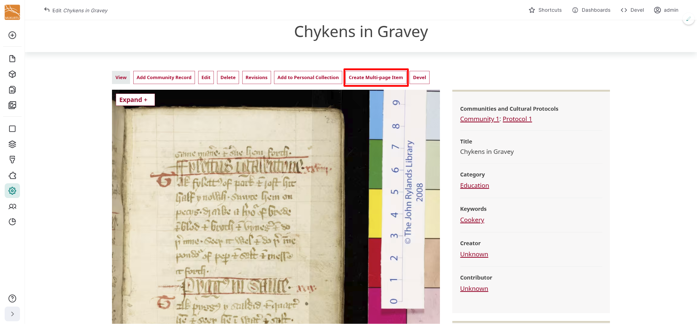

2. Enter a *Title* for your multipage item. This defaults to the title of the initial content item.

    !!! tip
        This is the umbrella title for the entire multipage item; the individual pages have their own titles. For example, if you are digitizing a yearbook this can be the title of the book. Subsequent pages are assigned their own title.

    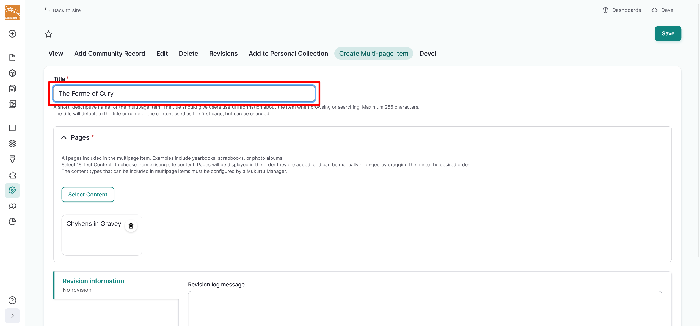

3. Your current digital heritage item should be selected. If you need to add additional existing pages, those can be selected at this time. If not, you can simply select "Save" and add new pages later.

4. Select the "Save" button.

    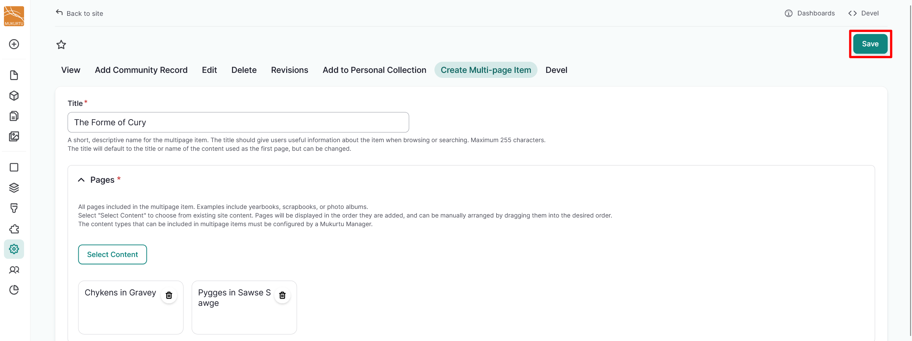

## Add new pages

There are two different ways to add new pages to your multipage item: by adding existing content to the multipage item or by creating new pages from the multipage item itself. Combining existing digital heritage items into one multipage item can be useful if you have a series of digital heritage items you have created over time, such as recipes to create a cookbook or quilt patterns to create a pattern book. Creating additional pages from the first page can be helpful if you are trying to provide access to something with multiple pages already, like a newspaper or yearbook. 

To begin adding new pages, select your multipage item.

### Add existing content

You can add existing digital heritage items or person records to multipage items.

1. Select the "Edit MPI" button. 

    

2. Select the "Select Content" button to add additional digital heritage items to add to your multipage item.

    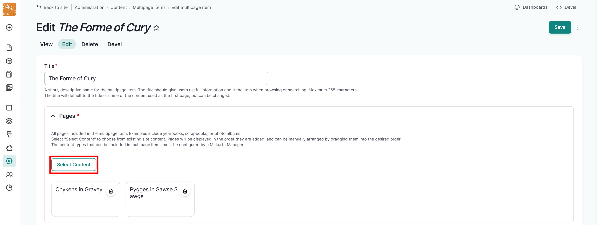

3. Select the checkbox by the digital heritage item or items you want to assign to your multipage item. Select the "Add content" button.

    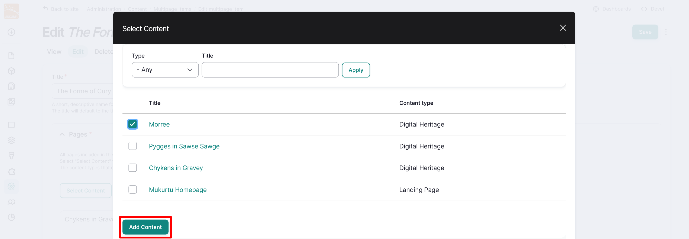

4. Select the "Save" button to save your multipage item.

### Add a new page

1. Select the "Add New Page" button.

    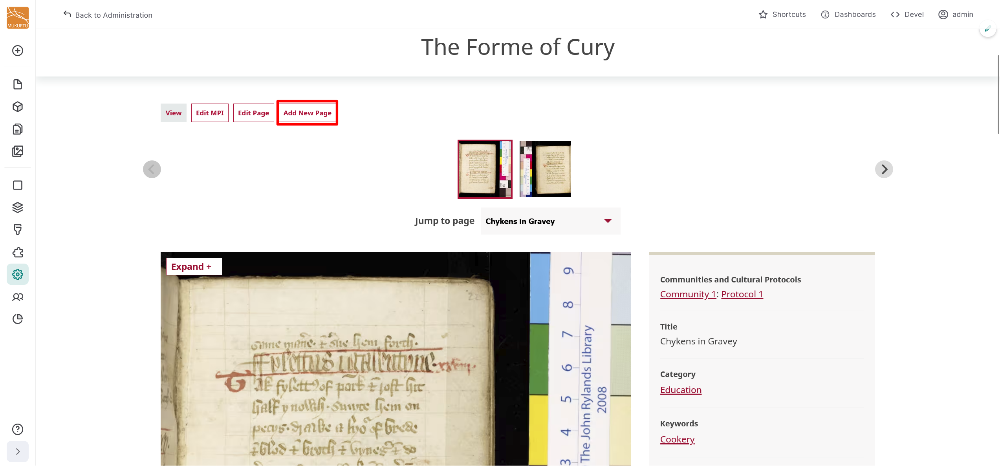

2. New pages are created as additional digital heritage items or person records. Select which type of content to use for your new page.

    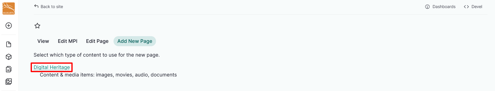

    For more information on creating digital heritage items, visit [Create a Digital Heritage Item](CreateDHItem.md).
    For more information on creating person records, refer to [Create Person Records](../person-records/PersonRecords.md)

3. When your new item or record is complete, select the "Save" button. 

    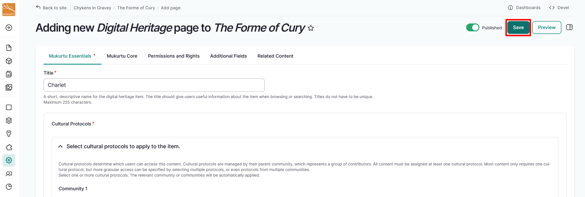

## Edit a multipage item

You can edit your multipage item by selecting the "Edit MPI" button, or you can edit individual pages in your multipage item by selecting the "Edit Page" button. 

Select "Edit MPI" to edit your multipage item. 

- Reorder the pages in your multipage item by selecting and dragging individual content items.
- Remove a page by selecting the "Remove page" button below the page you want to remove. Select the "Save" button to save your changes.

    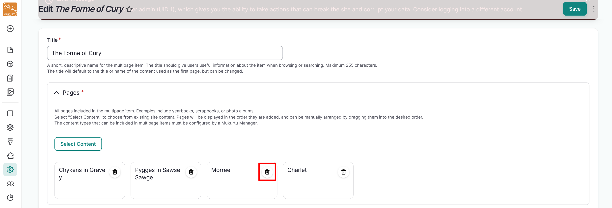

Select the "Edit Page" button to edit individual pages. Make your edits, then select the "Save" button to save your changes.

   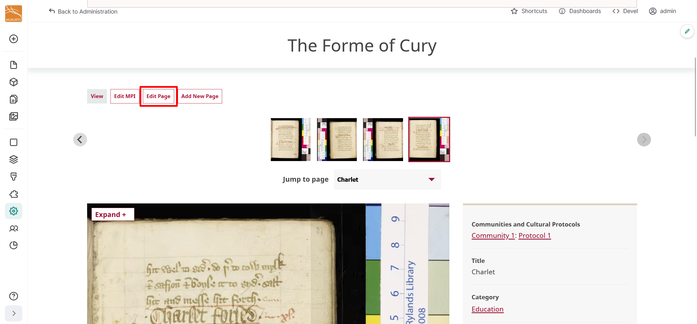

## Browse a multipage item 

Browse your multipage item by selecting a thumbnail from the carousel or by selecting a page from the **Jump to Page** menu.

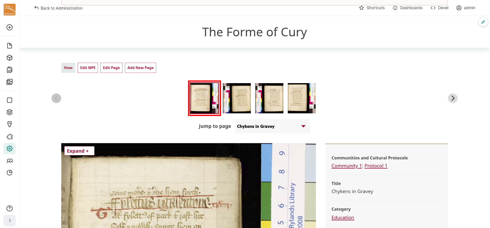

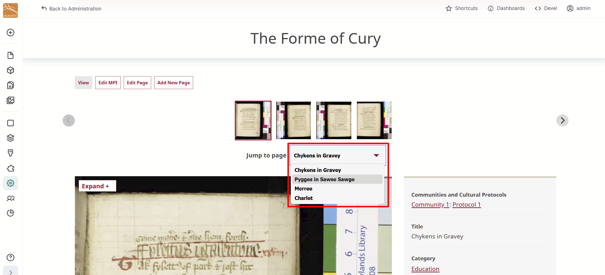