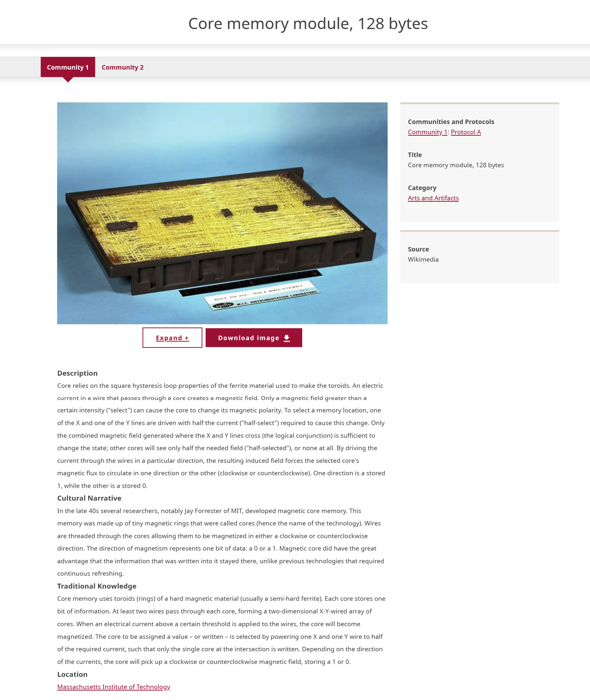
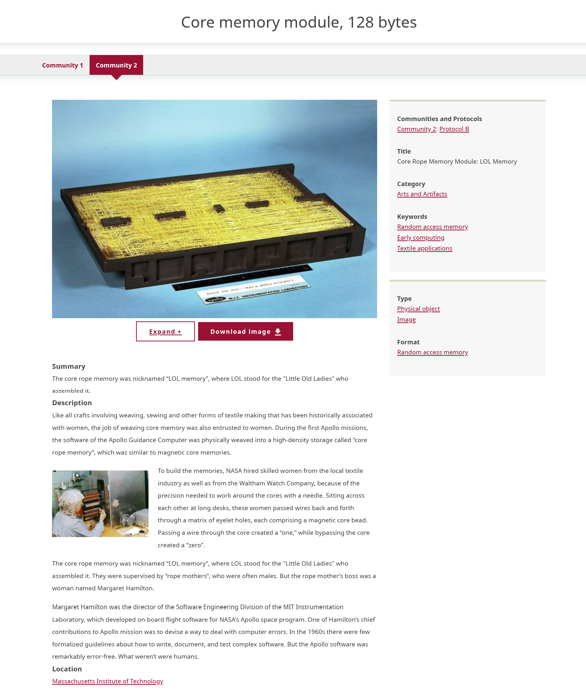

---
tags:
    - content
    - digital heritage items
---
# Understanding Community Records

!!! roles "User roles"
    Protocol steward, community record steward

Community records allow for multiple layers of information and knowledge to be shared within one item. They are a tool used to provide multiple sets of metadata, and to push back on the concept of a singular, canonical record. Community records can be used for several different purposes, including:

  - Preserving community-provided knowledge alongside institutional (library, archive, or museum) catalog records,
  - Enabling community members to add their own unique knowledge about the item,
  - Allowing members of multiple communities to share their own information without having to edit or erase other community members’ contributions, and
  - Providing appropriate access to knowledge.

An important note is that within Mukurtu, a community simply means a group of people with shared responsibility for material or knowledge. In many sites this does represent tribal or Indigenous communities, groups, or clans, etc, but Mukurtu communities can also be used to represent institutions and organizations (whether Indigenous or not). This concept carries through to community records. Any type of community can create the original digital heritage item, and then subsequent records will all be called "community records", regardless of who is creating them. While some sites first create the digital heritage item from a repository-based catalog record and later add traditional and cultural knowledge in the form of community records, other sites first create the digital heritage item from their community knowledge and later add instiutional metadata in the form of community records. 

When a community record is added to a digital heritage item, they are displayed together and share the same media asset(s). The rest of the metadata is completely independent. Community records can have different sets of cultural protocols from the initial digital heritage item, which can be an effective tool for ensuring select metadata fields are shared with the appropriate users.

!!! tip
    The "community" in community record refers to any Mukurtu communities. 

In the example below, the first image shows the some of the metadata from a digital heritage item. 

The next image shows a community record on the same digital heritage item. The media asset is shared, but many of the metadata fields are entirely different, or include different content.

For more information and instructions on how to create a community record, refer to [Create Community Records](CreateCommunityRecord.md).