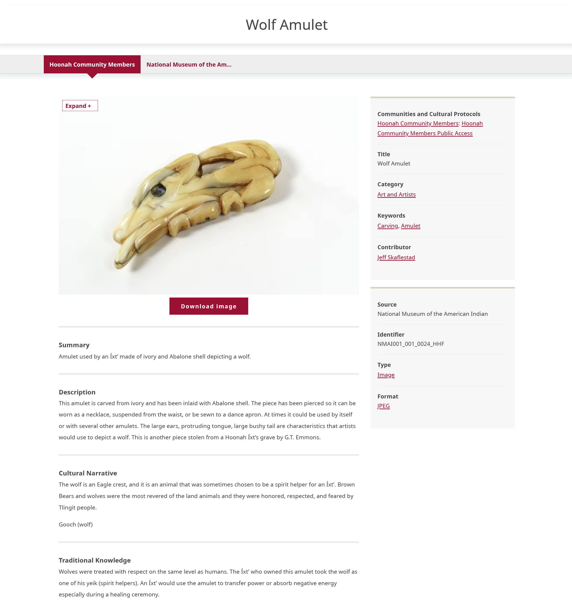

---
tags:
    - digital heritage item
    - content
---
# Understanding Digital Heritage Items

!!! roles "User roles"
    Protocol steward, contributor

Digital heritage items are the main content type for Mukurtu sites. They combine metadata and media assets to share cultural heritage information about an object, person, story, image, or other focus. Digital heritage items can be as simple or as complex as required. Simpler digital heritage items can be built around a few lines of text or metadata, or they can consist of simple metadata structured around a single media asset, such as an image, video, document, audio clip, or embedded media. More complex digital heritage items can use multiple media assets and rich metadata to tell a story. 

Digital heritage items are created within communities and grouped together by categories. Appropriate user access to items is provided by cultural protocols. For more information about creating digital heritage items, please refer to [Create a Digital Heritage Item](CreateDHItem.md).

Mukurtu includes an extensive set of descriptive, administrative, and technical metadata fields to represent digital heritage items. Some fields are more generic, such as Title, Description, or Format. Other fields such as Cultural Narrative, Traditional Knowledge, an interactive mapping field, and our new Citing Indigenous Elders and Knowledge Keepers field enable communities to provide richer, more detailed metadata and a fuller representation of an item's provenance. For more information on digital heritage metadata fields, refer to [Digital Heritage Metadata Fields](DHMetadataFields.md).