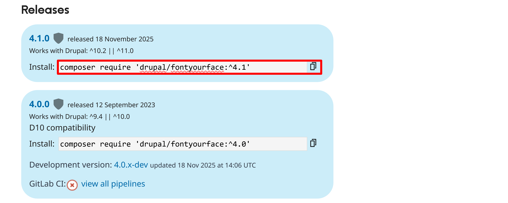
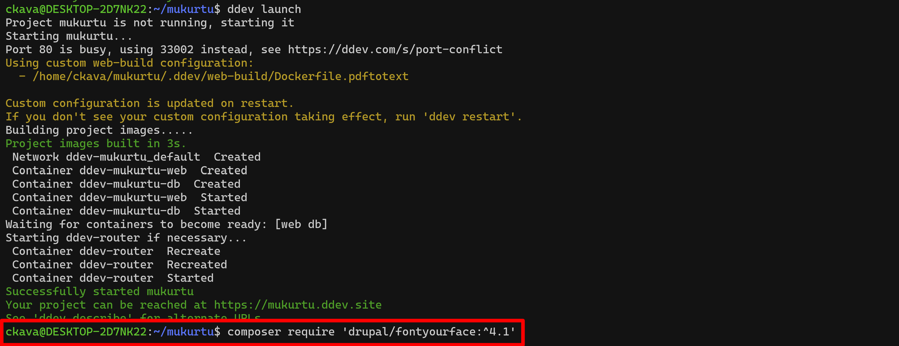
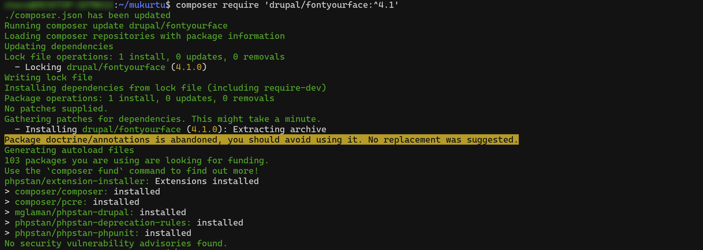
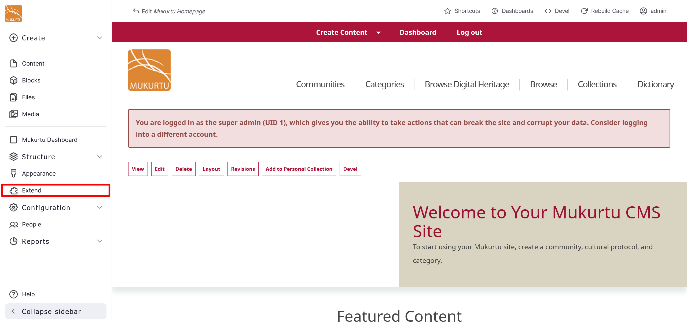
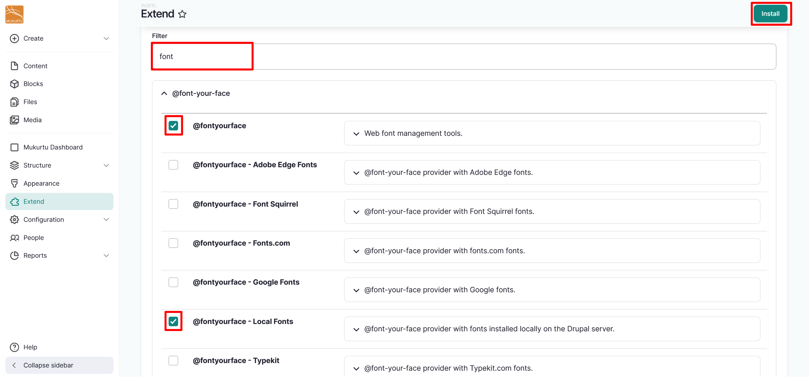
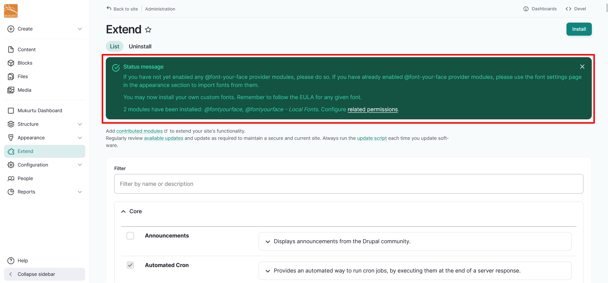

# Add a module 

You may choose to add a Drupal module to your Mukurtu CMS site to extend your site's functionality or further customize your site. Drupal modules can be found on their site at [https://www.drupal.org/project/project_module](https://www.drupal.org/project/project_module).

Follow the instructions below to add a module to your Mukurtu CMS site. 

1. Navigate to the page for the module you want to install. In this case, we will install the @font-your-face module, which allows you to add custom fonts from the front end of your Mukurtu site. This module can be found at ([https://www.drupal.org/project/fontyourface](https://www.drupal.org/project/fontyourface)). 
2. Navigate to Releases.  
3. Copy the most recently updated Install code. 

    

4. Navigate to your terminal.  
5. Open your site directory and paste the copied code snippet, then execute. 

    
    
    

6. Navigate to your site and log in as an admin. 
7. From the Administration menu, select Extend or navigate directly to `/admin/modules`. 

    

8. Filter your site's modules by entering a term from your module into the Filter field. This examples uses the term `font`, but the process is the same for any module you choose to add. 
9. Select the applicable modules. This example uses the @fontyourface and the @fontyourface - Local Fonts modules, but the process is the same for any module you choose to add. 

    

10. Select "Install". You should receive a status message telling you that your modules have been installed successfully. 

    