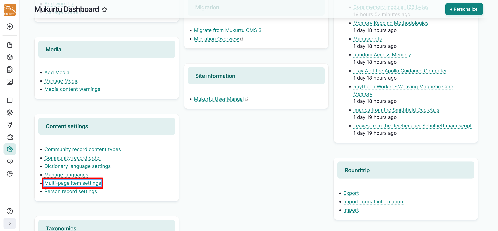
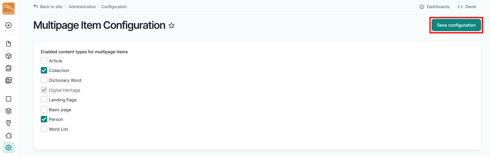

# Configure Multipage Items

!!! roles "User role"
    Mukurtu manager

Multipage items can be configured to allow multiple pages with unique metadata to be added to any content type in Mukurtu CMS 4. This allows for granular page-level description for all content types, which makes individual pages discoverable in site-wide search.

Digital heritage items are configured to allow multipage items by default. Enabling multipage items for other content types allows users to create multipage items directly from other content types or to add other content types as pages in multipage items. For example, enabling person records would allow you to add a person record as a page in a cookbook or book of quilt patterns to better highlight the biography of an individual who contributed a recipe or pattern. Follow the instructions below to enable multipage items for other content types.

1. Navigate to your **Dashboard**. 
2. Under **Content settings**, select the **Multi-page item settings** link. 

    

3. Select the content types you want to enable for multipage items. 
4. Select "Save configuration". 

    

    

5. Creating a multipage item follows the same process for all content types. For more instructions, reference [Multipage Items](../digital-heritage-items/MultipageItems.md).
