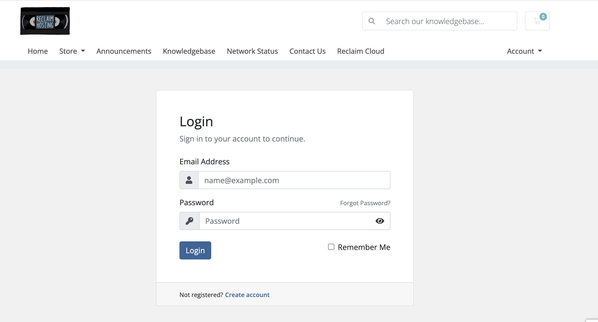
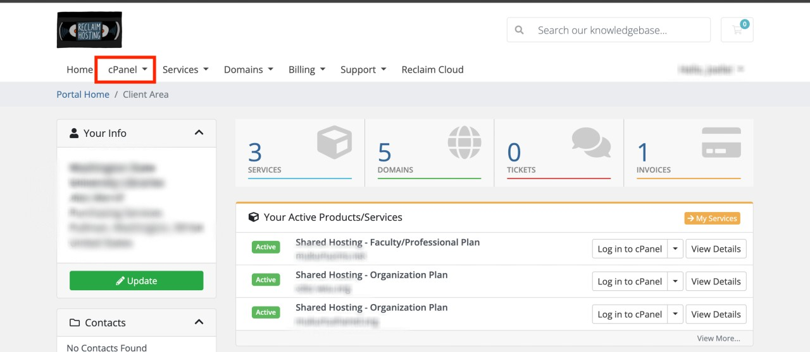
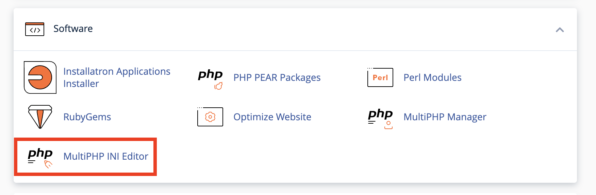
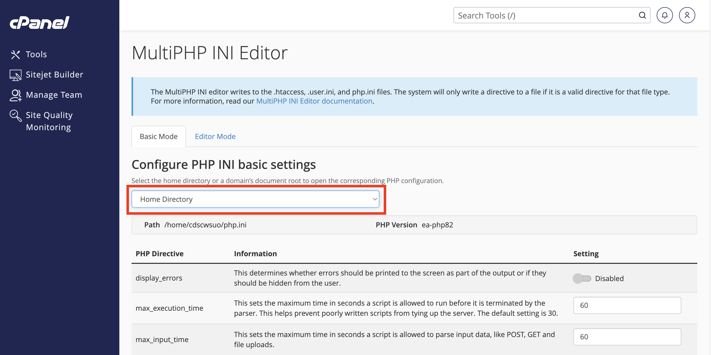
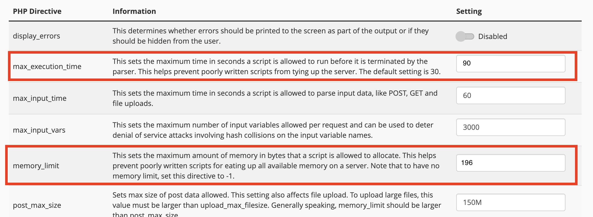

---
tags:
    - infrsutructure
---

# PHP Configuration 

For most Mukurtu sites to run properly, the PHP memory_limit must be set to a minimum of 196 MB. For larger sites, 256 MB is recommended. The max_execution_time should be set to a minimum of 90 or 120 seconds.

If you are using Reclaim Hosting, follow the directions below to view and change your memory_limit setting. If your site is hosted elsewhere, contact your site administrator and/or hosting provider.

Login to the Reclaim client portal: [https://portal.reclaimhosting.com/clientarea.php](https://portal.reclaimhosting.com/clientarea.php)

Go to the cPanel.

Search or browse for the MultiPHP INI editor.

Select the location of your site. This may be your site URL, or be listed as “Home Directory”.

Locate the max_execution_time field and set it to 90 (or 120 if needed), and memory_limit field and set it to 196M (or 256M if needed).

Select "Apply" at the bottom of the screen.

It may take a few minutes for the changes to affect your site.

