---
tags:
    - local contexts
---

# Convert Legacy TK Labels to Hub Labels

!!! roles "User roles"
    Administrator, Mukurtu manager

Move content off legacy Traditional Knowledge (TK) Labels and notices migrated from Mukurtu 3 and onto real Local Contexts Hub projects, labels, and notices, so they can be managed like any other label going forward.

!!! tip
    To learn more about legacy labels, see [Understanding Legacy Traditional Knowledge Labels](UnderstandingLegacyTKLabels.md).

## Prerequisites

- A real Local Contexts Hub project already added to the site, community, or protocol you're converting. See [Manage Local Contexts Projects](ManageLocalContextsProjects.md).

## Reassign a legacy project

This conversion tool maps a legacy project's labels and notices to a real Hub project's labels and notices, then rewrites the affected content. You don't need to map everything at once: any labels or notices you leave unmapped stay on their content untouched, and you can run the tool again later to map more.

1. From the Mukurtu dashboard, select **Remap Legacy Projects**. For a community or protocol, navigate to its page and select the **Remap Legacy Projects** tab instead.
2. Select the legacy project you want to reassign, and the target Hub project you want to reassign it to.
3. Select the "Next: Map Labels" button.

    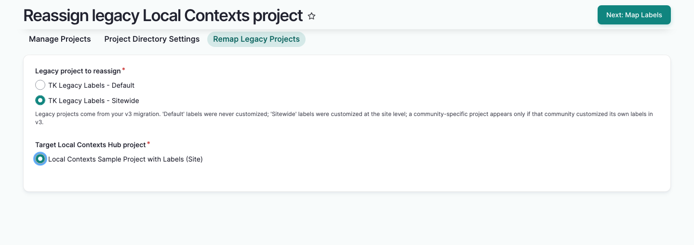

4. On the mapping step, map each legacy label or notice to its real equivalent on the target project, or leave it set to "— Skip (leave unmapped) —". This step is optional; select the "Preview" button when you're done.

    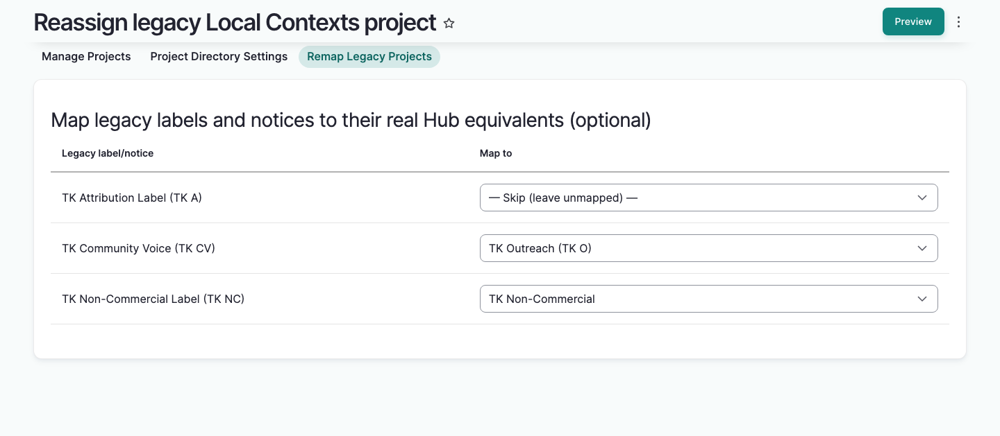

5. Review the preview. It lists every label, notice, and whole-project reference that will change, how many content items each affects, and whether it "Will be reassigned" or "Will be skipped — map this label to include it." Select the "Back to mapping" button to adjust your mapping, or the "Confirm & Run Batch" button to proceed. This button is hidden if no content will be affected.

    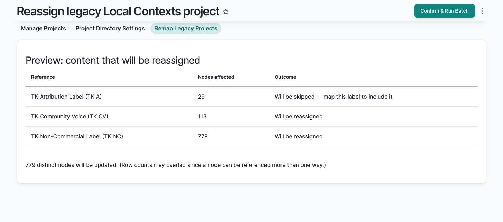

6. Wait for the batch to finish. A message reports how many items were updated, and names any labels or notices that were left unmapped so you can address them later.

    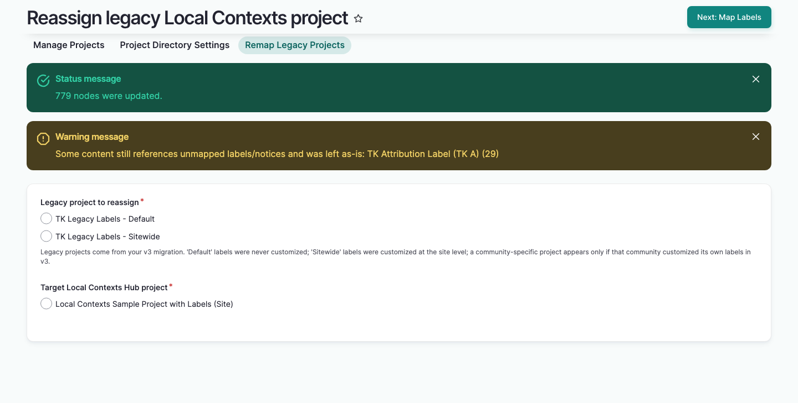

## Remove content from an unmappable label

Some legacy labels or notices may have no real equivalent on the Hub. To fully retire a legacy project, remove these from content directly instead of mapping them.

1. On the Manage Projects page, a legacy project that still has content attached shows an "Active — referenced by *N* node(s)" status. Select this link.

    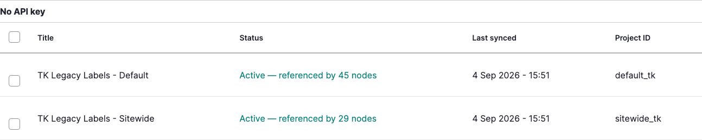

2. On the resulting page, find the label or notice you want to remove, then select its "Review & remove" link.

    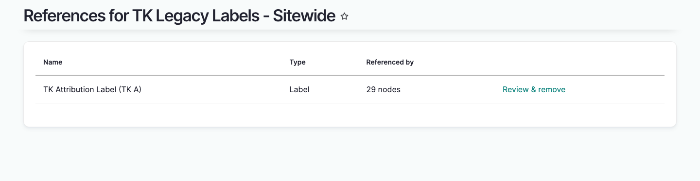

3. Select the content items you want to remove the label or notice from. Items are unchecked by default, so only what you check is affected.

    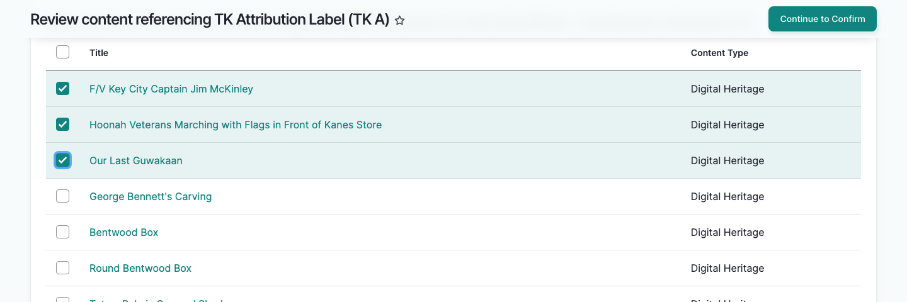

4. Select the "Continue to Confirm" button.
5. Review the list of selected items, then select the "Remove" button to permanently remove the label or notice from them. Other labels, notices, and projects on those items aren't affected.

    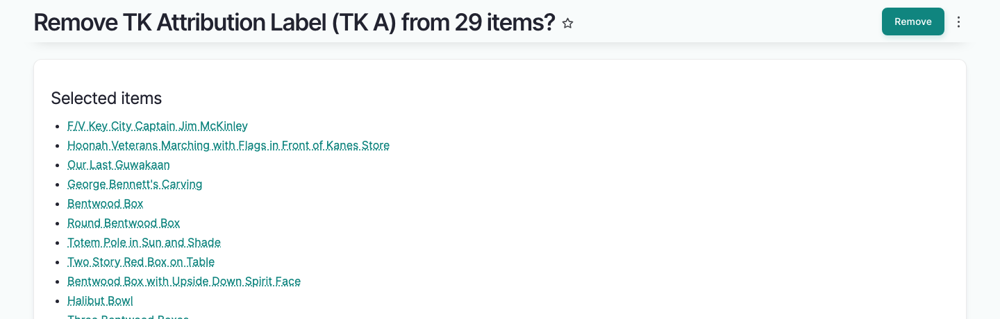

    Once the label has been removed from every item referencing it, the breakdown page confirms there's nothing left to address.

    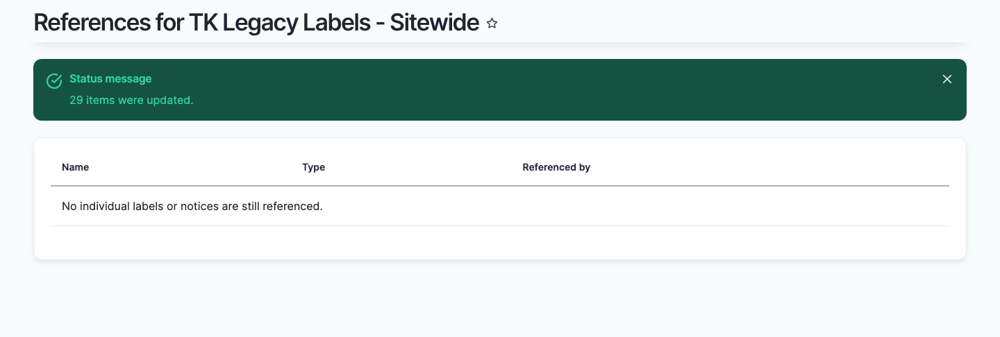

## Decommission a legacy project

Once a legacy project has no remaining content references, whether because everything was reassigned or removed, you can decommission it to permanently delete its cached legacy label and notice data.

1. On the Manage Projects page, confirm the legacy project's status reads "Active — no remaining references."

    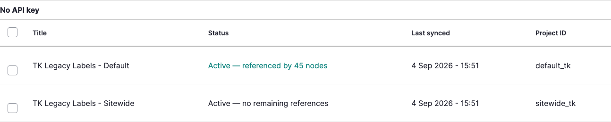

2. Select the checkbox next to the project.

    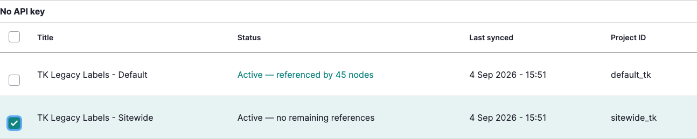

3. From the dropdown menu, select "Decommission," then select "Apply action."

    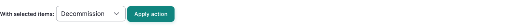

4. Review the confirmation page, then select the "Decommission" button. This cannot be undone.

    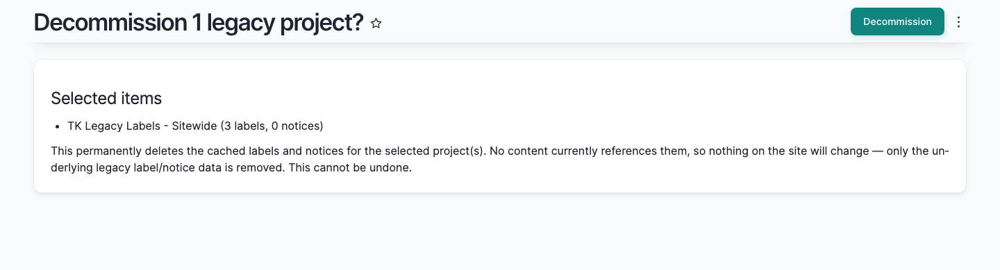

    The project no longer appears in the legacy projects table once it's decommissioned.

    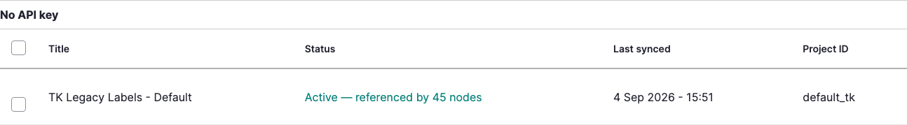

## Related articles

- [Understanding Legacy Traditional Knowledge Labels](UnderstandingLegacyTKLabels.md)
- [Manage Local Contexts Projects](ManageLocalContextsProjects.md)
