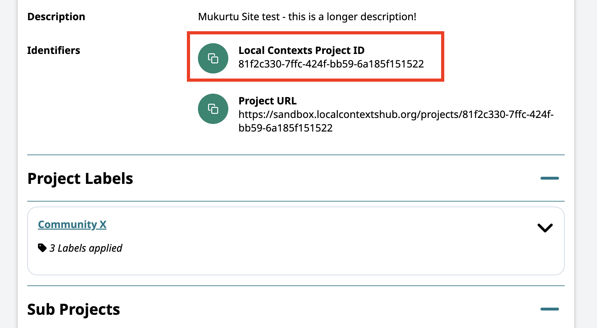
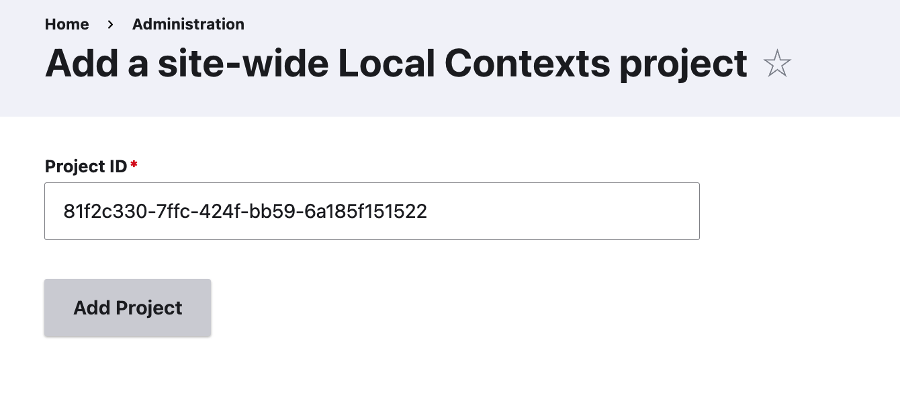
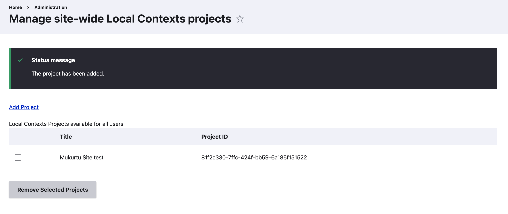

---
tags:
    - Local Contexts
---

# Manage Local Context Projects

!!! roles "User roles"
    
    Mukurtu administrator, Community manager, Protocol steward

Local Contexts projects can be managed at three different levels: site-wide, per community, and per protocol. This article provides instructions for adding and managing projects at each level. For more about how projects work in Mukurtu, see [Levels of Local Contexts Projects](./LevelsOfLocalContextsProjects.md).

To learn more about Local Contexts, and the Local Contexts Hub see [Understanding the Local Contexts Hub](./UnderstandingTheLocalContextsHub.md)

!!! Requirement
    The following steps can only be applied after you've created a Local Contexts profile and account, configured your labels within projects, and generated a unique project ID. To learn more about this process, and configure your labels, visit [Getting Started on the Hub](https://localcontexts.org/support/getting-started-on-the-hub/)

## Get your project ID

To add a project to your site, you will first need your project ID number. In your Local Contexts project, scroll down to the "Identifiers" section. Find and copy the project ID number. You will be pasting it into your Mukurtu site. 

Follow the steps below to add the project ID to the entire site, or to individual communities or protocols.

## Manage site-wide projects

!!! roles "User roles"

    Mukurtu administrator

1. Navigate to the Mukurtu dashboard, and select **Manage Local Contexts Projects**

2. Select "Add Project."
3. Paste the project ID into the *project ID* field.
6. Select "Add Project"

7. You will be returned to the projects list and a success message will be displayed. 

8. To remove a project, select the box next to the project name and select Remove Selected Projects. Note that only projects with labels that are not in use can be removed.

## Manage community-based projects

!!! roles "User roles"

    Community manager

1. Navigate to the community you wish to manage.
2. Select "Manage."
3. Select **Manage Local Contexts Projects.**
4. Select **Add Project**. 
5. Past the project ID into the *project ID* field.

6. Select "Add Project"
7. A success message will display, along with the title of the project and the project ID.

8. To remove a project, select the box next to the project name and select Remove Selected Projects. Note that any projects that have been applied to content cannot be removed.

## Manage protocol-based projects

!!! roles "User roles"

    Protocol steward

1. Navigate to the protocol you wish to manage.
2. Select "Manage."
3. Select **Manage Local Contexts Projects.**
4. Select **Add Project**. 
5. Paste the project ID into the *project ID* field.

6. Select "Add Project"
7. A success message will display, along with the title of the project and the project ID.

8. To remove a project, select the box next to the project name and select Remove Selected Projects. Note that only projects with labels that are not in use can be deleted.
