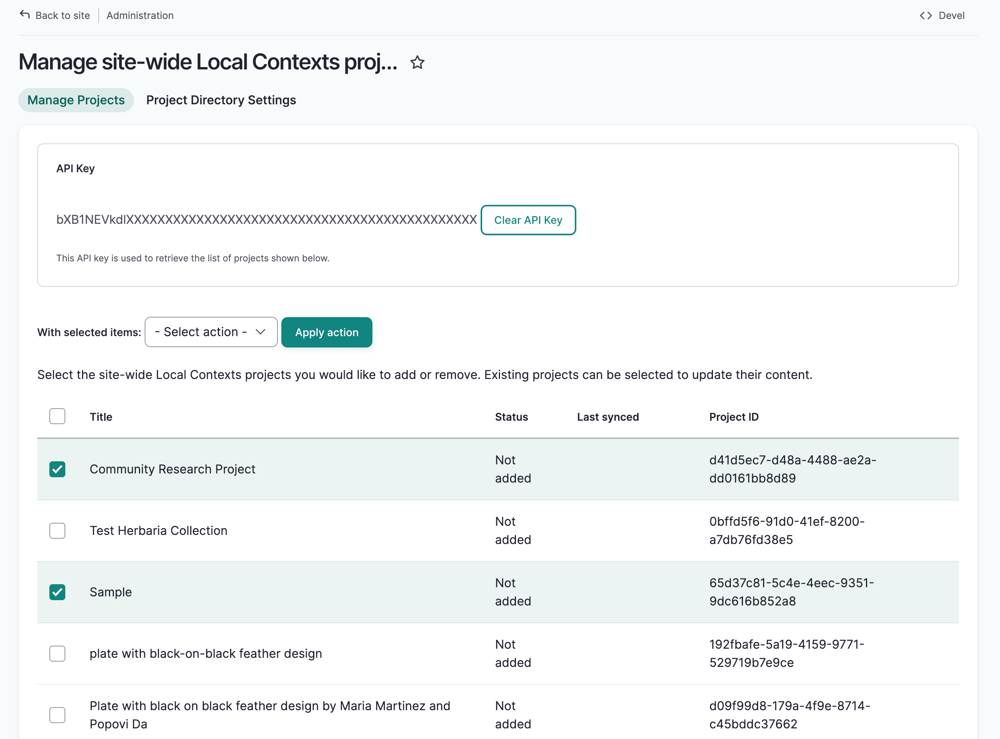

---
tags:
    - Local Contexts
---

# Manage Local Context Projects

!!! roles "User roles"
    
    Mukurtu administrator, Community manager, Protocol steward

Local Contexts projects can be managed at three different levels: site-wide, per community, and per protocol. This article provides instructions for adding and managing projects at each level. For more about how projects work in Mukurtu, see [Levels of Local Contexts Projects](./LevelsOfLocalContextsProjects.md).

To learn more about Local Contexts, and the Local Contexts Hub see [Understanding the Local Contexts Hub](./UnderstandingTheLocalContextsHub.md)

!!! Requirement
    The following steps can only be applied after you've created a Local Contexts profile and account, configured your labels within projects, and generated a unique API key. To learn more about this process, and configure your labels, visit [Getting Started on the Hub](https://localcontexts.org/support/getting-started-on-the-hub/)

## Get your API Key

API keys can be generated from the settings page in your Local Contexts account. 

1. In the API key mangager, select "Generate API Key"

2. Add a name for your API key, then select "Generate API Key."

3. Your API key will be created. It should look like a long stream of letters and numbers. Select the "Copy" icon to copy the API key.

## Add your API Key

!!! roles "User roles"

    Mukurtu manager, community manager, protocol steward

The steps to add an API key are the same whether you're adding it to the entire site, or to a community or protocol. For more information about Local Contexts projects at different levels of a Mukurtu site, please see [Levels of Local Contexts Projects](./LevelsOfLocalContextsProjects.md)

To add an API key to an entire site, as a Mukurtu manager, from the dashboard, select **Manage Local Contexts Projects**.

To add an API key to a community, as a community manager, navigate to the community page. Select "Manage," then select **Manage Local Contexts Projects**

To add an API key to a protocol, as a protocol steward, navigate to the protocol page. Select "Manage," then select **Manage Local Contexts Projects**

1. Paste the API key into the *API key* field and select "Set API Key" A list of projects associated with the API will display.
    

2. Select the projects you wish to add to the site by checking the box next to the appropriate projects. 
    

3. From the dropdown menu, select **Add/Sync.**
    

4. Select "Apply Action." The page will reload and the status of the added projects will update to *Active.* Projects you do not add to the site will not be available to use.
    

5. To remove a project, select the box next to the project name. 

6. Select **Delete** from the dropdown menu, then select "Apply Action." Note that only projects with labels that are not in use can be removed. The project list will reload with an updated status of "Not added" and a success message.
    

You can view synced labels and notices from your group’s directory page. Administrators and Mukurtu Managers can view labels and notices applied at the site level by selecting “Local Contexts Projects” on the dashboard. Community and protocol managers can view them from the manage page of their group. For more on directory pages, see [View and Manage Directory Pages](./ViewAndManageDirectoryPages.md)

