---
tags:
    - Local Contexts
---

# Manage Local Contexts Projects

!!! roles "User roles"
    
    Mukurtu administrator, Community manager, Protocol steward

Local Contexts projects can be managed at three different levels: site-wide, per community, and per protocol. This article provides instructions for adding and managing projects at each level. For more about how projects work in Mukurtu, see [Levels of Local Contexts Projects](./LevelsOfLocalContextsProjects.md).

To learn more about Local Contexts, and the Local Contexts Hub see [Understanding the Local Contexts Hub](./UnderstandingTheLocalContextsHub.md)

!!! Requirement
    The following steps can only be applied after you've created a Local Contexts profile and account, configured your labels within projects, and generated a unique API key. To learn more about this process, and configure your labels, visit [Getting Started on the Hub](https://localcontexts.org/support/getting-started-on-the-hub/).

## Get API key

API keys can be generated from the settings page in your Local Contexts account. 

1. In the API key manager, select "Generate API Key".
    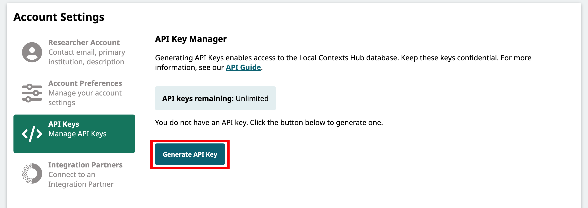

2. Add a name for your API key, then select "Generate API Key".
    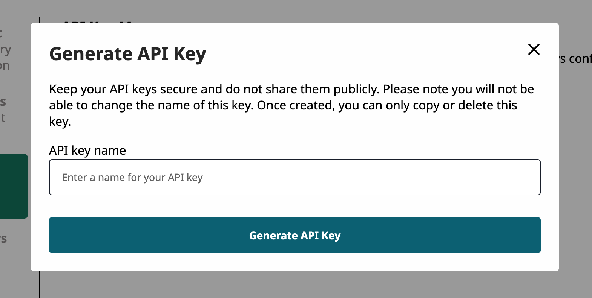

3. Your API key will be created. It should look like a long stream of letters and numbers. Select the "Copy" icon to copy the API key.
    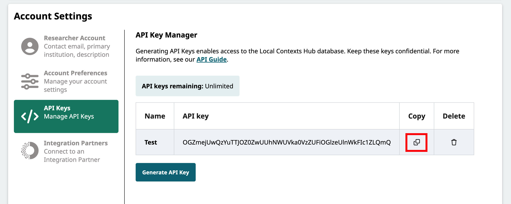

## Add API key to Mukurtu site

The steps to add an API key are the same whether you're adding it to the entire site, to a community, or to a protocol. For more information about Local Contexts projects at different levels of a Mukurtu site, please see [Levels of Local Contexts Projects](./LevelsOfLocalContextsProjects.md).

To add an API key to an entire site, as a Mukurtu manager, from the dashboard select **Manage Local Contexts Projects**.

To add an API key to a community, as a community manager, navigate to the community page and select **Manage Local Contexts Projects**.

To add an API key to a protocol, as a protocol steward, navigate to the protocol page and select **Manage Local Contexts Projects**.

1. Paste the API key into the *Add API key* field. Add an optional name. This will display above your project list and is helpful for distinguishing between multiple API keys. Select "Add Key". 
    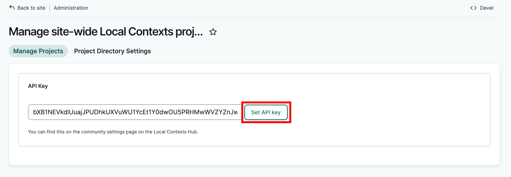

2.  The API key is listed with a "Remove" button. The *API Key* field is reset. Additional API keys may be added.
    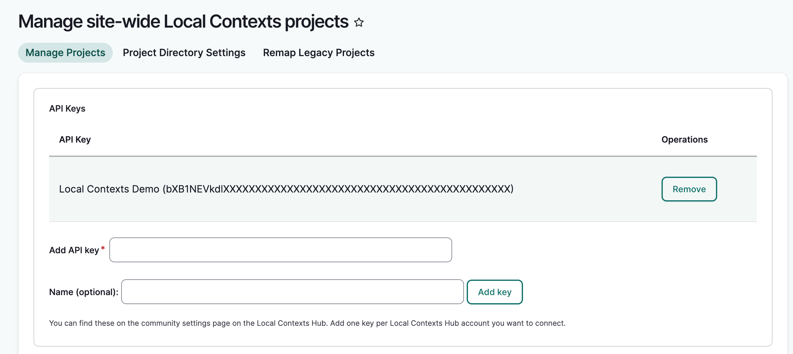

## Add projects

3. A list of projects associated with the API key displays below. If you've added multiple API keys, you will see the projects grouped under each API key along with the API key name if added. Select the projects you wish to add to the site by checking the box next to the appropriate projects. From the dropdown menu, select **Add/Sync.**

    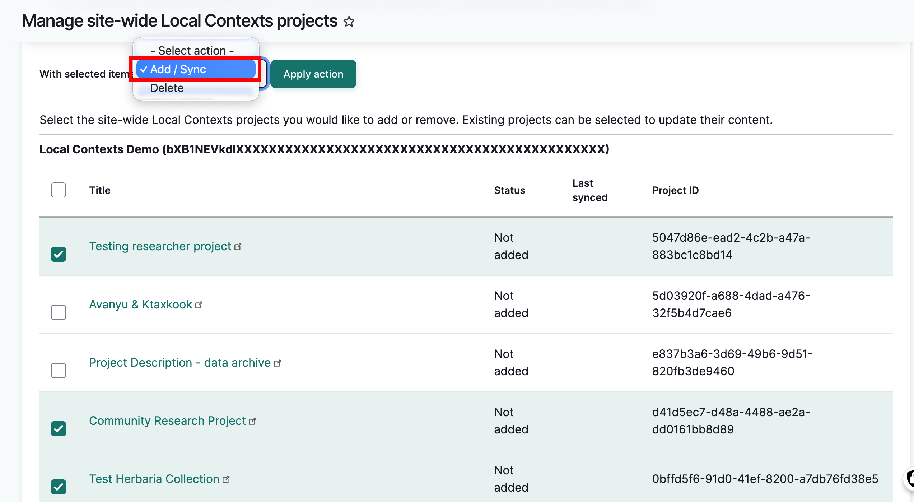

5. Select "Apply Action." The page will reload and the status of the added projects will update to *Active.* Projects you do not add to the site will not be available to use.
    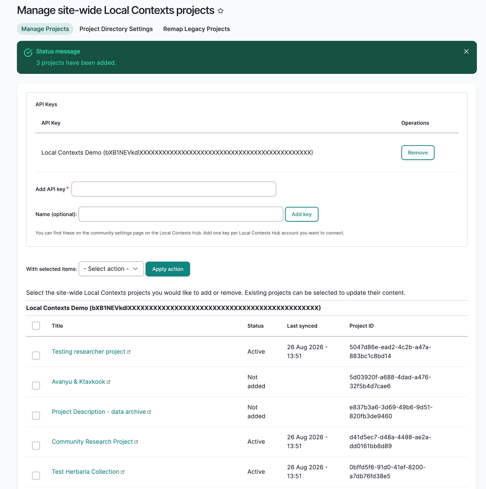

## Delete projects

6. To remove a project, select the box next to the project name. 

7. Select **Delete** from the dropdown menu, then select "Apply Action." 
        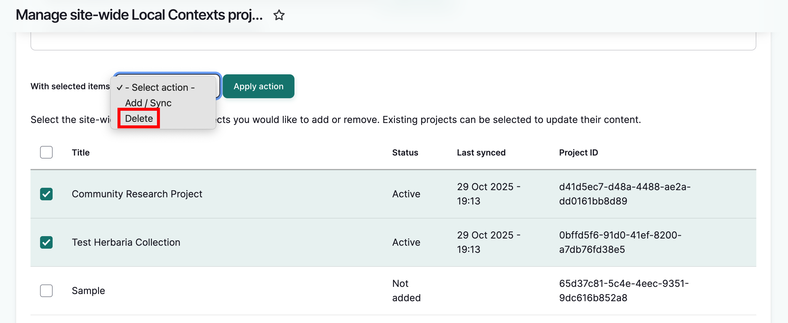

    !!! Requirement
        Only projects with labels that are not in use can be removed. Remove labels from all items before attempting to delete a project. 
    
    !!! Tip
        Use the filters on the content manage page to find content using labels from projects you wish to remove. See [Manage Content](../content-settings/manage-content.md)

    The project list will reload with an updated status of "Not added" and a success message.
        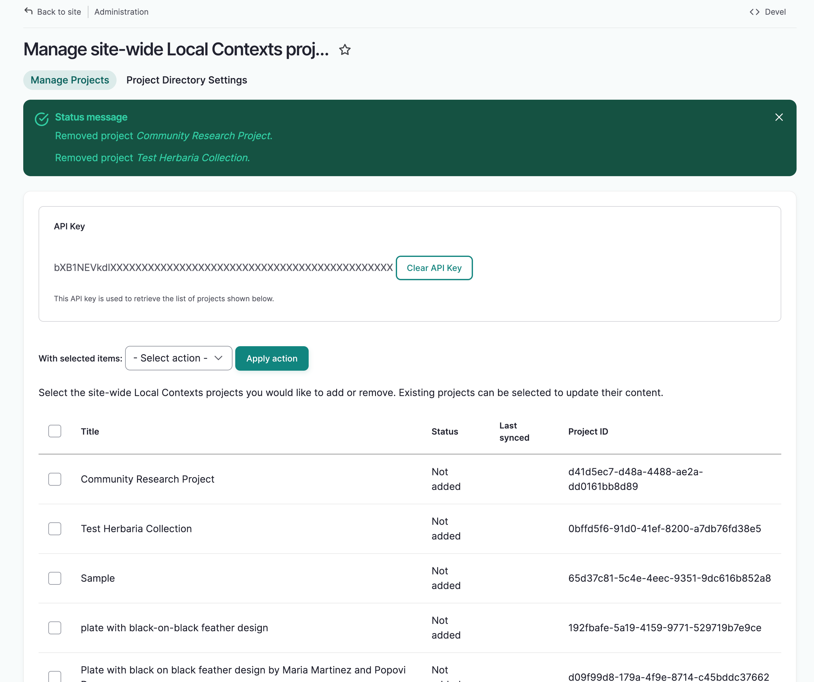

## Remove API key

To remove an API key, select "Remove" next to the API key you wish to remove.

!!! Requirement
    Only API keys whose projects are deleted can be removed. Delete all associated projects, then use the "Remove" button.

## View projects

Administrators and Mukurtu Managers can view labels and notices applied at the site level by selecting “View site-wide Local Contexts Projects” on the dashboard. 

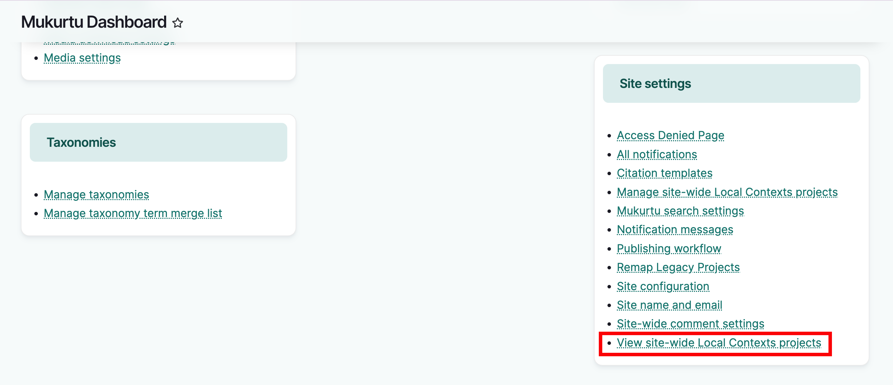

Community managers and protocol stewards can view them on the sidebar of their group pages. For more on directory pages, see [View and Manage Directory Pages](./ViewAndManageDirectoryPages.md).

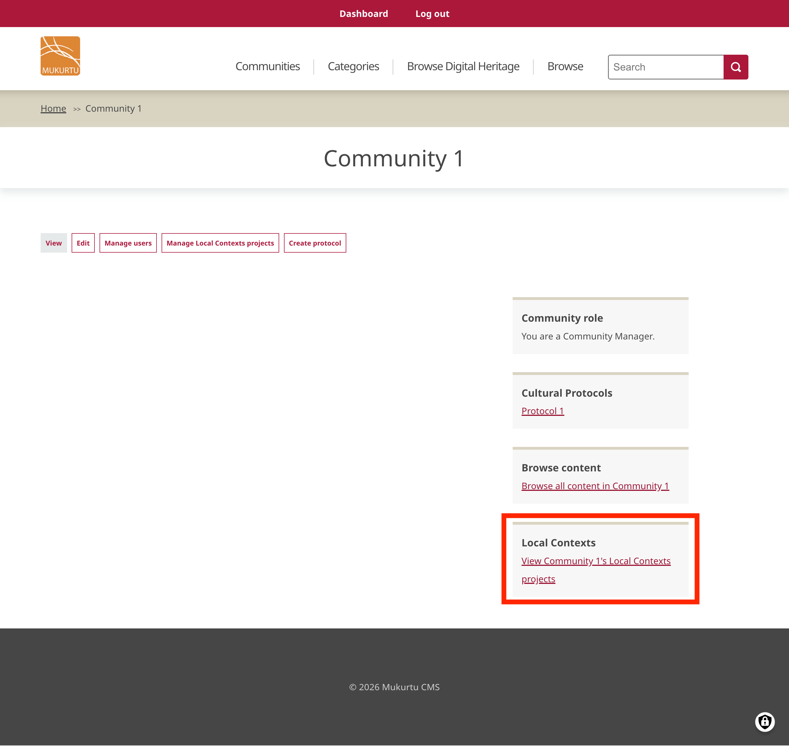

