---
tags:
    - Local Contexts
---

# View and Manage Directory Pages

!!! roles "User roles"
    
    Mukurtu manager, community manager, protocol steward

The Local Contexts directory provides information about Local Contexts projects and their accompanying labels and notices. Each directory page displays all the relevant projects, along with their labels and notices, grouped by project and type.

To learn more about Local Contexts, and the Local Contexts Hub see [Understanding the Local Contexts Hub](./UnderstandingTheLocalContextsHub.md)

!!! Requirement
    To use the directory you must first create a Local Contexts profile and account, configure your labels within projects, generate a unique API key, and add that key to your site. To learn more about this process, and configure your labels, visit [Getting Started on the Hub](https://localcontexts.org/support/getting-started-on-the-hub/). To add an API key to your site, see [Manage Local Contexts Projects](ManageLocalContextsProjects.md) for instructions. 

## View project directories

Project directory pages exist at the site level and within each community and protocol.

1. To view project directories within a community or protocol, navigate to the community or protocol you wish to view and select **View Local Contexts Projects** in the right-hand sidebar.

    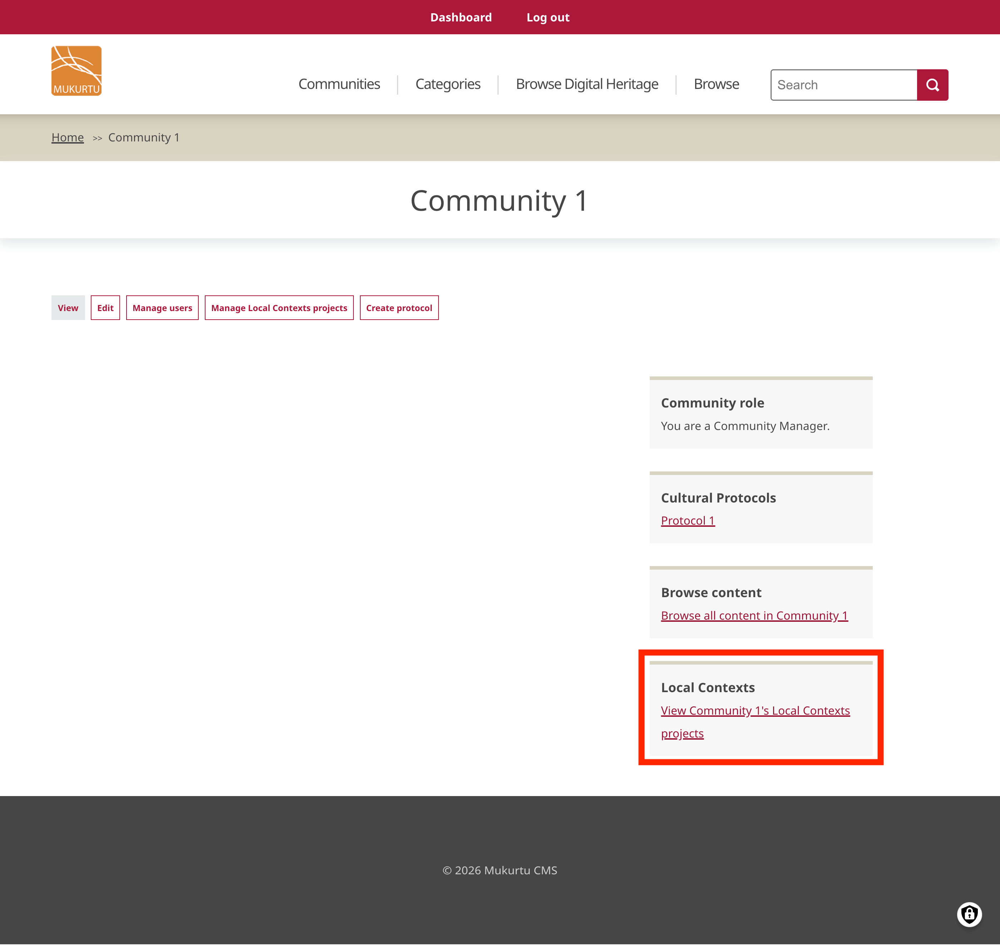

2. To view the site project directory, go to the dashboard. In the **Site Settings** section, select **View site-wide Local Contexts Projects**. The site-wide directory is public, but the link isn't shown anywhere by default. You can add the link to the main menu, a basic page, the site footer, or anywhere else as needed.

    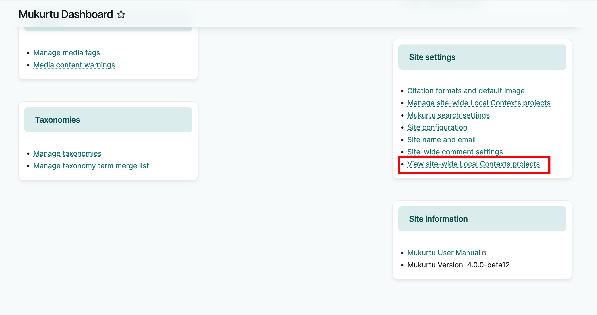

## Project directory management

The information displayed in directories are managed in two locations: the Local Contexts Hub and the Mukurtu site. 

The API will pull in project names, labels, and notices from the Local Contexts Hub. Your Mukurtu site provides you with a **project directory description** field where you can include information about the project, how labels are being used, people or organizations working on the project, etc. 

Descriptions for individual labels and notices are synced from the Local Contexts Hub. If you've added multiple translations or recordings to the labels, they will display alongside the label. 

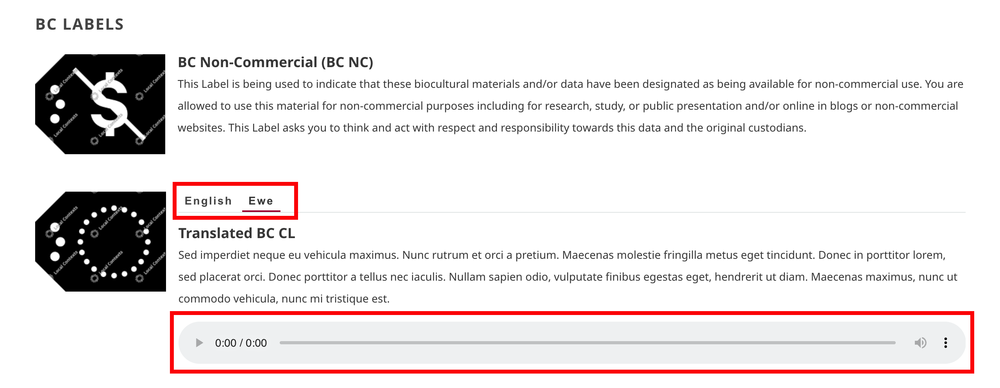

### Manage community or protocol directories

For communities and protocols, the project directory description field is located in the edit form for that group.

1. To access it, navigate to the community or protocol you wish to manage and select **Edit**.

    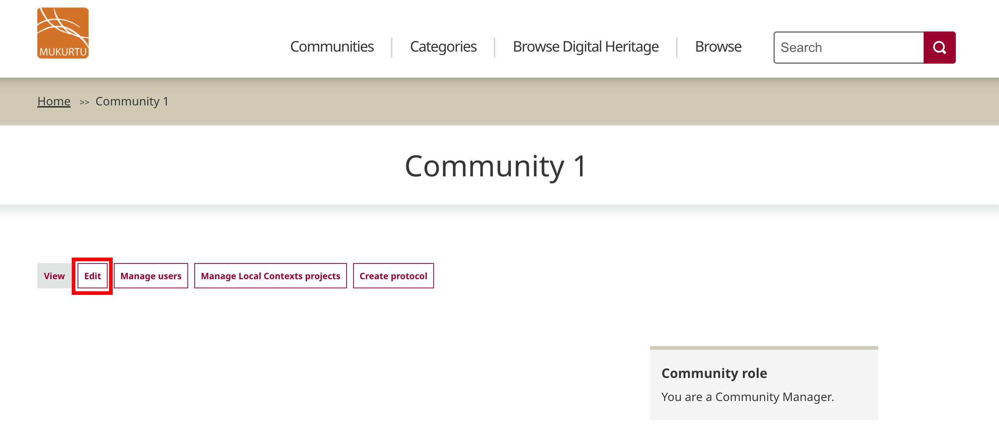

2. Scroll down to the Local Contexts Description field and add or edit your project description.

    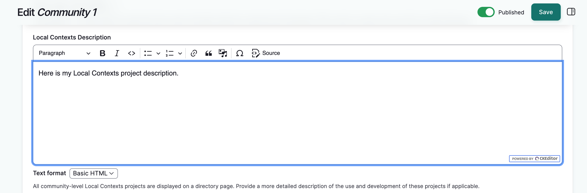

3. Select "Save". The community or protocol page will load with a success message.

    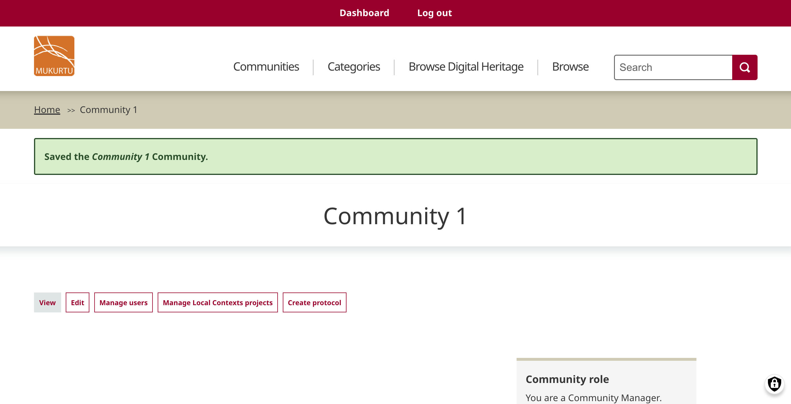

4. The description will be visible on the group's project directory page.

    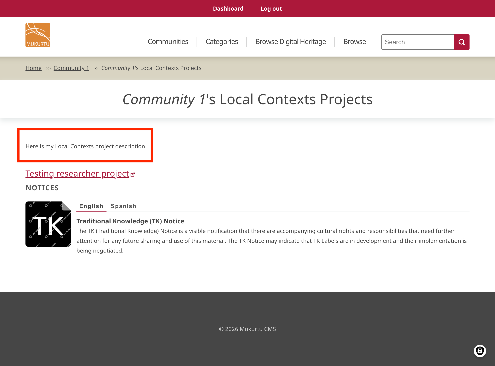

### Manage site-wide project directory

1. To manage the site project directory, as a Mukurtu Manager, go to the dashboard. In the **Site Settings** section, select **Manage Local Contexts Projects**.

    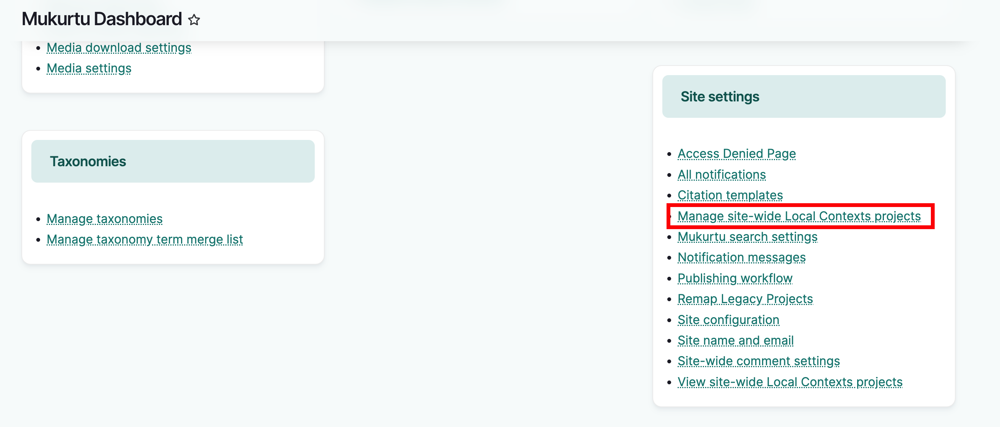

2. A list of added API keys and associated Local Contexts projects will display.

3. Select the Project Directory Settings tab. 
    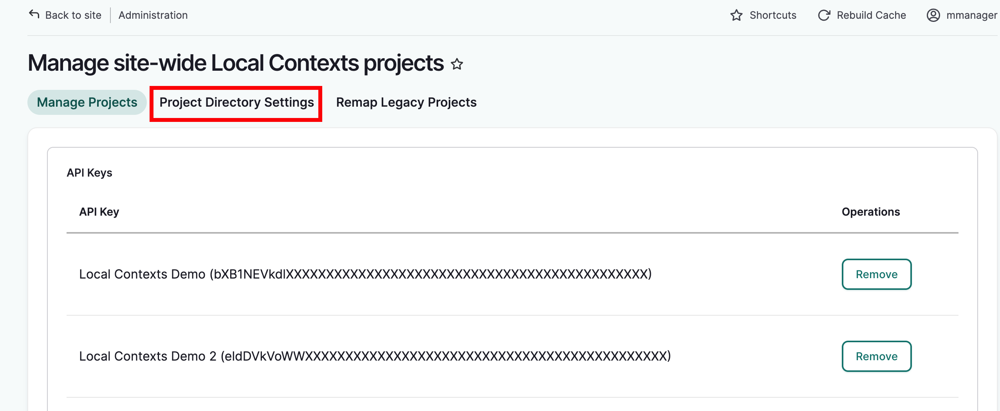

4. Add or edit your description and select "Save."
    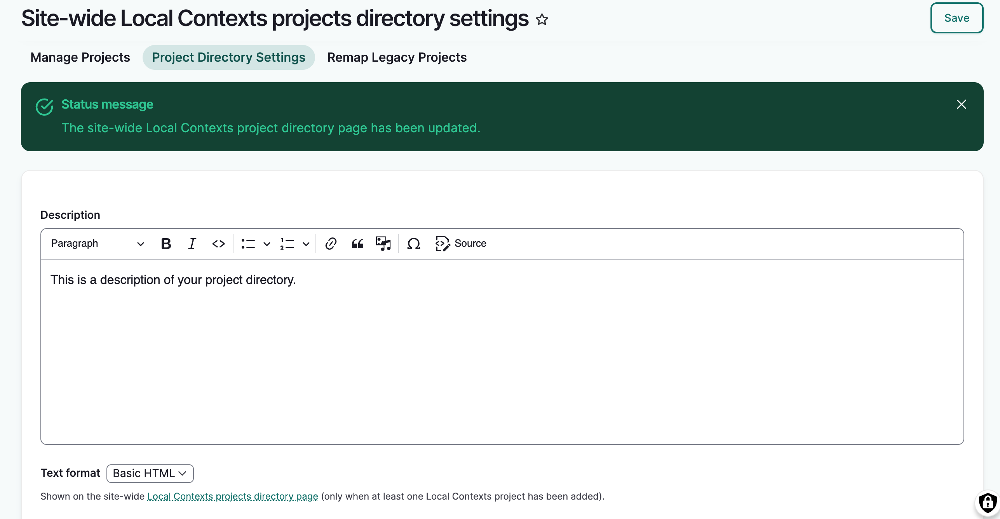

5. Updates to the description are visible on the directory page.
    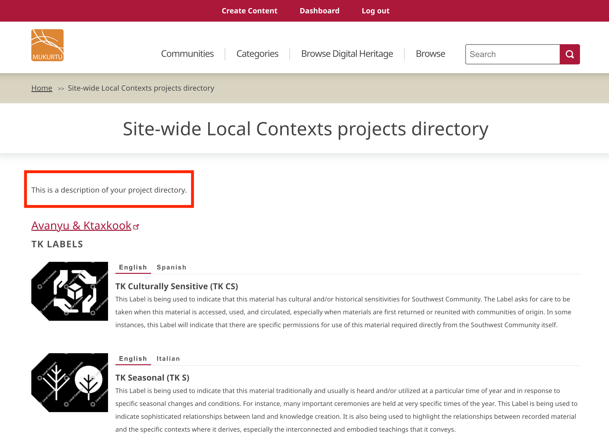