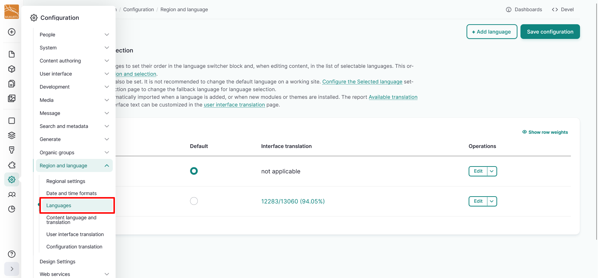
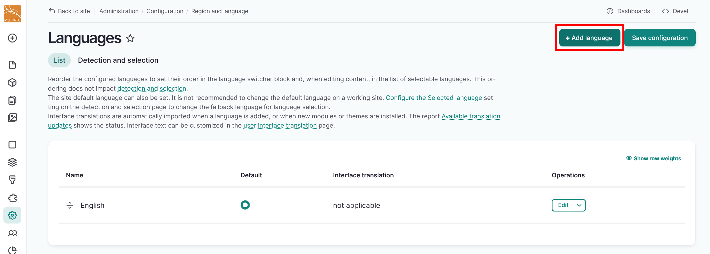
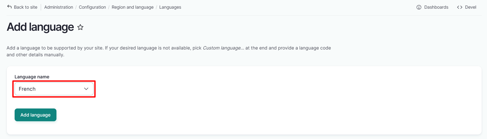
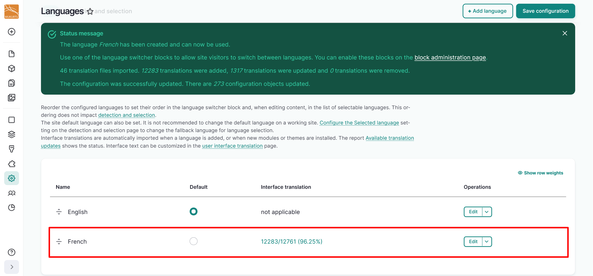
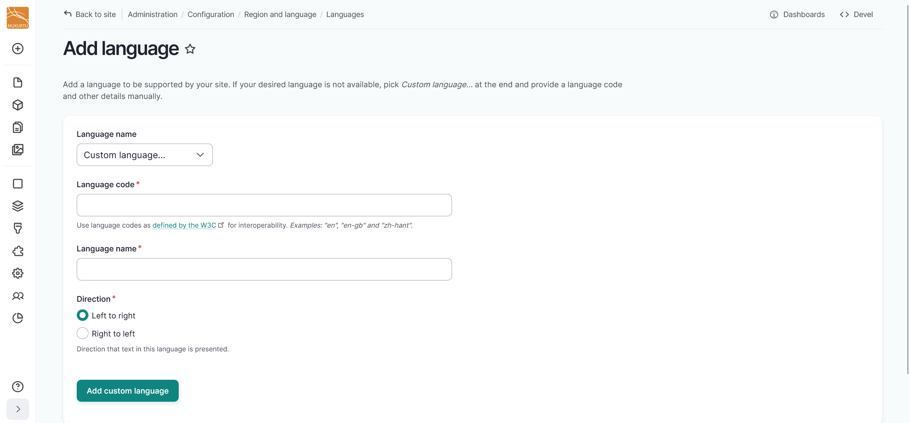

---
tags:
    - translation and localization
---

# Add Languages

!!! roles "User role"
    Mukurtu manager

You can add pre-configured or custom languages to your Mukurtu site after configuring translation by following the link in the warning message or by navigating to Configuration > Region and Languages > Language in your left-hand sidebar. You can access this setting directly by going to `/admin/config/regional/language`. For more information on configuring translation, refer to [Configure Translation and Localization](ConfigureTranslation.md)

## Add a pre-configured language

1. Select the "Add Language" button in the top right-hand corner of the Languages configuration page.

    

2. Select a language to be supported by your site from the dropdown menu. If your language is not listed in the dropdown menu, refer to [Add a custom language code](#add-a-custom-language-code) section of this article for instructions on how to add your language.

    

3. Select the "Add language" button to add the selected language to your site.
4. You will receive a confirmation message your language has been added successfully.

    

## Add a custom language code

1. If your language is not available, select the "Custom language" option to provide a language code and other details manually. Be aware that custom languages may require more translation work as fewer site elements may already be translated. For more information on translating site elements, refer to **WRITE AN ARTICLE FOR THIS**

    - A listing of IANA language tags can be found at the [IANA Language Tags Registry](https://r12a.github.io/app-subtags/) site. 
    - If your language is not listed, you can construct a custom language tag. For more information on constructing custom language tags, visit the [IANA Language Tags Registry](https://www.w3.org/International/articles/language-tags/). 

2. Add your language code in the *Language code* field.
3. Add the name of your language in the *Language name* field. 
4. Select a text direction for your language. 
5. Select the "Add custom language" button to import your language.
        
For more information on language tags and subtags, visit the [IANA Language Tags Registry Primary Language Subtag](https://www.w3.org/International/articles/language-tags/#language) article. For help configuring a custom language tag, please contact Mukurtu Support at [support@mukurtu.org](mailto:support@mukurtu.org).

## Switch enabled languages

To switch between languages in Mukurtu, you can use the language switcher button in the top right-hand corner of your top menu. The language switcher is only enabled when you have more than one language available on your site.

