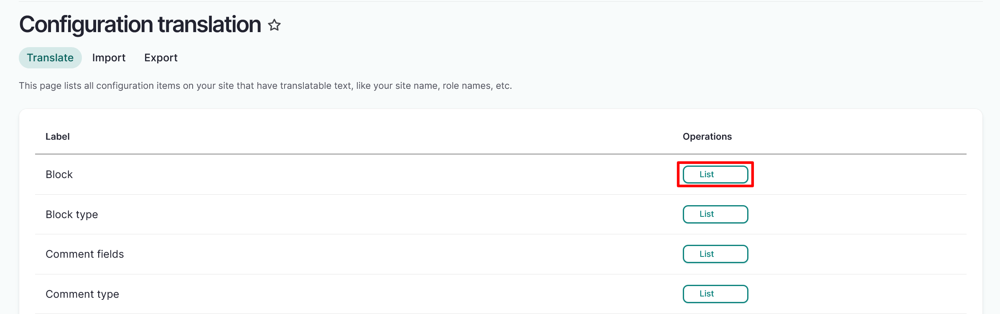
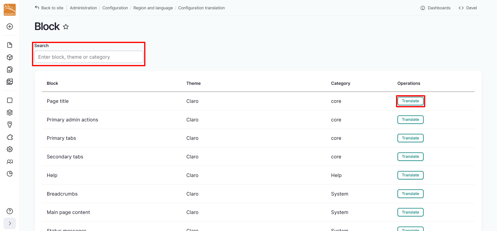
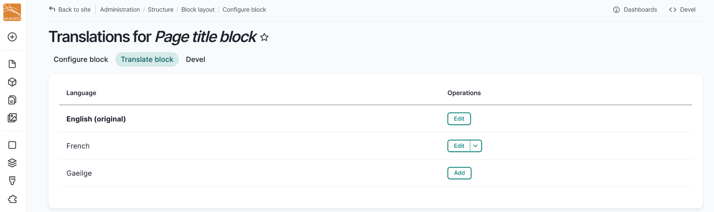
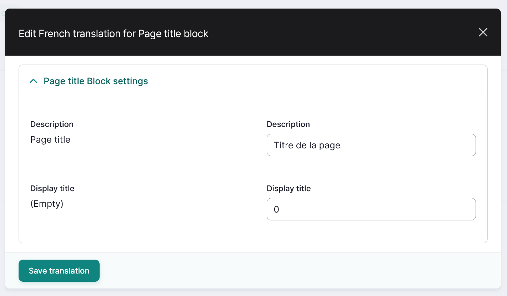

---
tags:
    - multilingual
---

# Configuration Translation

!!! roles "User role"
    Mukurtu manager

Mukurtu managers can translate all the configuration items on their site that have translatable text, such as the site name, role names, and other structural blocks. Depending on the language, some of the blocks may already be translated. To begin translating these, navigate to Configuration > Region and Language > Configuration Translation, or go directly to `/admin/config/regional/config-translation`.

1. Select the "List" button to the right of the label that contains the blocks you want to translate.

    

2. Select the "Translate" button to the right of the specific block title you want to translate. Use the *Search* field to search for specific blocks. 

    

3. If your block is not yet translated, select the "Add" button to add a translation. If it is already translated, select the "Edit" button to edit the translation.

    
    
4. Enter your preferred translation in the modal, then select "Save translation".

    
