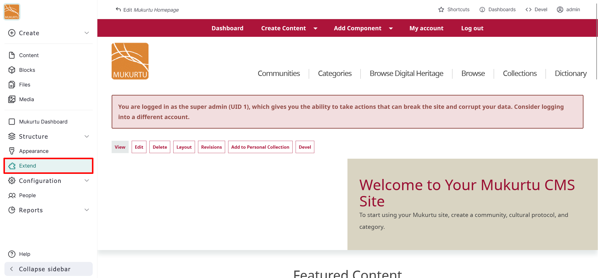
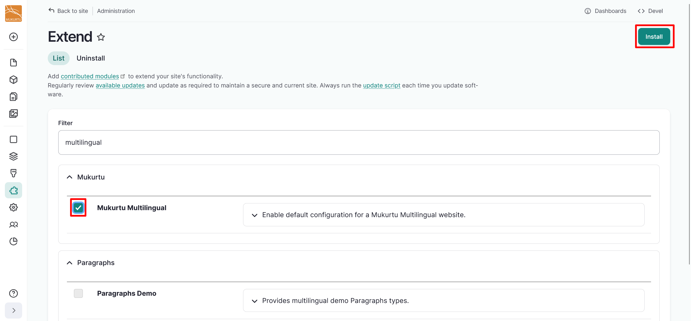
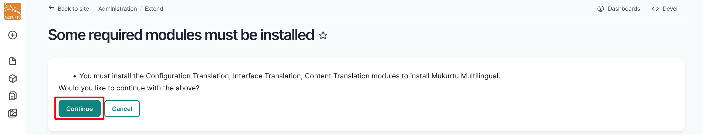

---
tags:
    - translation and localization
---

# Configure Translation and Localization

!!! roles "User role"
    Mukurtu manager

Mukurtu 4 supports translation and localization into multiple languages. 

The following modules are included and can be installed from the front end of the site. Configuration Translation, Content Translation, and Interface Translation must be installed manually, but the Language Module comes pre-installed.

- Configuration Translation
- Content Translation
- Interface Translation
- Language Module

Follow the instructions below to configure your site to display the user interface and site content in multiple languages. 

1. Select **Extend** from the left-hand sidebar menu, or navigate to `/admin/modules`.

    

2. Use the *Filter* field to search for "translation". Three translation modules, Configuration Translation, Content Translation, and Interface Translation, are grouped in the multilingual package.
3. Select all three modules, then select "Install".

    !!! tip
        The Language module should already be installed. If in doubt, search for and install it in the same way.

    

4. You will receive a status message confirming whether your modules have been installed. You will also receive a warning message with the next steps for configuring your Mukurtu site's language. For instructions on adding languages to your Mukurtu site, refer to [Add Languages](AddLanguage.md).

    