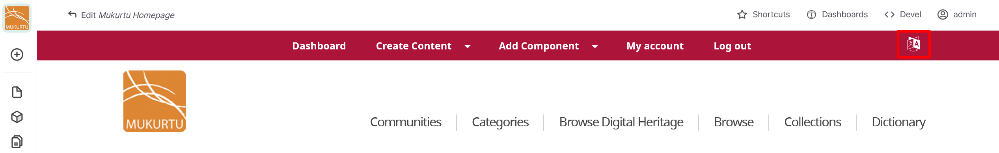

---
tags:
    - multilingual
---

# Multilingual Tools

!!! roles "User roles"
    Mukurtu manager, protocol steward, language steward, contributor, language contributor, curator, community record steward

To switch between languages in Mukurtu, you can use the language switcher button in the top right-hand corner of your top menu. The language switcher is only enabled when you have more than one language available on your site.

