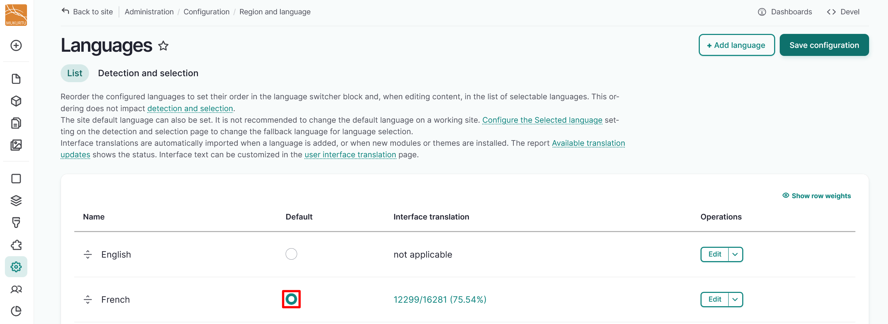
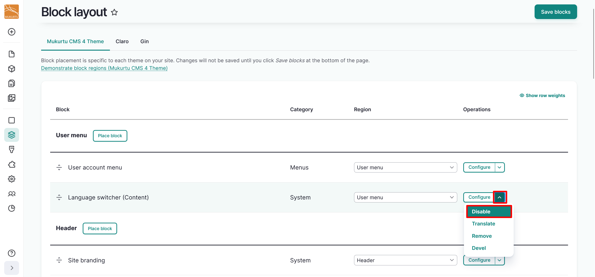
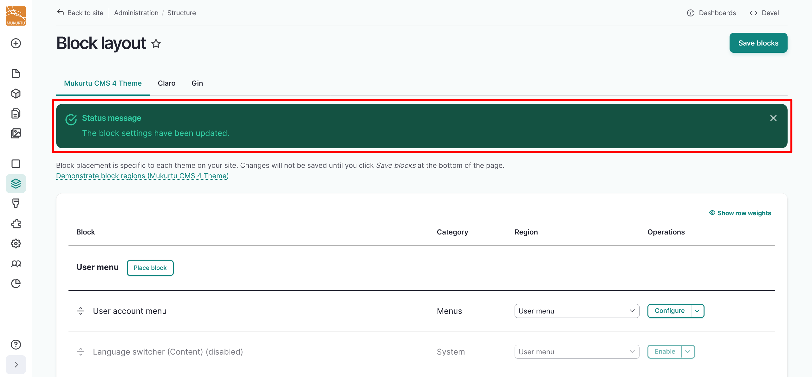
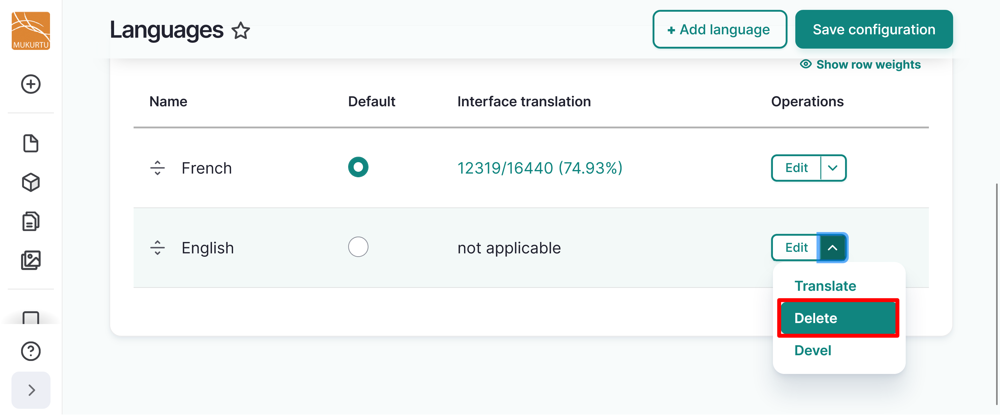
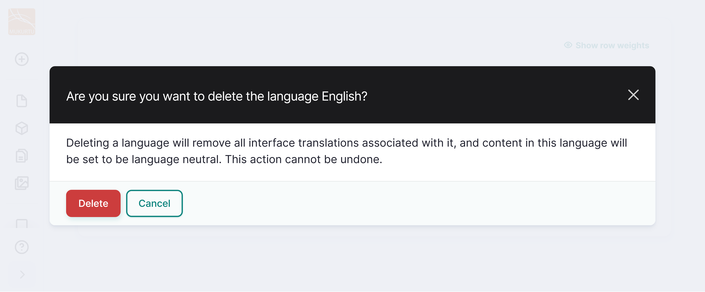

---
tags:
    - multilingual
---

# Configure the Default Site Language

!!! roles "User role"
    Mukurtu manager

By default, Mukurtu CMS installs and configures English as the default language. You may wish to change the default language for a single language site (eg: a site only in Spanish), or for a multilingual site (eg: a site with French as the default language, and another language as translation).

1. Refer to the [Mukurtu Multilingual](ConfigureTranslation.md/) and [Add a Language](ConfigureTranslation.md/#add-a-language) articles to enable Mukurtu Multilingual module and add a language to your site.
2. After adding your language, set it to default by selecting the radio selector to the right of your language in the Default column. 

    

3. Select "Save Configuration". 
4. Disable or remove the language switcher block by navigating to your administrative menu and select Structure > Block layout or navigating directly to `/admin/structure/block`. 
5. Under the User menu in the *Language switcher (Content)* field, use the dropdown menu to select Disable or Remove. 

    

You will get a status message confirming that the block settings have been updated.

   

5. The language switcher can also be removed by selecting the edit option to the left of the language switcher block. Select the **Edit** icon, then select the **Remove block** option.

   

   

6. Refer to the [Configuration Translation](ConfigurationTranslation.md) and [User Interface Translation](UITranslation.md) articles to translate any configuration or user interface strings.
7. New content does not need to be translated, and can simply be added in your preferred language.

