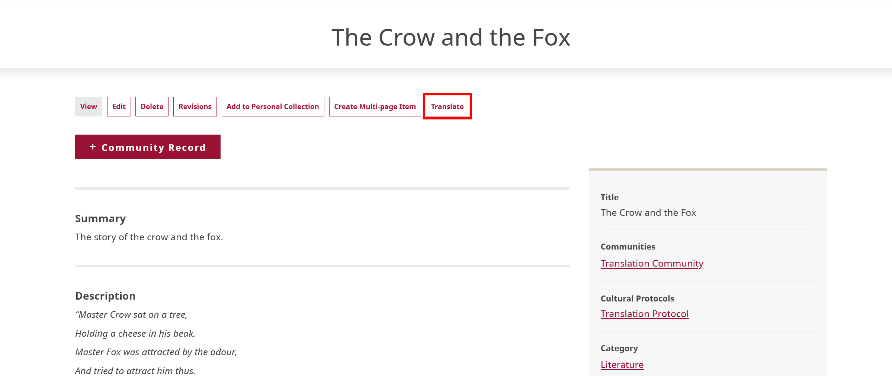
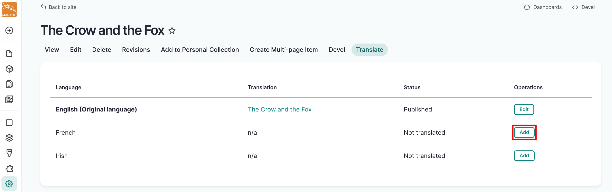
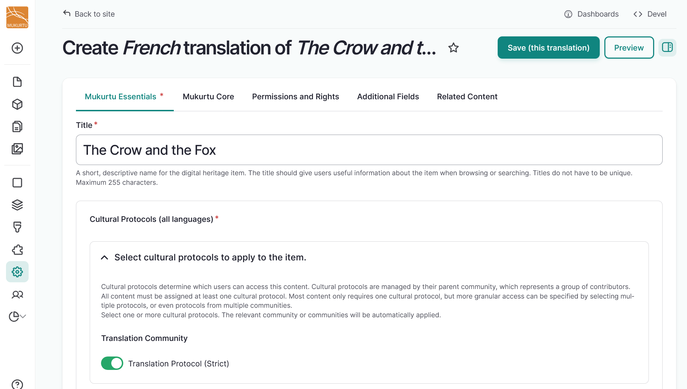
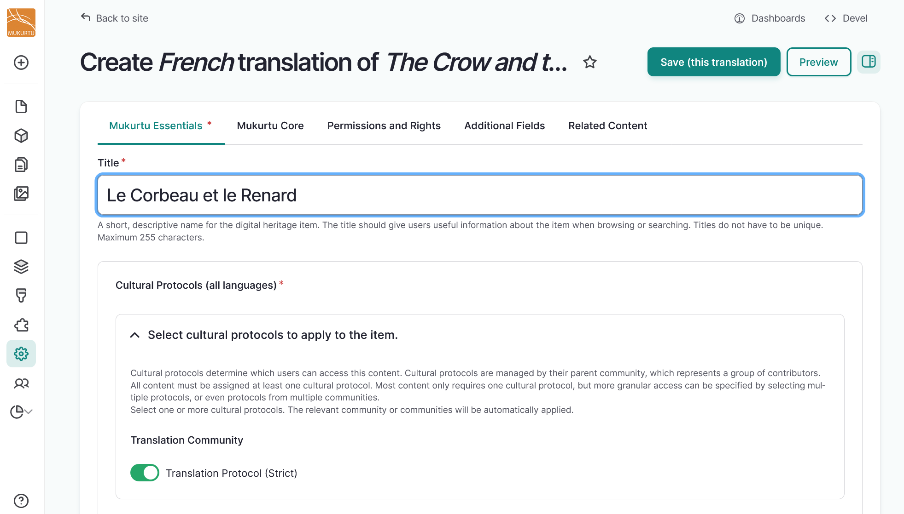
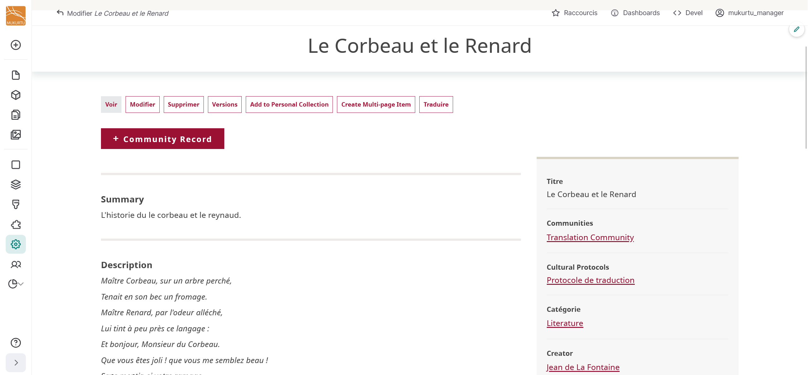

---
tags:
    - multilingual
---

# Translate Content

!!! roles "User roles"
    Mukurtu manager, protocol steward, language steward, contributor, language contributor, curator, community record steward

Once the Mukurtu Multilingual module is installed and a language is added (see [Configure Translation](ConfigureTranslation.md)), site content can be translated.

If a user can create or edit a piece of content, they can also translate it - additional roles or permissions are not required. 

Content translation functions the same way for all content types. 

1. Navigate to the content you want to translate and select the "Translate" button.

    

2. Select the "Add" button to the right of the language you want to translate your content into. 

    

3. The fields appear with text in the original language for ease of reference. Replace this text with your preferred translation.

    

4. When you complete your translation, select the "Save (this translation)" button in the top right-hand corner to save your translation.

    

5. This is what a translated digital heritage item looks like. 

    