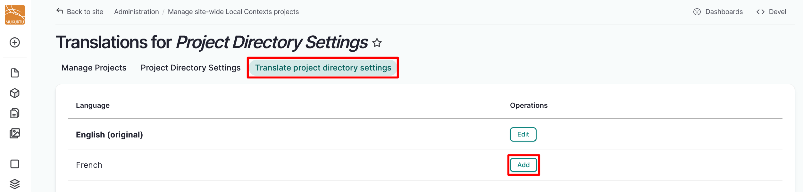
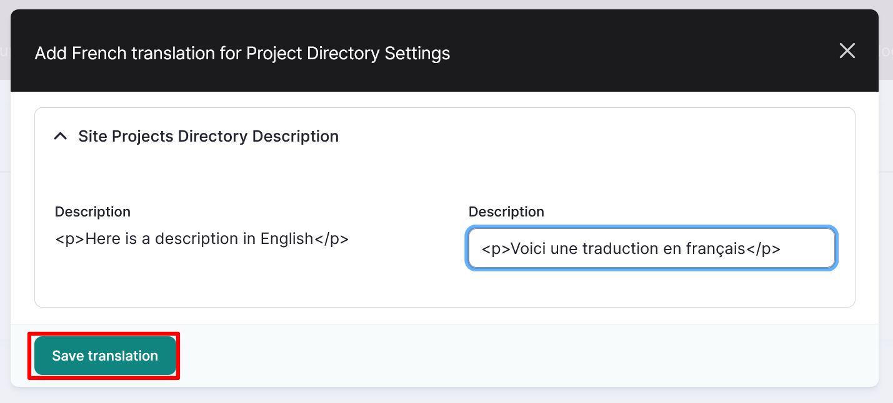
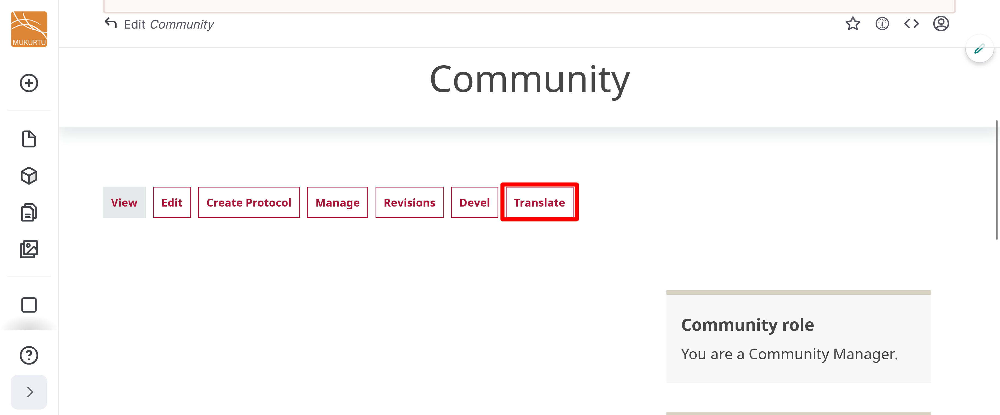
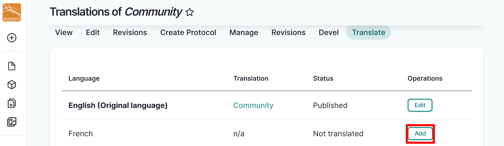
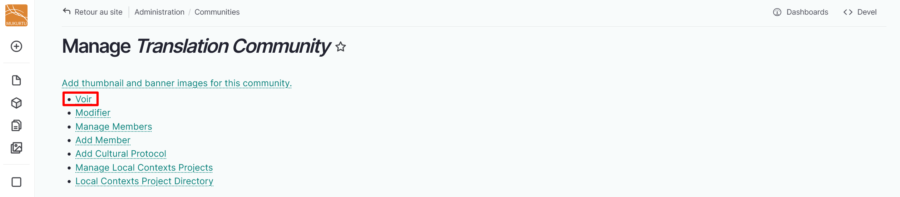
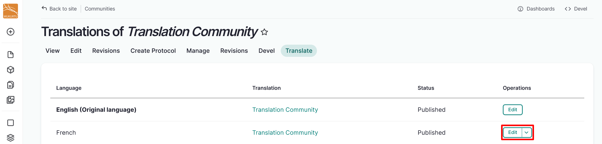
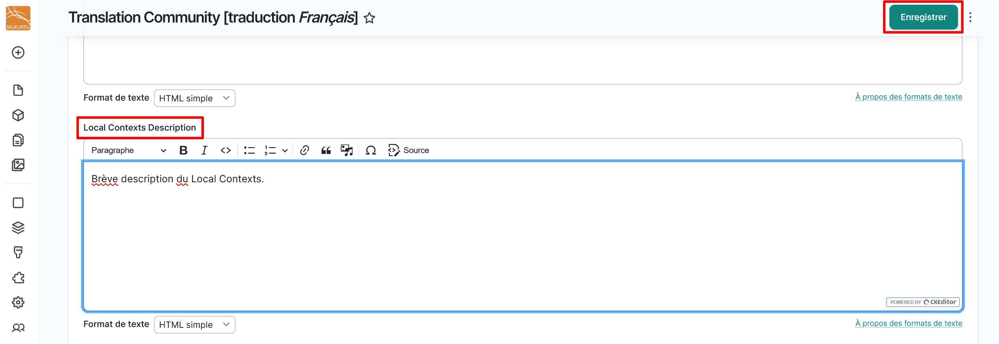
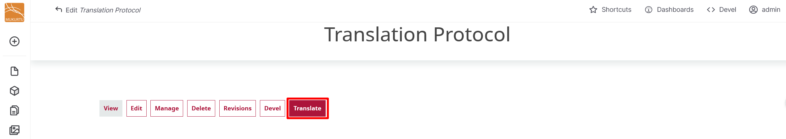
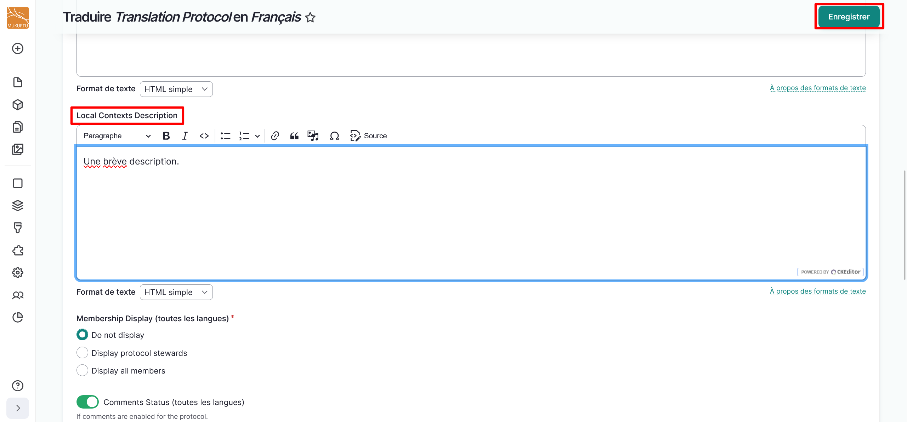

---
tags:
    - multilingual
    - local contexts
---

# Translate Local Contexts Directory Descriptions

!!! roles "User roles"
    Mukurtu manager, community manager, protocol steward

Local Contexts project directory descriptions can be translated in Mukurtu when they are applied Site-wide, to communities, or to cultural protocols.

!!! tip
    Local Contexts projects and labels must be translated at the Local Contexts Hub. Visit [Local Contexts: Working with the Labels in the Hub](https://localcontexts.org/support/working-with-labels/#customize-labels) for more information.

## Translate site-wide directory descriptions

From your **Dashboard**, navigate to **Manage Local Contexts Projects**. Refer to the [Local Contexts: Using Labels and Notices](../local-contexts/ApplyLabelsAndNoticesToSiteContent.md) to apply your Local Contexts projects. Refer to [Manage Local Contexts Projects](../local-contexts/ManageLocalContextsProjects.md) for how to manage your project directory description. 

Once your Local Contexts projects are applied, navigate to the **Translate project directory settings** tab. 

Enter your translated *Description* text, then select "Save translation". 

## Translate community directory descriptions

1. Navigate to your community page through the **Communities** link on your home page, through your **Dashboard**, or by going directly to `/communities`. 
2. Select the community you want to translate the Local Contexts directory description for.

    !!! tip
        The Local Contexts project must be applied to the community and have an existing translation and directory description and for it to be translated. For more information on applying Local Contexts projects and labels to communities, refer to [Local Contexts: Using Labels and Notices](../local-contexts/ApplyLabelsAndNoticesToSiteContent.md) to apply your Local Contexts projects. Refer to [Manage Local Contexts Projects](../local-contexts/ManageLocalContextsProjects.md) for how to manage your project directory description.

3. Select "Translate". 

    

5. Select "Add" to add a translation.

    

6. Select "Save" to save your translation. Note that this button might be in the new language.
7. Navigate back to your Community page by selecting "View".

    

8. Select "Translate". 

    

9. Select "Edit" to edit your translation.

    

10. Navigate to the *Local Contexts Description* field and enter your translation. 
11. Select the "Save" button. Note that this button may be displaying in the new language.

    

## Translate cultural protocol directory descriptions

1. Navigate to your cultural protocol through through your **Dashboard** by selecting Cultural Protocols, or by going directly to `/admin/protocols`. 
2. Select the cultural protocol you want to translate the Local Contexts directory description for.

    !!! tip
        The Local Contexts project must be applied to the cultural protocol and have an existing translation and directory description and for it to be translated. For more information on applying Local Contexts projects and labels to cultural protocols, refer to [Local Contexts: Using Labels and Notices](../local-contexts/ApplyLabelsAndNoticesToSiteContent.md) to apply your Local Contexts projects. Refer to [Manage Local Contexts Projects](../local-contexts/ManageLocalContextsProjects.md) for how to manage your project directory description.

3. Select "Translate". 

    

4. Select "Add" to add a translation.

    

5. Navigate to the *Local Contexts Description* field and enter your translation. 
6. Select the "Save" button. Note that this button may be displaying in the new language.

    