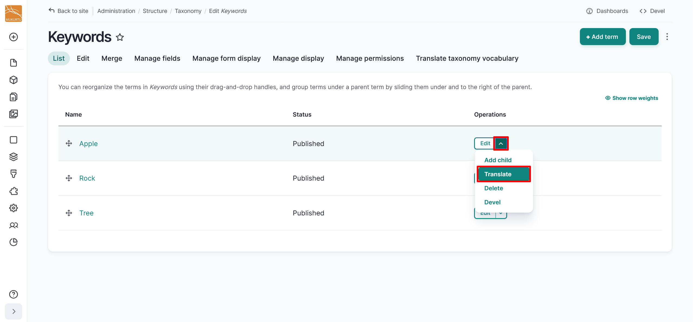
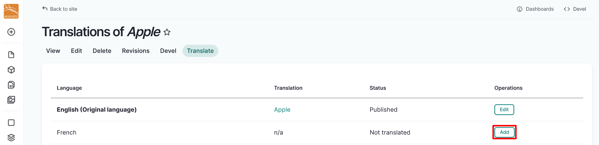
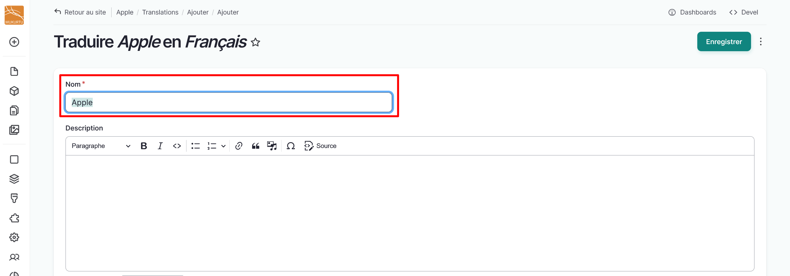
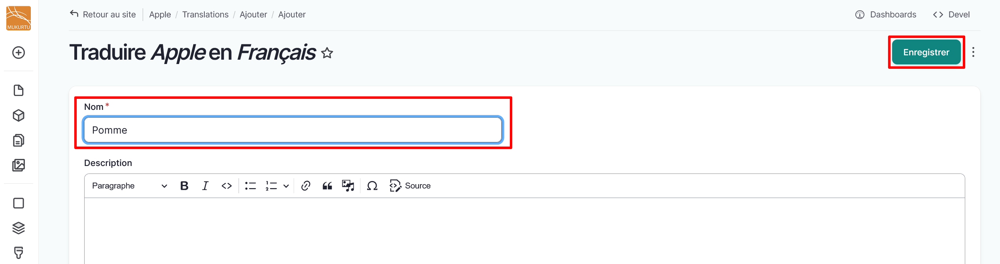

---
tags:
    - multilingual
    - taxonomies
    - content
---

# Translate Taxonomies

!!! roles "User role"
    Mukurtu manager

Translate taxonomy terms by selecting Manage Taxonomies from the Dashboard or navigating directly to `/admin/structure/taxonomy`.

!!! tip
    Taxonomy terms cannot be translated when translating content. Attempting to translate them from content will simply add additional terms to the taxonomy. 

1. Select a taxonomy.

2. Navigate to a taxonomy term. From the dropdown menu to the right of the taxonomy term, select **Translate**.

    

3. Select "Add" to the right of the language you want to translate the term into.

    

3. Select the text in the *Name* field and replace it with your new translation. 

    

4. Select "Save" to save your translation. 

    

5. Repeat these steps to translate your taxonomy terms into additional languages. 