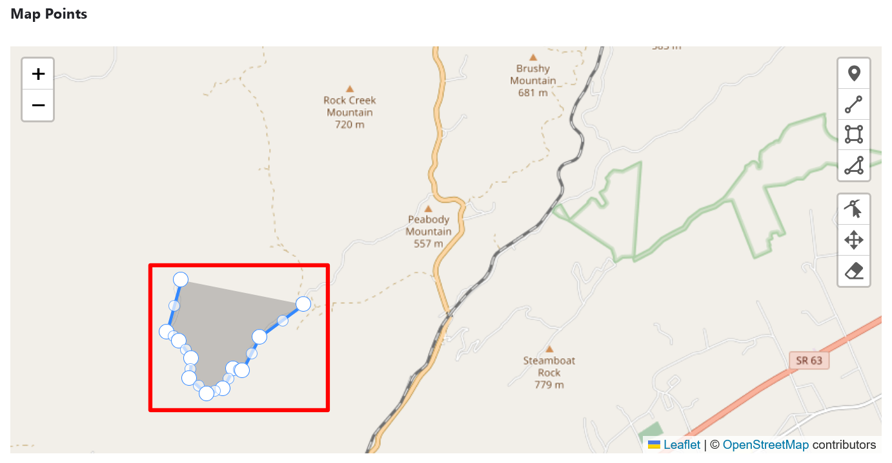
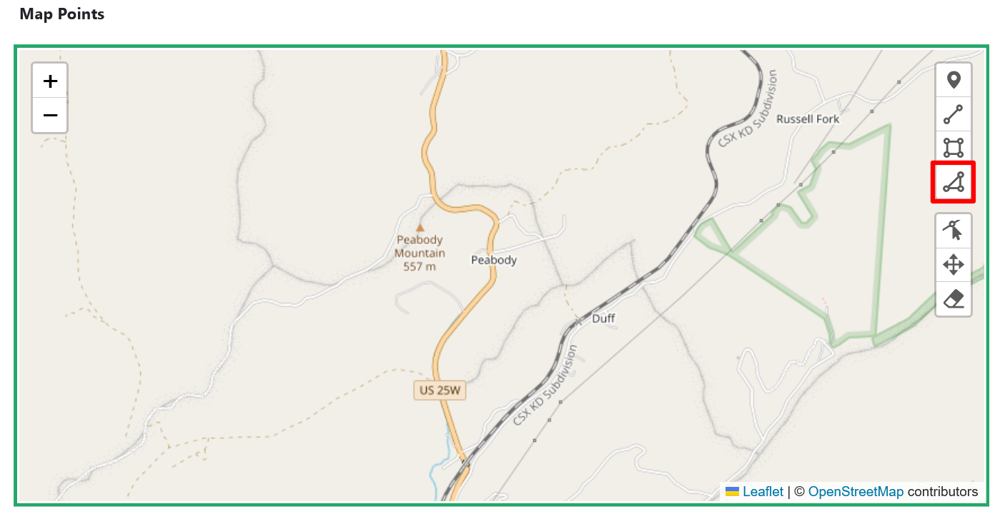

# Create Map Points

!!! roles "User roles"
    Protocol steward, contributor, community record steward, curator, language steward, language contributor 

Mukurtu allows users to create and manage map points and areas using the embedded Leaflet maps. 

## Location settings

If you have location settings enabled in your browser, your map will automatically center on your location. If you do not have location settings enabled in your browser, the map will automatically center in the middle of the Atlantic Ocean. Zoom out by selecting the "-" icon to enlarge your map, or select and drag the map to a different location.

## Add map layers

You can easily add layers to highlight features on your map, including markers, polylines, rectangles, and polygons. 

### Add a marker

1. To add a marker, or point, to your map, select the "Draw Marker" icon in the top right-hand corner of the map.

    

2. Select a location on the map to place a marker. There is no limit on the number of markers you can drop.

     

3. Select "Cancel" to finish dropping markers.

    

4. Label your marker by selecting the marker and entering a location description in the *Map points description* field on the map. If you do not label your marker, the label will default to the name of your content.

### Add a polyline

Polylines are lines that consist of multiple joined points to create a path. This can be useful for highlighting significant routes or roads. Follow the directions to draw a polyline layer on your map.

1. To add a polyline to your map, select the "Draw polyline" icon from the right-hand edge of your map.

    

2. Select the beginning of your polyline on the map to place the first marker, or vertex. There is no limit on the number of vertices you can drop.

    

3. Continue your line by placing another vertex. A line will connect the two vertices.

    

4. To finish your line, select an existing marker. 

    

    

5. To edit your polyline while you are drawing it, select the "Remove last vertex" button.

    

6. To edit your polyline after it is complete you can select and drag one of the vertices. 

    

7. Label your polyline by selecting the line and entering a location description in the *Map points description* field on the map. If you do not label your polyline, the label will default to the name of your content.

### Add a rectangle

Rectangles can indicate an area. Follow the directions to add a rectangle layer to your map.

1. To add a rectangle to your map, select the "Draw Rectangle" icon from the right-hand edge of your map.

     

2. Select a location to place your first vertex. This vertex will be one corner of your rectangle.

     

3. Move your cursor to select a location for your final vertex. This vertex will be opposite the first vertex and the rectangle will be shaped between them.

     

4. Select the location to place your final vertex to complete your rectangle.

    

7. Label your rectangle by selecting the shape and entering a location description in the *Map points description* field on the map. If you do not label your rectangle, the label will default to the name of your content.

### Add a polygon

Polygons can indicate a specific area. Follow the directions to add a polygon layer to your map.

1. To add a polygon to your map, select the "Draw Polygon" icon from the right-hand edge of your map.

     

2. Select a location to place your first vertex. This is similar to the process for adding a polyline. 

     

3. Continue your polygon by placing another vertex. Continue placing vertices until you have drawn your polygon.
    
     

4. Select the first marker to finish drawing your polygon. 

     

     

5. To edit your polygon while you are drawing it, select the "Remove last vertex" button.

    

6. Label your polygon by selecting the polygon and entering a location description in the *Map points description* field on the map. If you do not label your polygon, the label will default to the name of your content.

## Edit and remove map layers

To edit the objects on your map, you can use the three editing icons on the right-hand side of the map. 

1. To edit individual vectors, select the "Edit layers" icon. This icon highlights all of the vertices on your map. 
    
    - Move the vertex or vertices by selecting one at a time dragging it to a new location. 

        !!! tip
            If you are trying to draw an amorphous shape, you can outline it by selecting and moving vertices. Each vertex you move generates an inactive vertex to either side. These vertices can be activated by selecting them. This allows you more flexibility to outline lines or shapes.
    
    

2. To move objects or layers, select the "Drag layers" icon. You can then select and drag your objects to a new location.

    

3. To remove objects or layers, select the "Remove layers" icon. Select the objects you want to remove, then select "Finish" when done.

    
    
    
