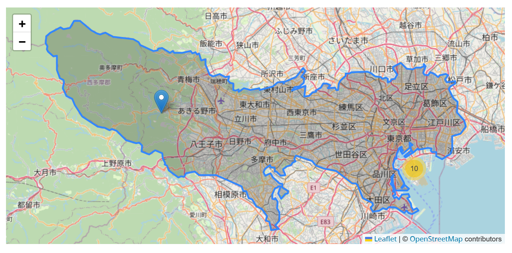
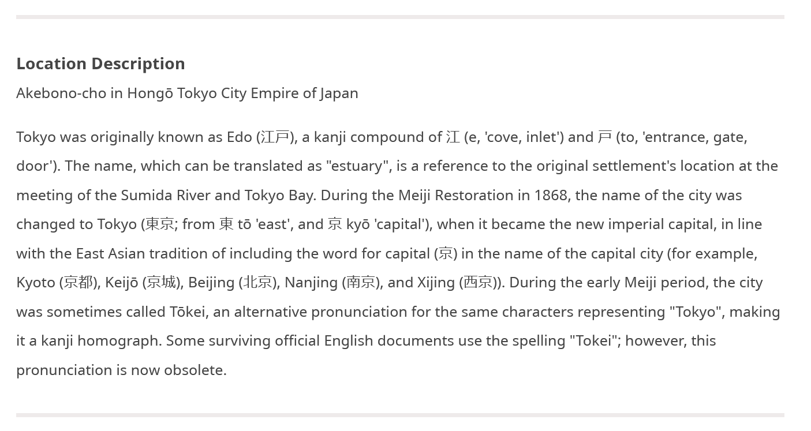
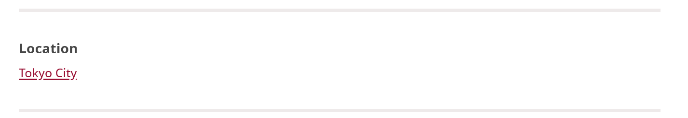

# Understanding Location Fields

Mukurtu uses three different location fields to help describe, locate, and discover content based on location data and information.

These three location fields are available for all content types (digital heritage items, collections, dictionary words, word lists, person records, and place records), and are generally found in the Additional Fields tab when creating or editing content. The exception to this is in place records, where the location fields are found in the Mukurtu Essentials tab.

## Map points

Map points provides an interactive mapping tool that allows users to identify multiple locations within the content, and provide individual labels for each location. The available map point types are single point markers, paths, polygons, circles, and rectangles. This location data is used in the map-based browse views and is displayed on content pages. The data is stored in a GeoJSON format. 

If your location data is in a Shapefile (.shp), OpenStreetMaps (.osm), or other file format that is not GeoJSON, you can convert it using web-based programs like [QuickMapTools](https://www.quickmaptools.com/convert) or command line programs like [ogr2ogr](https://ogre.adc4gis.com/) (which also has a web client). 

While Mukurtu has robust privacy controls, we know that certain place and location data (e.g., sacred sites, natural resources) can be very sensitive, so we encourage you to use this field appropriately. There may be cases where including a name or description in one of the other fields is preferable to pinpointing the location on a map.

## Location description 

Location description is a rich text field that allows for longer descriptions or more information about the place(s) referenced in the content. It may be useful in cases where a general description of the places are appropriate or when more context is necessary.

## Location 

Location is a taxonomy field that can label and connect content using the same term. Content can list multiple location terms, which is useful if multiple locations are mentioned, or a place is identified by multiple names.

