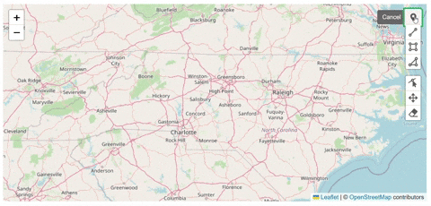
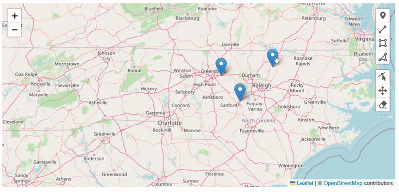
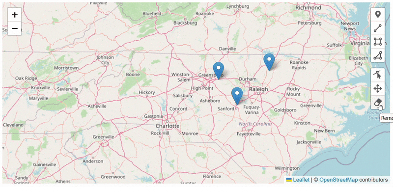

# Map Points

There are several ways users can highlight the location for content items. One of the most visual is by using the **Map Points** field. This is an interactive map from [Leaflet](https://leafletjs.com/) that supports various marking methods. Users can mark one or more points, paths, or areas on the map.

To mark a specific location on your map with a pin, select the "Place Marker" icon on the map. It is the icon on the top right hand side of the map.

To label your pin, select the pin and enter the name of the label in the *Location Description* text box.

To erase any pins you do not want, select the "Erase" icon, then select any pins you want to erase.

