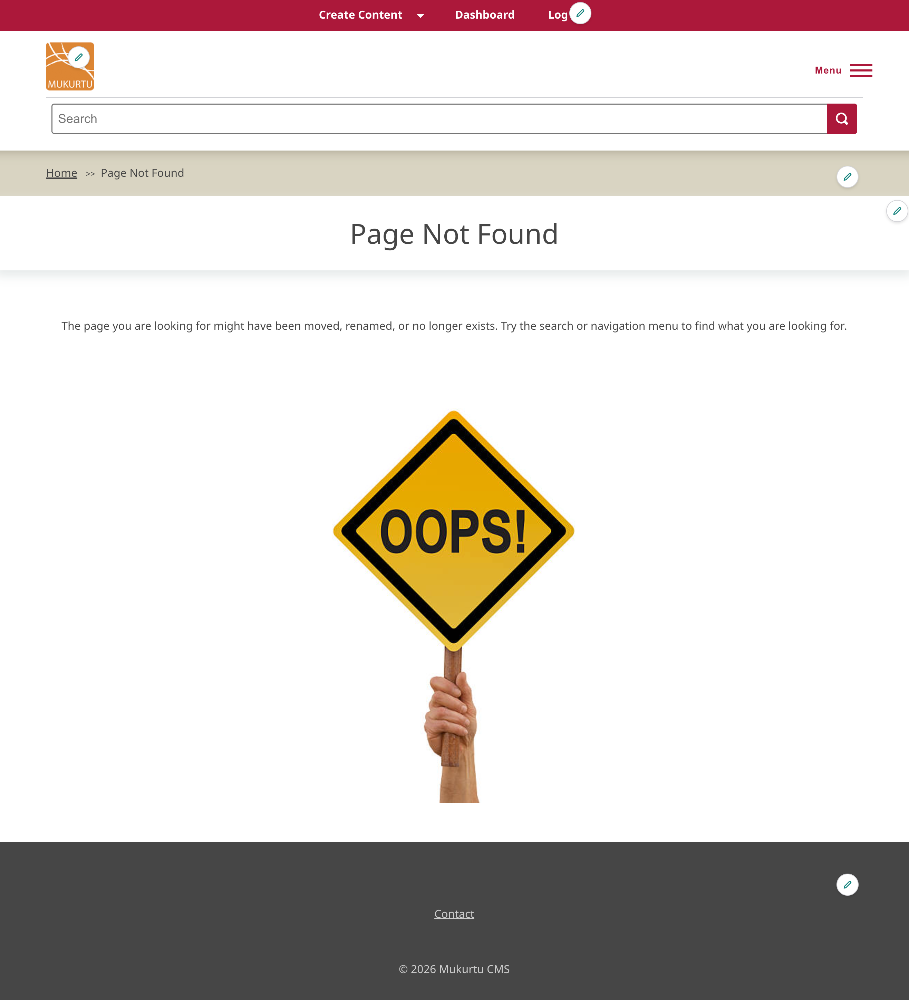

---
tags:
- site settings
---
# Configure the "Access Denied" and "Not Found" Page Settings

!!! Roles "User roles" 
    Administrator, Mukurtu manager

The "Access denied" page displays when a user attempts to access a page they do not have permission to view. The "Not found" page displays when a user attempts to access a page that doesn't exist on the site. These pages will display a default message, but you also have the option to customize them.

The "access denied" page can be found on the **Dashboard** under **Look and Feel**, select **Access Denied Page.**

The "not found" page can be found on the **Dashboard** under **Site Settings**. Select **Not Found Page.**

For either page, you can edit the title and add a custom message using the formatted text field. This allows you to add media and other elements to further customize the page.

When you've made your changes, select "Save Configuration". 

