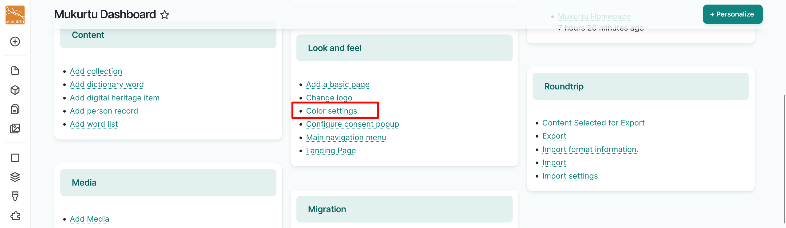
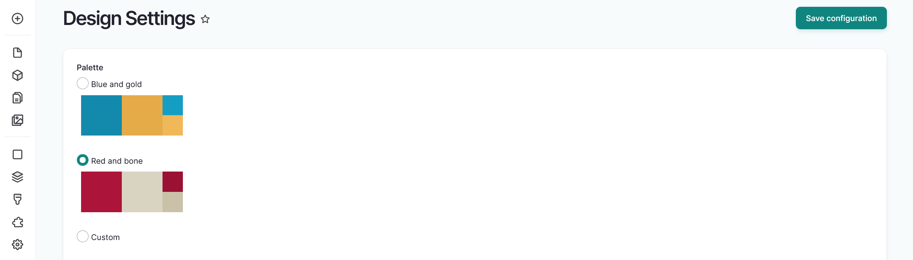
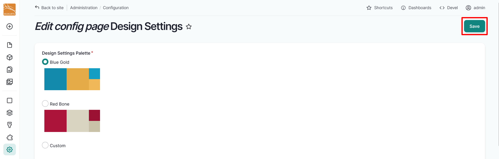
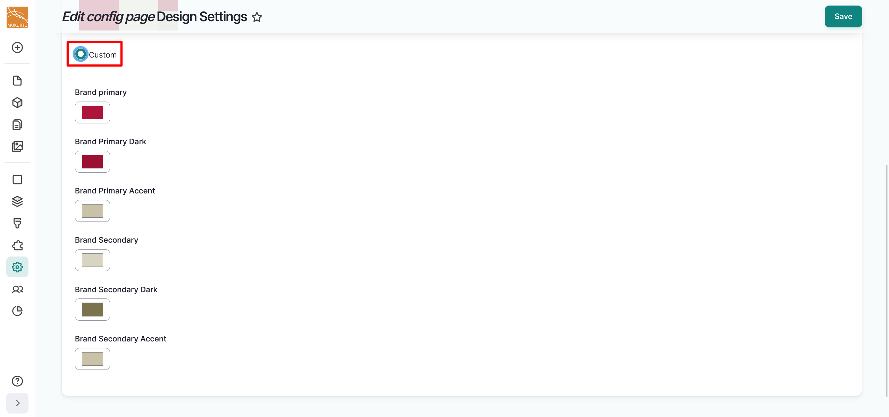
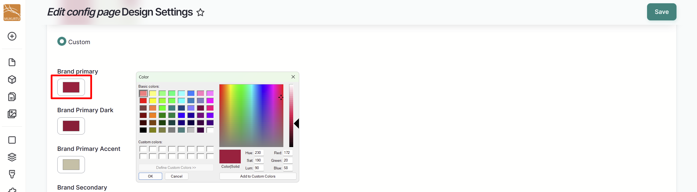
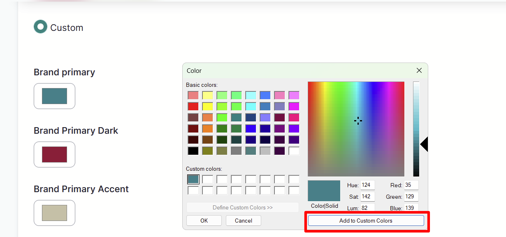
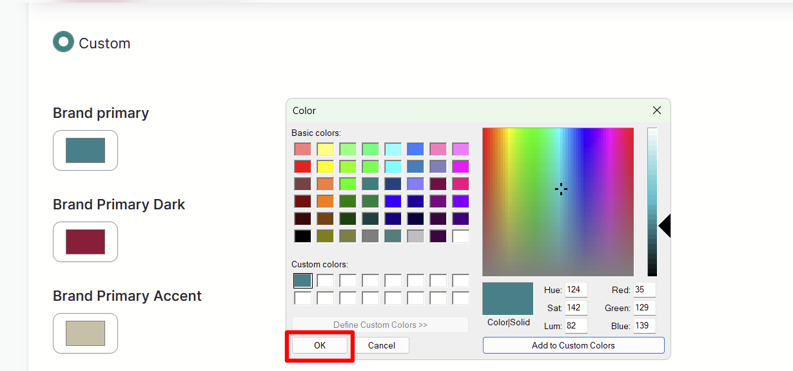
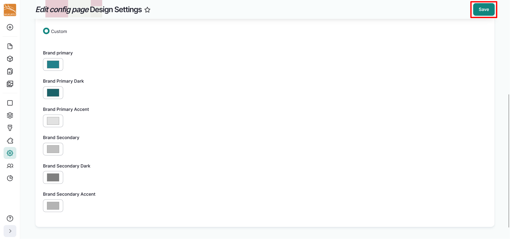

---
tags:
    - getting started
    - look and feel
---

# Configure Color Settings

!!! roles "User role"
    Drupal administrator

Mukurtu CMS offers three color palettes for your site: our custom Blue Gold palette, our classic Red Bone palette, and our new Custom palette, which allows you to easily configure a color palette that matches your organizational brand. You can configure your color palette settings in the **Dashboard** by navigating to **Look and Feel** and selecting the **Color settings** link.

## Select preconfigured colors

1. Select the radio button to the left of the **Blue Gold** or **Red Bone** palette.

    

2. Select the "Save" button to apply your color palette site-wide.

    

## Configure the custom palette

1. Select the **Custom** radio button.

    

2. Select the color selector for the colors you want to edit. 

    

3. Use the Color modal to select the color you want to apply. You can select from basic colors or add custom colors.
4. Select a basic color using the **Basic Colors** section of the modal.
5. To select a custom color, use the color selector on the right-hand side of the modal. You can use the *HSL* (*Hue Sat Lum*) or the *RGB* (*Red Green Blue*) fields to specify colors. 

    - To save a custom color, select a blank **Custom colors** box before you input your custom color on the right. Select "Add to Custom Colors" to add the color to your custom colors.

    

6. Select the "Ok" button to apply your chosen color to your custom palette. 

    

7. Select the "Save" button to apply your color palette site-wide.

    