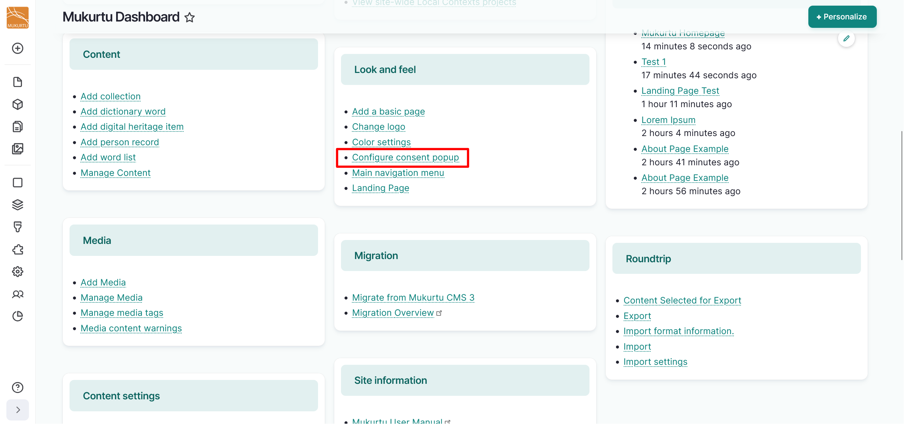
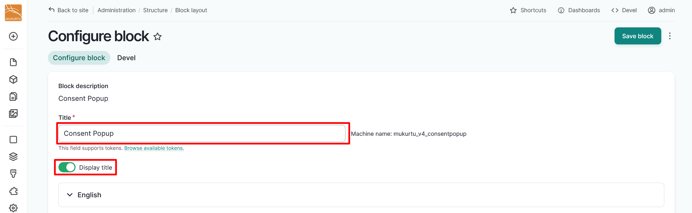
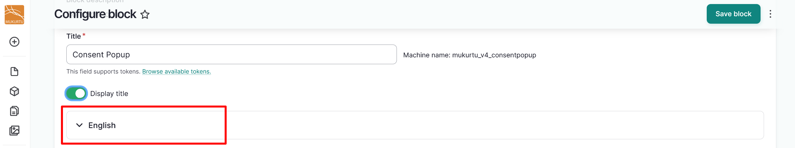
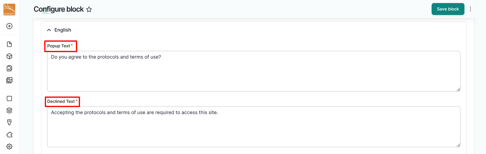
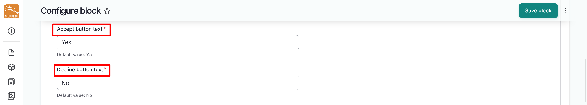
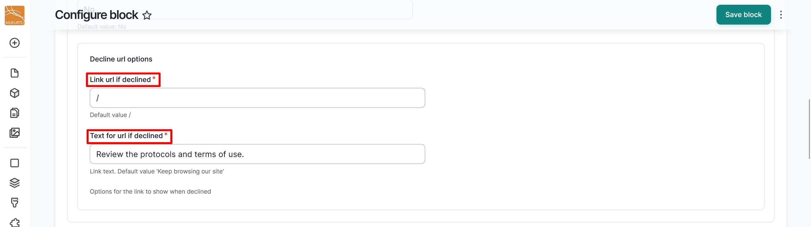
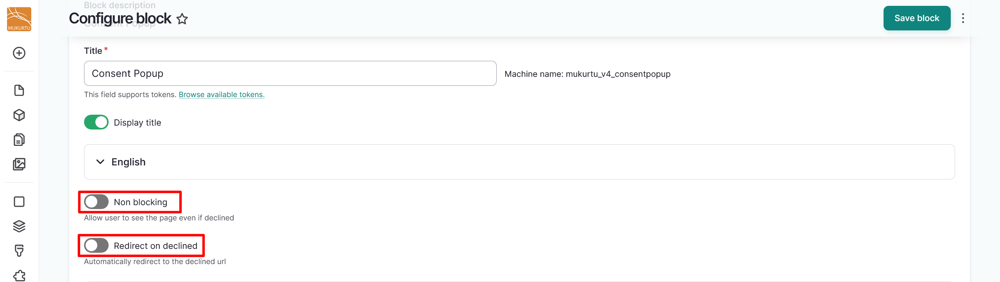

---
tags:
    - getting started
    - look and feel
---

# Configure Consent Popup

!!! roles "User role"
    Drupal administrator

Some Mukurtu CMS sites may choose to use consent popups that appear when their site is accessed. These can require users and visitors to their site consent to certain terms of use in order to access the site or can require visitors to acknowledge something about the content on the site. Follow the instructions below to configure your site's consent popup.

1. From the **Dashboard**, navigate to the **Look and Feel** section and select the **Configure Consent Popup** link.

    

2. Use the *Title* field to change your title. This field includes the default title "Consent Popup".
3. Use the **Display title** toggle to select whether to display the title of your consent popup.

    

4. Select the **English** dropdown section. All of the fields in this section are required.

    !!! tip
        This dropdown is configured automatically to reflect the languages that are enabled on your site. If you have more than one language enabled, you must configure this popup individually for each language. To change your site's primary language or add additional languages to your site, refer to our [Translation Workflow](../multilingual/TranslationWorkflow.md) article.

    

5. Use the *Popup Text* field to edit the text on the consent popup.
6. Use the *Declined Text* field to edit the text that will display if the user chooses to decline to accept the terms of the consent popup. 

    

7. Use the *Accept button text* field to edit the text on the "Accept" button. The default value for this field is **Yes**.
8. Use the *Decline button text* to edit the text on the "Decline" button. The default value for this field is **No**.

    

9. If the consent popup is declined, use the *Link url if declined* field to redirect users to another link.
10. Use the *Text for url if declined* field to set link text for the URL.

    

11. Select the **Non blocking** toggle to allow users to see the page even if they decline.
12. Select the **Redirect on declined** toggle to automatically redirect users who decline to the declined URL.

    

13. Use the **Cookie info** section to define your *Cookie Name* and *Cookie life time*, or how many days until the cookie is deleted. This setting determines how many days until the cookie is automatically deleted.
