---
tags:
    - multilingual
    - look and feel
---

# Configure Font

!!! roles "User role"
    Drupal admin

The primary font on Mukurtu CMS is BC Sans, which was selected for its wide support of Indigenous languages. If your site requires a custom font, you can update your font from code or by installing a module such as @font-your-face.

!!! warning 
    The instructions in this article require a degree of familiarity working with command line tools and editing code, which is not without risk. Changing your code may break your site and corrupt your data. Before following these instructions, make sure to back up your site, and confirm that you can restore from a backup.

If you would like to add other fonts to your theme, simply download the appropriate font files (WOFF and WOFF2 generally, though TTF is also supported) to the fonts folder in the theme, and update the relative path as needed. If a serif font is required, users should assess [First Nations Unicode Font](https://cis.arts.ubc.ca/community/first-nations-unicode-font/) from the University of British Columbia, which seems similar to BC Sans in its support of Indigenous languages. Follow the instructions below to add a font from your code source to the Mukurtu 4 and Gin (admin) themes.

!!! tip
    You can convert your chosen font to WOFF or WOFF2 format using [https://cloudconvert.com/](https://cloudconvert.com/) or any other conversion tool. Download your new file and save it in a place that is easily accessible.

## Configure from code

### Configure Mukurtu 4 theme font

1. Select your font file. 
2. Open your file directory and navigate to `\mukurtu\themes\mukurtu_v4\fonts`. 
3. Drop your font file into the fonts folder.

    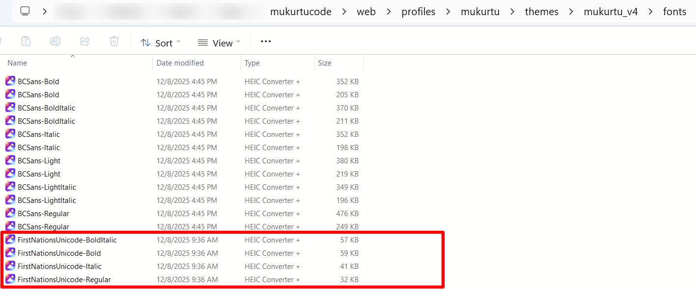

4. Navigate to `\mukurtu\themes\mukurtu_v4\components\00-base\typography`.
5. Select the `_fonts.scss`file. You may choose to edit this in your browser or your preferred text editor. 
6. Edit the .scss file to reflect your chosen fonts.

    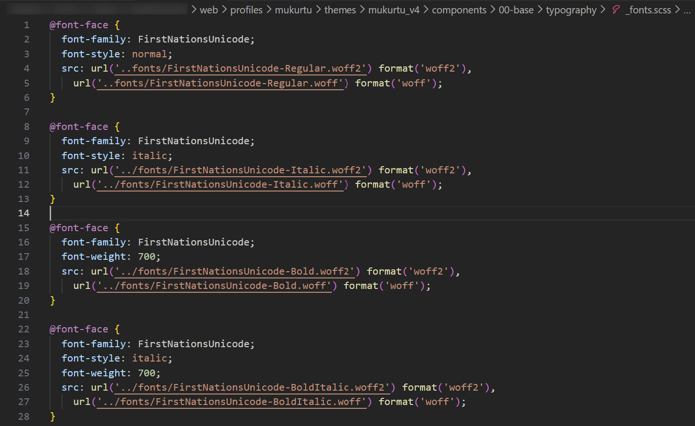

7. Save this file to update your fonts. 

### Configure Gin (admin) theme font

1. Select your font file. 
2. Open your file directory and navigate to `\themes\contrib\gin\dist\media\font`. 
3. Drop your font file into the fonts folder.

    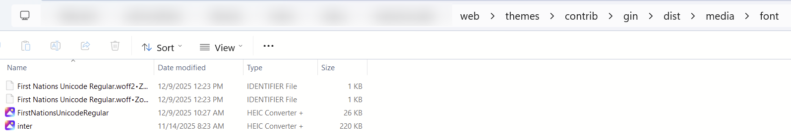

4. Navigate to `\themes\contrib\gin\dist\css\theme`.
5. Select the `_font.css` file. You may choose to edit this in your browser or your preferred text editor. 
6. Edit line 9 of the .css file to reflect your chosen fonts.

    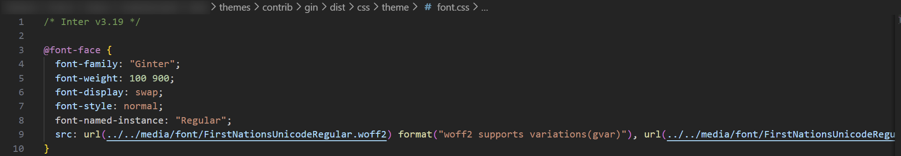

7. Save this file to update your fonts. 

## Configure from module 

@font-your-face provides an administrative interface for browsing and applying web fonts using CSS @font-face. Drupal administrators can install @font-your-face using Composer. 

!!! requirement 
    You must have command line administrative privileges to add modules to your Mukurtu CMS site. 

### Add a module

For instructions on adding a module to your Mukurtu CMS site, refer to the [Install a Module](../infrastructure/InstallModule.md) article.

### Add custom fonts 

1. Navigate to Appearance > @font-your-face > Custom Fonts or go directly to `/admin/appearance/font/local_font_config_entity`. 
2. Select the "+ Add Custom Font" button. 

    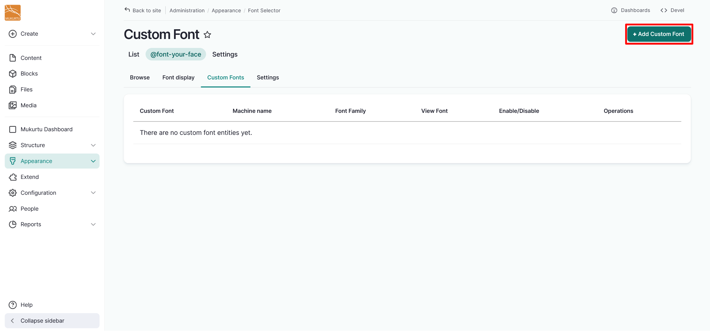

3. Enter a Label for your font. This will be the font's name and must be unique. 
4. Enter a Font family. This refers to the CSS font family and the @font-face name will be based on this. 
5. Optionally, you can select a Font Style and Font Weight from the dropdown menus. Use the checkboxes to select a Font Classification. 

    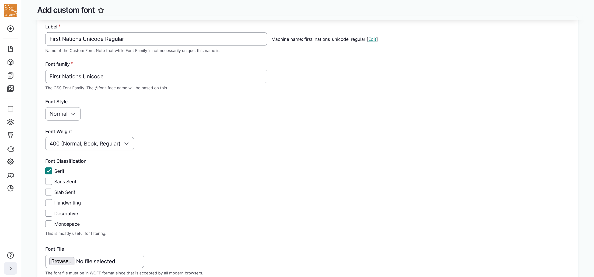

6. Select the "Browse" or "Choose File" button to upload your font. The name of the button depends on your browser. 

    !!! requirement 
        Fonts must be in WOFF format. You can convert font files to WOFF format using [https://cloudconvert.com/](https://cloudconvert.com/) or any other conversion tool. 

    

7. Select "Save" to save your font file. 

    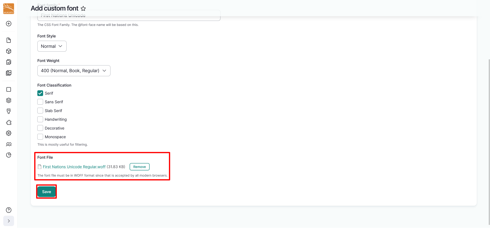

### Enable fonts 

1. Navigate to Appearance > @font-your-face > Browse or go directly to `/admin/appearance/font`. 
2. Select the "Enable* button to enable your font. 

    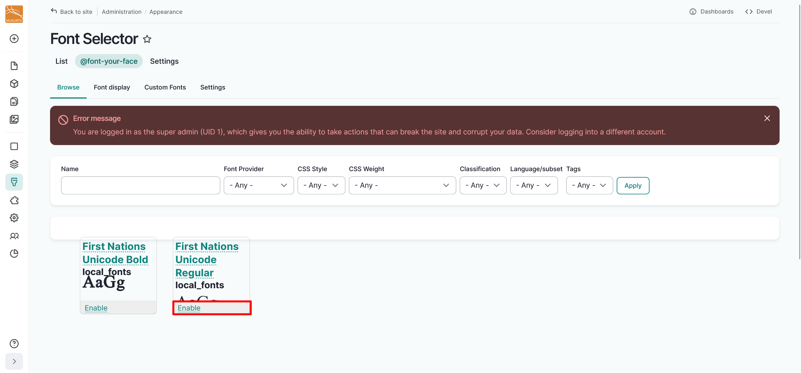

### Add font display 

1. Navigate to Appearance > Font Selector > Font display or go directly to `/admin/appearance/font/font_display`. 
2. Select "+ Add Font display". 

    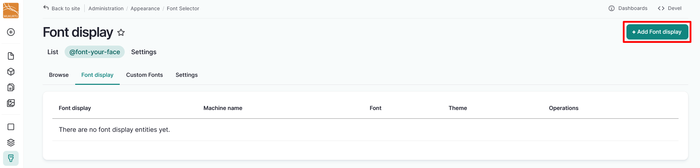

3. Enter a Label and select the font you want to apply using the Font dropdown. 

    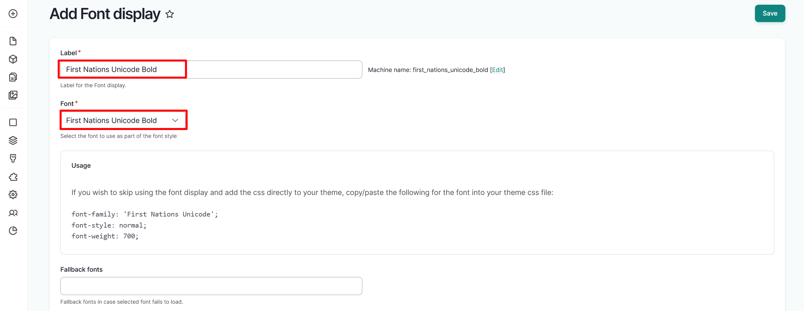

4. Select options from the Preset Selectors field. You may choose to apply your font to headers, standard text, other text, or everything. 
5. Select the theme that you want to apply the font to. You can apply your font to any theme. 

    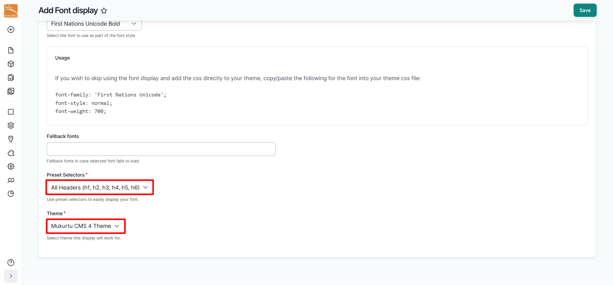

6. Select "Save" to save your Font display. This will apply your font as you selected. 

    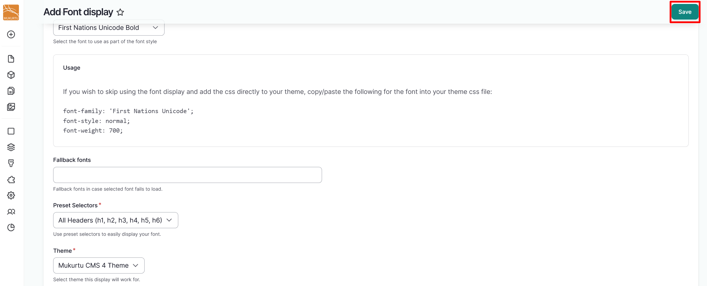