---
tags:
    - getting started
    - look and feel
---

# Configure Site Footer 

!!! roles "User role"
    Administrator, Mukurtu manager

You may choose to configure your Mukurtu site footer by adding contact information, logos, links, and other information. To begin configuring this block, navigate to Dashboard and select the **Edit Footer** link. 

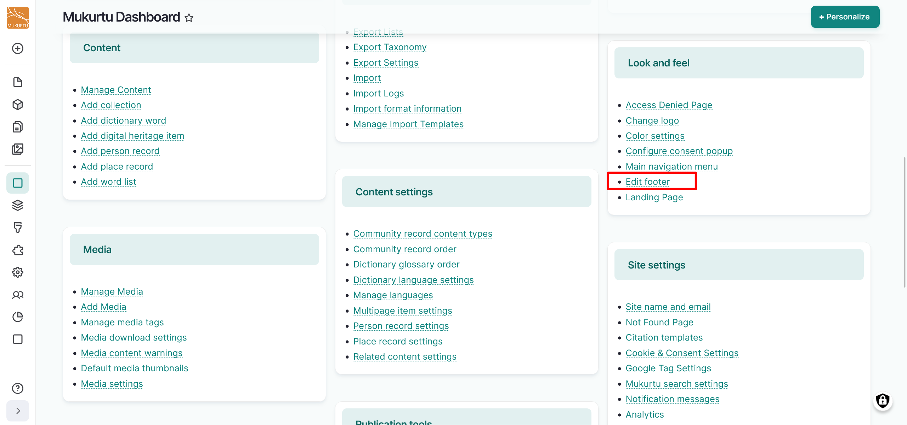

You can also access this setting from the **Blocks** menu in the left-hand admin sidebar or go directly to `/admin/content/block/1`.

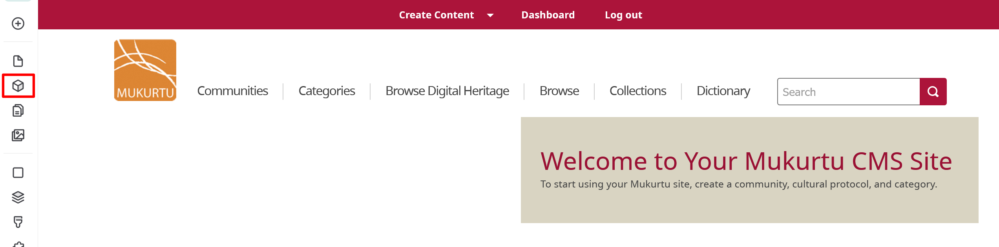

Select the **Mukurtu Footer** link or the "Edit" button.

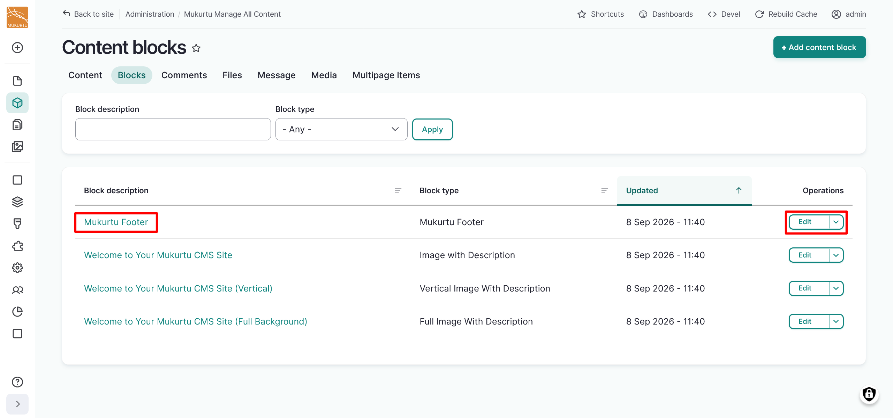

## Block description

Use the *Block description* field to change the description of your block. This is not visible to front-end users.

## Footer text

Enter text or media assets in the *Footer text* field. This is a full text HTML field that can support images, documents, audio or video recordings, or embeds. 

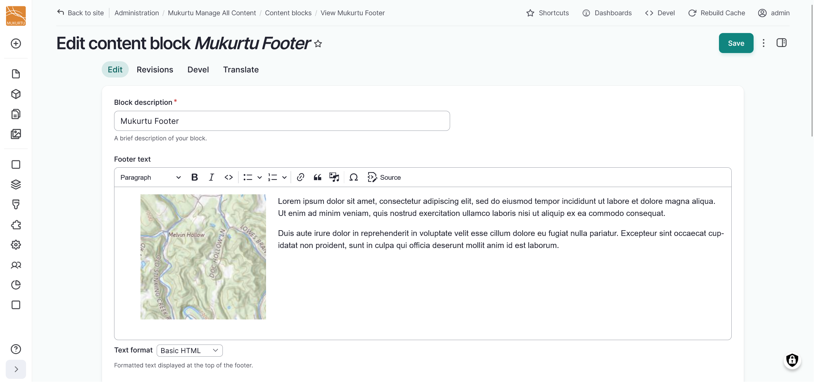

## Logos

Use this section to add logos to your footer. Each logo can have an option link URL.

1. Select the "Add Footer Logo" button.

    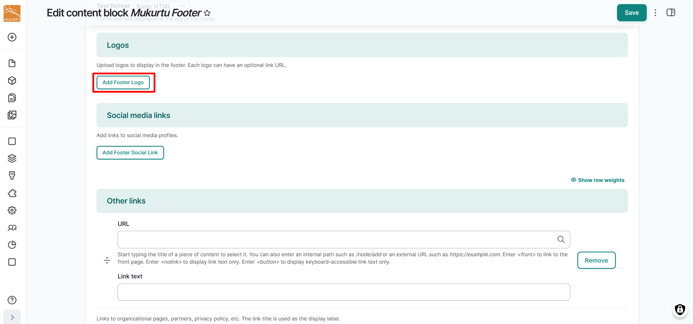

2. Add a **Logo image** to your logo using the "Browse" button. For specific instructions, refer to the [Upload Images](../media/ByTypeMediaUpload/Image.md) article. 

    !!! requirement
        Alternative text is required for all images.

3. Add a link to the optional *Link URL* field. You can use an internal path such as `/node/add/` or an external URL such as https://www.example.com. Enter `<front>` to link to the front page.

    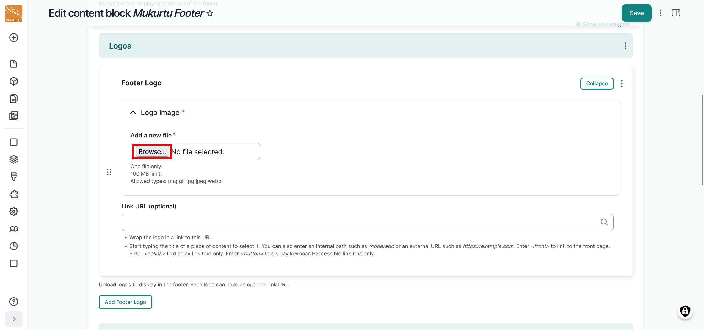

    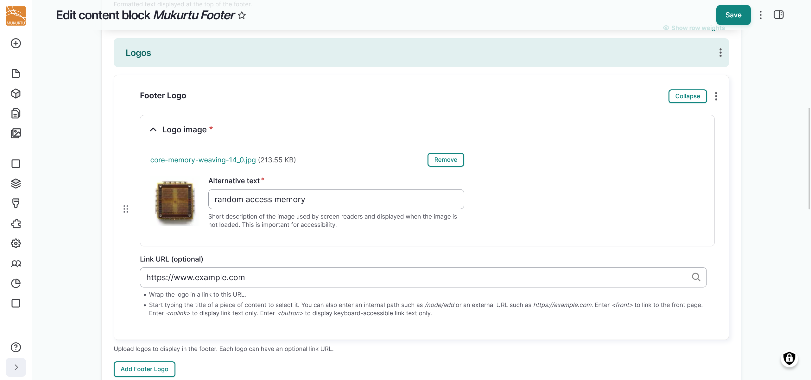

4. Select "Add Footer Logo" to add more footer logos.

## Social media links

Use this section to add links to social media profiles. Supported platforms include:

- Twitter / X
- Facebook
- Instagram
- YouTube
- LinkedIn
- TikTok
- Bluesky
- Mastodon

1. Select the "Add Footer Social Link" button.

    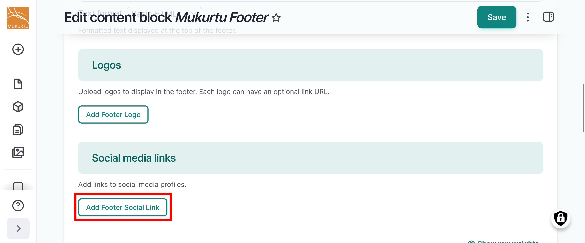

2. Select your **Platform** from the dropdown list. 

    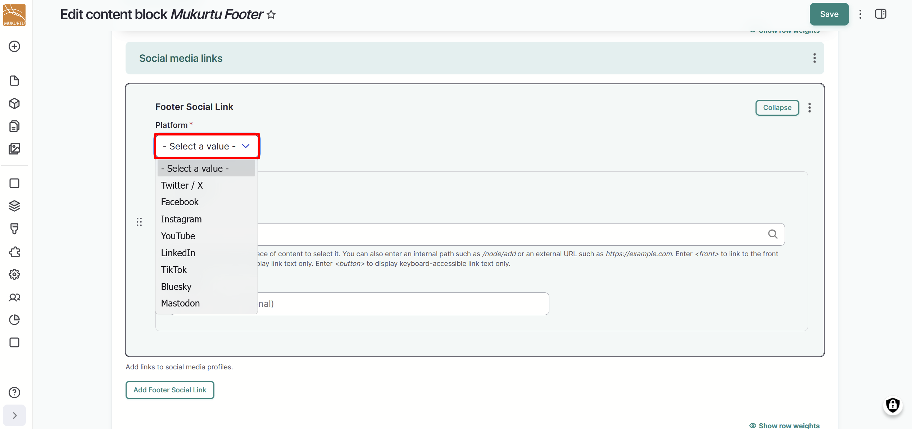

    !!! tip
        If your platform is not listed, you can still include a link to it using the Footer Link section.

3. Add your profile's URL in the *URL* field and use the *Link text* field to include any link text.

    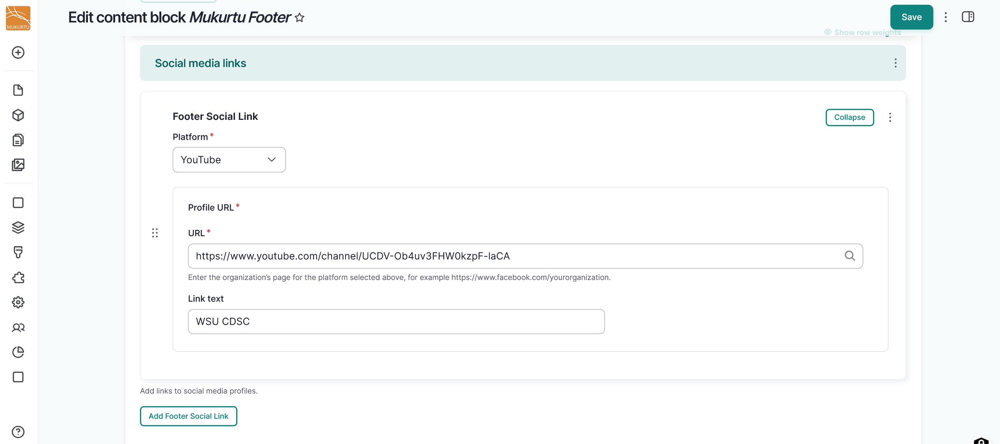

4. You can add additional social media profiles by selecting the "Add Footer Social Link" button.

## Other links

You can use this section to add other links to your footer. This can provide links to organizational pages, partners, privacy policy, etc. The link title is used as the display label.

1. Use the *URL* field to enter an external link or an internal path.
2. Use the *Link text* field to enter a link title.
3. You can add additional links by selecting the "Add another item" button.

    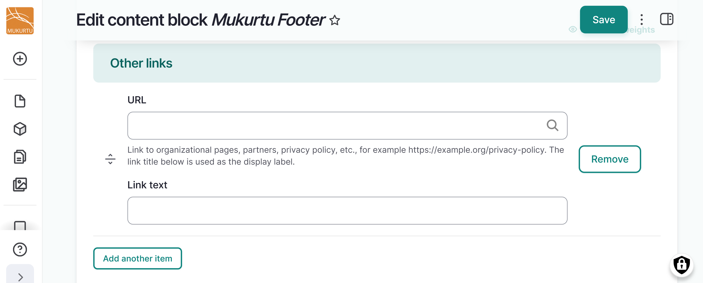

## Contact information and other fields

- Use the *Contact email address* to include an email address for users to contact site administrators
- Optionally use the *Contact email label* field, which includes text before the email address such as "Email us at". Leave this field empty to show the email address alone.
- Use the *Copyright message* field to include a copyright message for your site. You can use the `[current-date:html_year]` token to automatically include the current year. 

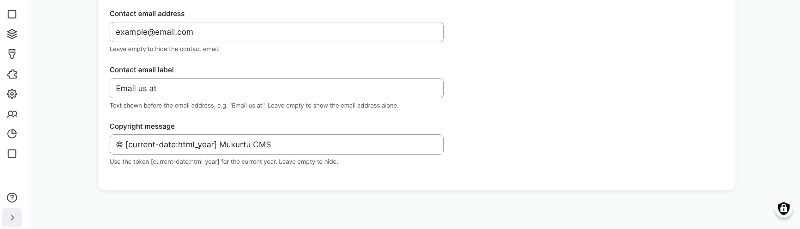

Select the "Save" button in the top right of the page to save your footer.

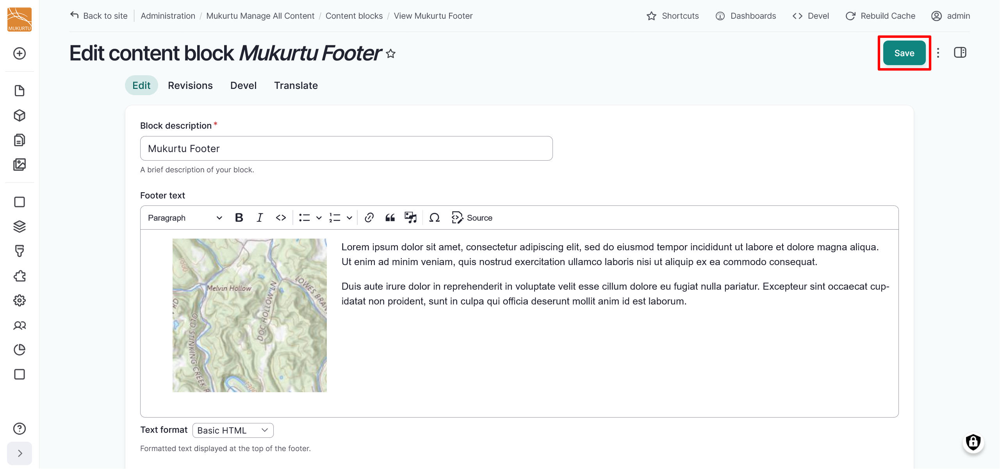