---
tags:
    - getting started
    - look and feel
---

# Configure Landing Page

!!! roles "User roles"
    Administrator, Mukurtu manager

Mukurtu CMS includes a preconfigured landing page layout that users can personalize to reflect their organizational branding. The default layout consists of:

- An easily personalized welcome banner.
- A Featured Content block to showcase any featured content on your site.
- A Mukurtu Categories browse block, featuring all the categories on your site.
- A Browse by Community block, which showcases all the different communities that a user has access to view.
- A Map Browse block, featuring an interactive Leaflet map showcasing the location of the site's content.

Users also have the option to personalize their landing page to reflect their organizational branding and best showcase their content. 

## Block types

- Welcome to Your Mukurtu CMS Site: This block features a half-page, right jusitified welcome banner in our classic Red and Bone color palette. For more information on configuring featured content blocks, refer to [Configure a Welcome Block](#configure-welcome-block-and-vertical-block).

    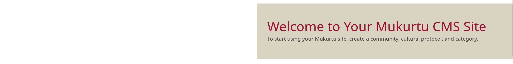

- Welcome to Your Mukurtu CMS Site (Full Background): This block features a full-width background image block with overlaid title and description text. For more information on configuring featured content blocks, refer to [Configure a Full Background Block](#configure-full-background-block).

    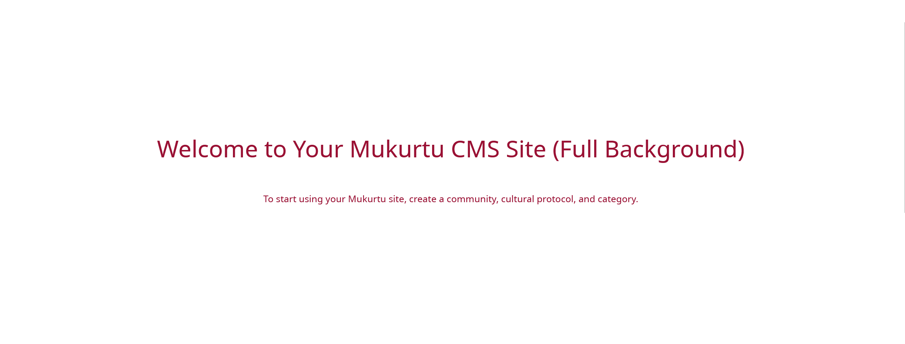

- Welcome to Your Mukurtu CMS Site (Vertical): This block features a single column block with the image on top, followed by title and text below. For more information on configuring featured content blocks, refer to [Configure a Vertical Block](#configure-welcome-block-and-vertical-block).

    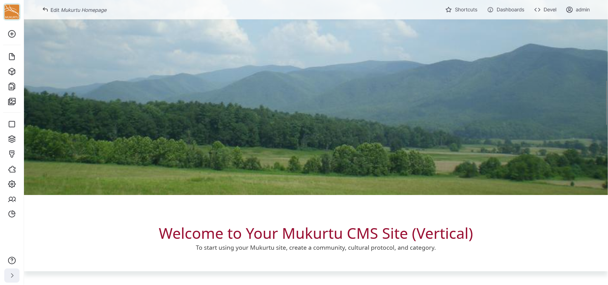

- Featured Content: This block enables users to showcase featured content on their site. For more information on configuring featured content blocks, refer to [Configure a Featured Content block](#configure-featured-content-block).

    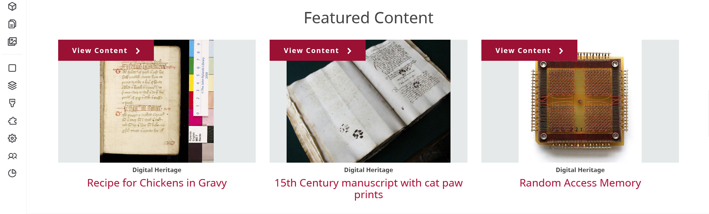

- Mukurtu Categories: This block features all of the categories on your site. Categories are automatically added to this block when they are created.

    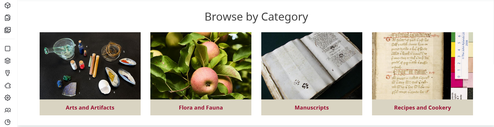

- Browse by Community: This block highlights all the communities on your site that users have permission to view. Communities are automatically added to this block when they are created.

    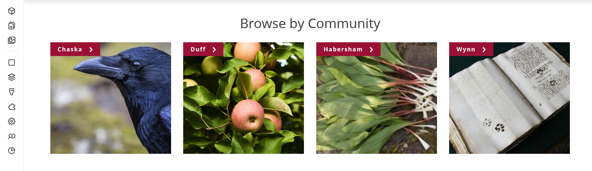

- Browse by Map: Map Block: This block highlights the locations of content using an embedded Leaflet map. Map points are automatically added to this block when they are created.

    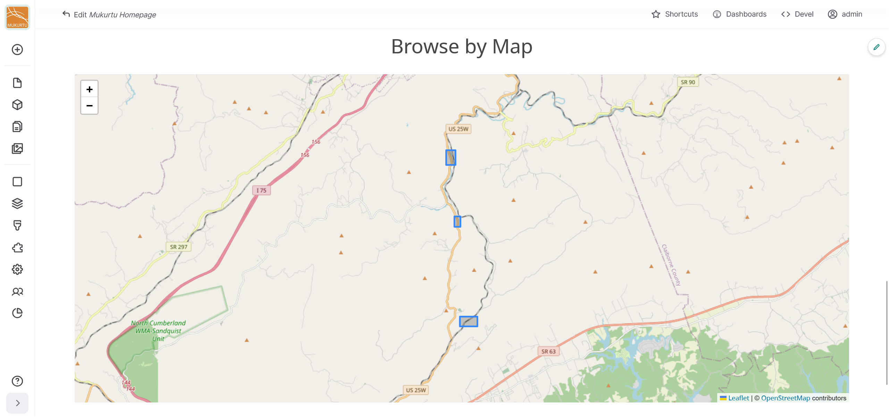

## Configure content blocks

Content blocks include the Featured Content block and the three different Welcome banner blocks. All content blocks can be accessed from the **Blocks** link, then are configured slightly differently depending on the block type. Blocks can be rearranged once they are configured. For more information on rearranging blocks, refer to the [Rearrange Blocks](#rearrange-blocks) section of this article. Follow the instructions below to configure your content blocks.

1. Select the **Blocks** icon from the left-hand admin sidebar or navigate directly to `/admin/content/block`.

    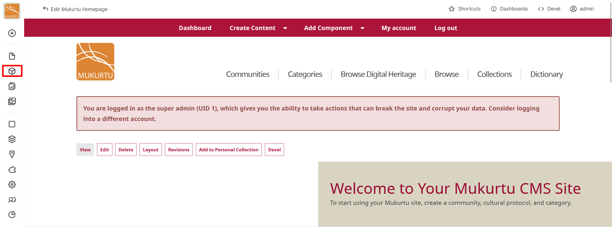

2. Select the "Edit" button to the right of the block you want to configure. 

    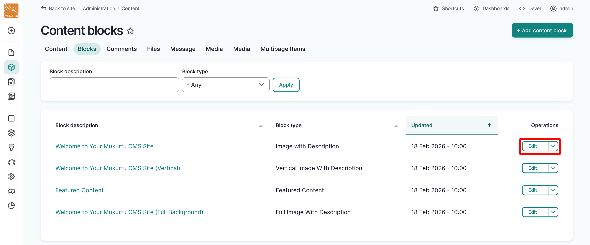

### Configure Welcome block and Vertical block

The  Welcome to Your Mukurtu CMS Site and Welcome to Your Mukurtu CMS Site (Vertical) welcome blocks are configured the same way, and allow image and video uploads. Follow the instructions to configure your welcome block.

1. Use the *Block description* field to rename your Welcome block.
2. Use the *Body* field to provide more information about your site. 

    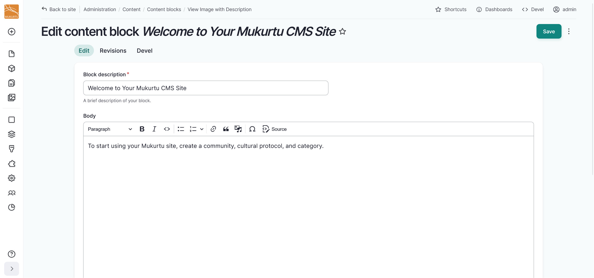

3. Use the "Add media" button to add a media asset to your welcome block. You can add an image or a video. For more information on adding media assets, refer to [Create Media Assets](../media/CreateMediaAssets.md)

    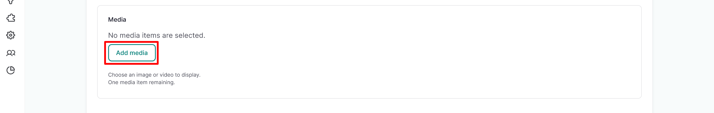

4. Select your media asset, then select the "Insert selected" button.

    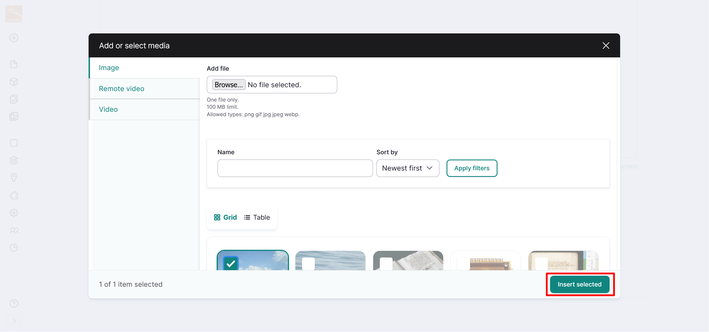

5. Select "Save" to save your welcome block.

### Configure Full Background block

The Welcome to Your Mukurtu CMS Site (Full Background) welcome block only allows images and requires users to configure the overlaid text color. Follow the instructions to configure your welcome block.

1. Use the *Block description* field to rename your Welcome block.
2. Use the *Body* field to provide more information about your site. 

    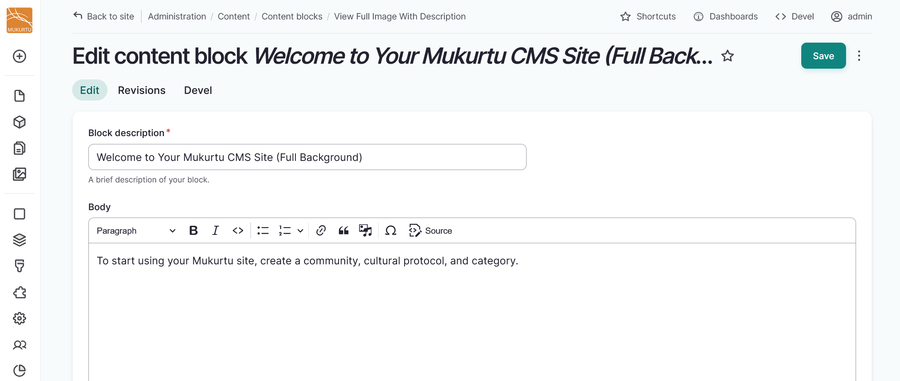

3. Use the "Add media" button to add a background image to your welcome block. For more information on adding media assets, refer to [Create Media Assets](../media/CreateMediaAssets.md).
4. Select your image, then select the "Insert selected" button.
5. Use the **Text Color** dropdown to select **Light** or **Dark** text. Choose your text color based on background contrast. Light uses white text, Dark uses brand primary dark color. Always verify color contrast meets accessibility standards (WCAG AA minimum 4.5:1 ratio) using an accessibility tool before publishing. 

    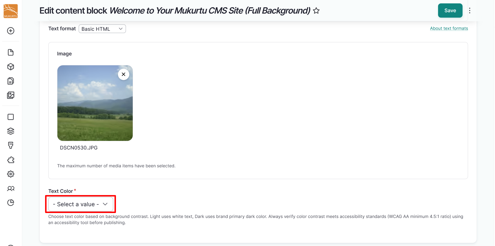

6. Select the "Save" button to save your welcome block.

### Configure Featured Content block

The Featured Content block allows you to showcase featured content on your Mukurtu CMS site. Follow the instructions below to configure your featured content.

1. From the **Edit content block Featured Content** page, you may choose to use the *Block description* field to rename your block.
2. Navigate to the **Featured Content** section of the page, and select the "Select Content" button.

    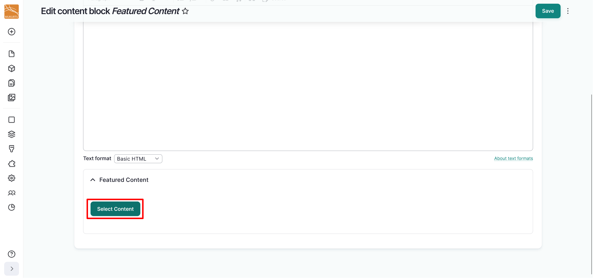

3. Select the checkbox beside all the content you wish to include as featured content, then scroll down and select "Add Content".

    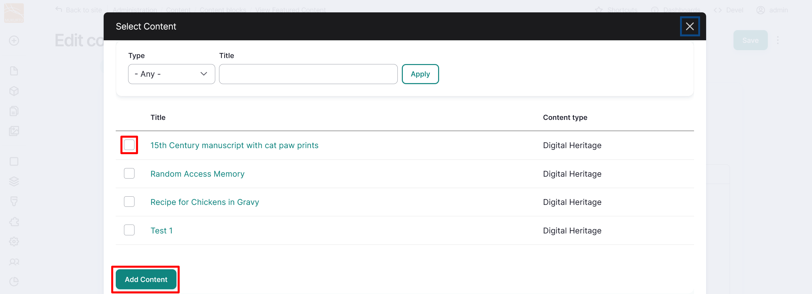

    !!! tip 
        You can filter content by type or search by title.

4. To remove content from the featured content, select the **Delete** icon from the right-hand corner of the content block.

    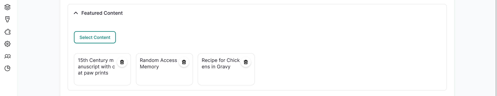

4. Select the "Save" button to save your Featured Content selections.

    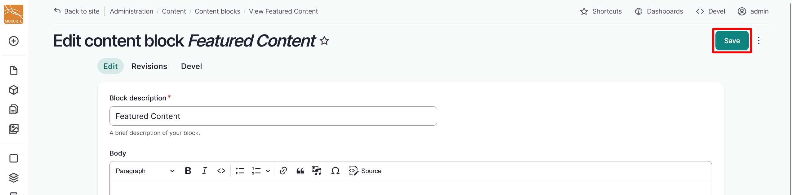

## Edit the default landing page

From the **Dashboard**, navigate to the **Look and Feel** section and select the **Landing Page** link. This takes you to Mukurtu's **Layout Builder** editor for the default landing page. From here you can add or remove sections and blocks. 

### Configure sections

Sections are the primary regions for your theme. 

#### Add a section

1. To add a new section to your landing page, select the "Add section" button. 

    

2. Select the "One Column" button in the right-hand **Choose a layout for this section** sidebar.

    

3. Optionally, you can use the *Administrative label* field to add a label for your section, then select "Update". If you choose not to add a label for your section, it will be automatically labelled in the order it appears on the page. Labelling your section can be useful for reference and organization, especially if your sections need to appear in a particular order.

    

4. You can select "Save" now to save your section, or you can add blocks. For more information about adding blocks, refer to the [Add a block](#add-a-block) section of this article.

    

After sections are created they can be rearranged by dragging them to appear in any order on the page.

#### Delete a section

Delete sections by selecting the "Delete" icon. 

!!! warning
    Deleting a section will delete all the blocks within the section.

### Configure blocks

Blocks are the individual pieces of your site's web layout and are placed within sections. 

#### Edit a block

1. Navigate to the **Edit** icon to the right of your block. Select **Configure block** to edit your block.

    

2. You can edit your block's title display status, items per block, or override the display title.   

    - You may choose to hide the display title by selecting the toggle.
    - Items per block is set to "0" by default. This setting allows your block to display even without applicable content.
    - You may select the toggle to override the display title. If you choose to override the display title, enter a new title in the *Title* field.

3. Select "Update" to update your block.

    

4. Select "Save" to save the updates to your landing page. 

#### Delete a block

1. Navigate to the **Edit** icon menu and select the **Remove block** link.
2. Select the "Remove" button to remove your block. If you choose not to remove your block, select "Cancel".

    

3. Select "Save" to save the updates to your landing page.

#### Rearrange blocks

You can rearrange the blocks on your landing page by selecting a block and dragging it into your preferred order. You can also use the "Move" button to move your block to different sections. 

1. Navigate to the **Edit** icon menu and select the **Move** link. 
2. To move your block to a new section, select the section from the dropdown menu.

    

3. Select and drag your block into your preferred order using the **Rearrange** icons.

    

4. Select the "Move" button to finalize your block arrangement.

    

5. Select "Save" to save the updates to your landing page.

#### Add a block

1. Select the "Add block" button to add a new block to your landing page.

    

2. Select your block type from the **Choose a block** sidebar menu. You can add different block types, including a Content block, a Custom block, or a Lists (Views) block. Use the *Filter by block name* field to search for a specific block.

    

    - Content blocks include Featured Content and Welcome to your Mukurtu CMS Site blocks.
    - Custom blocks include the Consent popup block.
    - Lists (Views) include the Browse by Community, Browse by Map: Map Block, and Mukurtu Categories blocks.

3. Selecting your block opens the **Configure block** settings. 

    - You may choose to hide the display title by selecting the toggle.
    - Items per block is set to "0" by default. This setting allows your block to display even without applicable content.
    - You may select the toggle to override the display title. If you choose to override the display title, enter a new title in the *Title* field.

4. Select the "Add block" button to add your block.

    

5. You may choose to add more blocks, or select "Save" to save your landing page configuration.

    

## Add a new landing page

Most sites will use the provided landing page, but if your landing page has been deleted or you prefer a more personalized landing page, you can add a new default landing page to your Mukurtu site. To add a landing page from the **Admin menu**, navigate to the **Create** section and select the **Landing Page** link.

1. Enter a *Title* for your landing page, then select the "Save" button.

    

2. This will take you to your new landing page. Select the "Layout" button to add sections and blocks to your landing page. 

    

3. Add your sections and blocks. For more information on adding sections and blocks, refer to the [Add a Section](#add-a-section) and [Add a Block](#add-a-block) sections of this article.
4. Select "Save" to save your landing page. 
5. Copy the new landing page extension from your navigation bar. 

    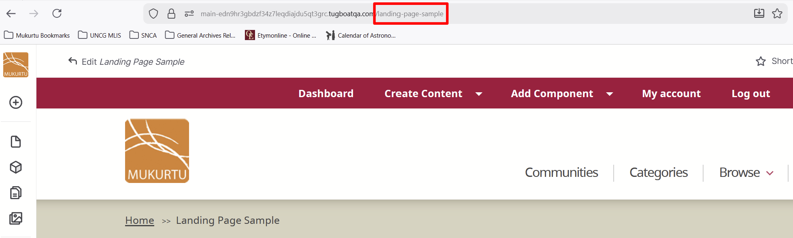

6. Navigate to your **Dashboard**. 
7. From your **Dashboard**, navigate to the **Site settings** section and select the **Site name and email** link.

    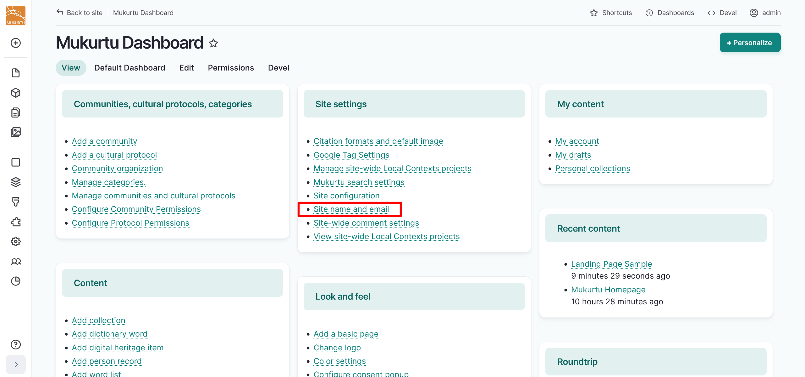

8. Navigate to the **Front page** section and replace the extension in the *Default front page* text box with the extension you copied from your landing page.

    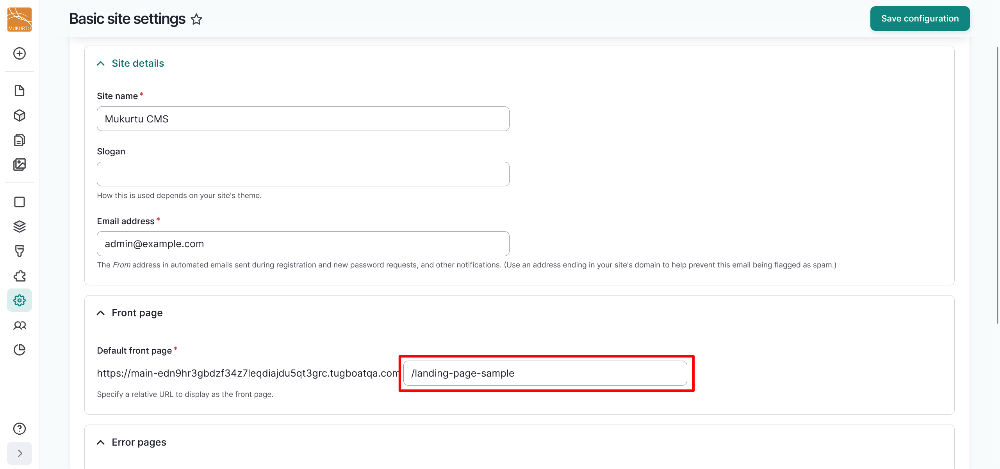

9. Select the "Save configuration" button to apply your changes.

    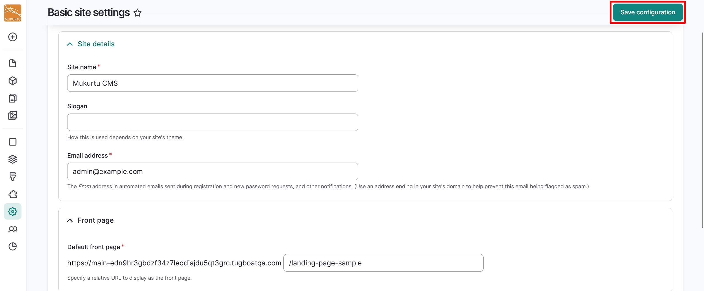