---
tags:
    - getting started
    - look and feel
---

# Configure a Landing Page

!!! roles "User role"
    Drupal administrator

Mukurtu 4 enables users to configure the landing page for their site to best showcase their content. You can edit the default landing page or create your own. Follow the directions below to configure your landing page.

## Edit the default landing page

From the **Dashboard**, navigate to the **Look and Feel** section and select the **Landing Page** link. This takes you to Mukurtu's **Layout Builder** editor for the default landing page. From here you can add or remove sections and blocks. 

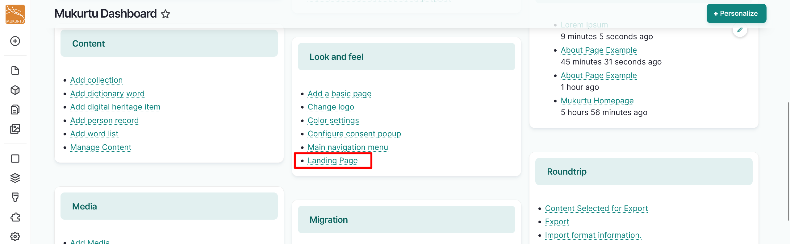

### Configure sections

Sections are the primary regions for your theme. 

#### Edit a section

1. Select the "Configure Section 1" icon to edit the administrative label of the section.

    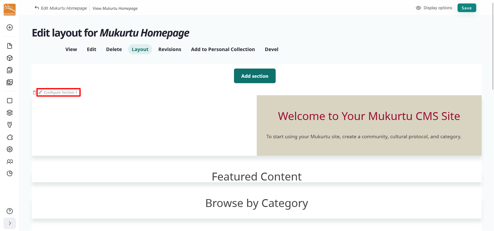

2. Edit the *Administrative label* field, then select "Update" to save the changes to your section.

    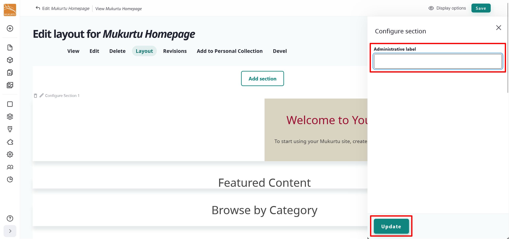

#### Delete a section

Delete sections by selecting the "Delete" icon. 

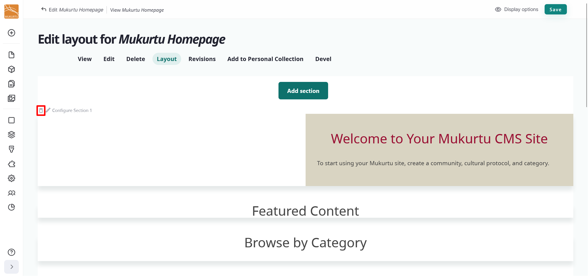

After sections are created they can be rearranged by dragging them to appear in any order on the page.

#### Add a section

1. To add a new section to your landing page, select the "Add section" button. 

    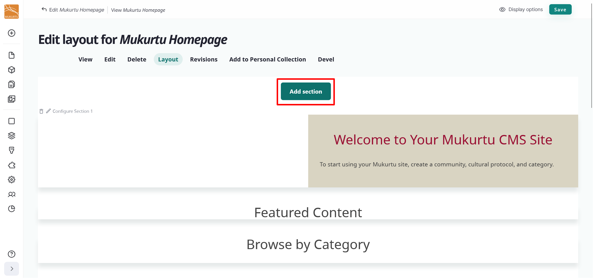

2. Select the "One Column" button in the right-hand **Choose a layout for this section** sidebar.

    !!! tip
        The one column layout is configured by default in layout builder for landing pages. To add additional options, navigate to `/admin/config/content/layout-builder-restrictions` and uncheck the box for the **Entity View Mode** option, then select the "Save configuration" button.  

    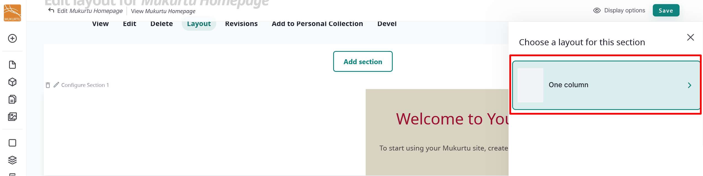

3. Use the *Administrative label* field to add a label for your section, then select "Update".

    

4. You can select "Save" now to save your section, or you can add blocks. For more information about adding blocks, refer to the [Add a block](#add-a-block) section of this article.

    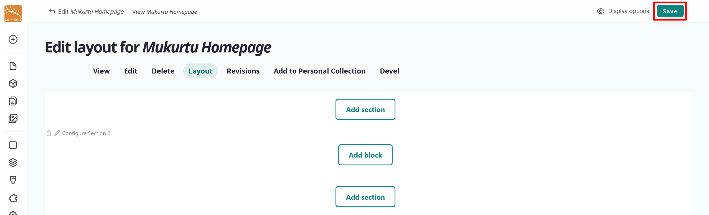

### Configure blocks

Blocks are the individual pieces of your site's web layout and are placed within sections. 

#### Edit a block

1. Navigate to the **Edit** icon to the right of your block. Select **Configure block** to edit your block.

    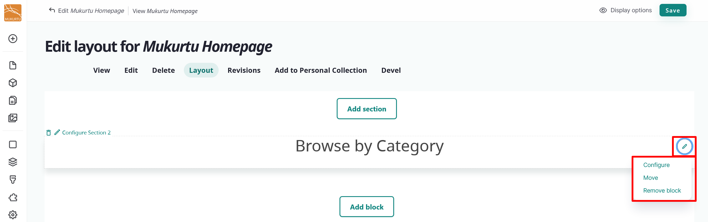

2. You can edit your block's title display status, items per block, or override the display title.   

    - You may choose to hide the display title by selecting the toggle.
    - Items per block is set to "0" by default. This setting allows your block to display even without applicable content.
    - You may select the toggle to override the display title. If you choose to override the display title, enter a new title in the *Title* field.

3. Select "Update" to update your block.

    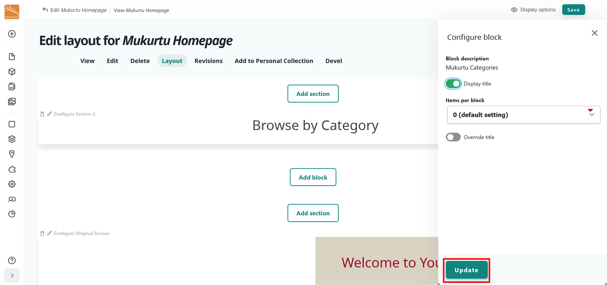

4. Select "Save" to save the updates to your landing page. 

#### Delete a block

1. Navigate to the **Edit** icon menu and select the **Remove block** link.
2. Select the "Remove" button to remove your block. If you choose not to remove your block, select "Cancel".

    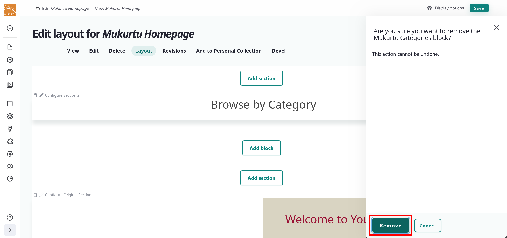

3. Select "Save" to save the updates to your landing page.

#### Rearrange blocks

You can rearrange the blocks on your landing page by selecting a block and dragging it into your preferred order. You can also use the "Move" button to move your block to different sections. 

1. Navigate to the **Edit** icon menu and select the **Move** link. 
2. To move your block to a new section, select the section from the dropdown menu.

    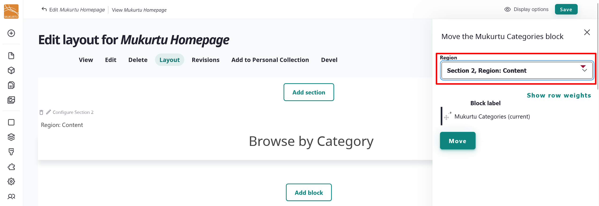

3. Select and drag your block into your preferred order using the **Rearrange** icons.

    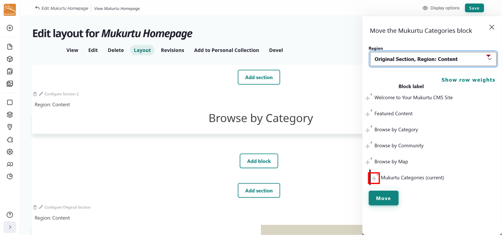

4. Select the "Move" button to finalize your block arrangement.

    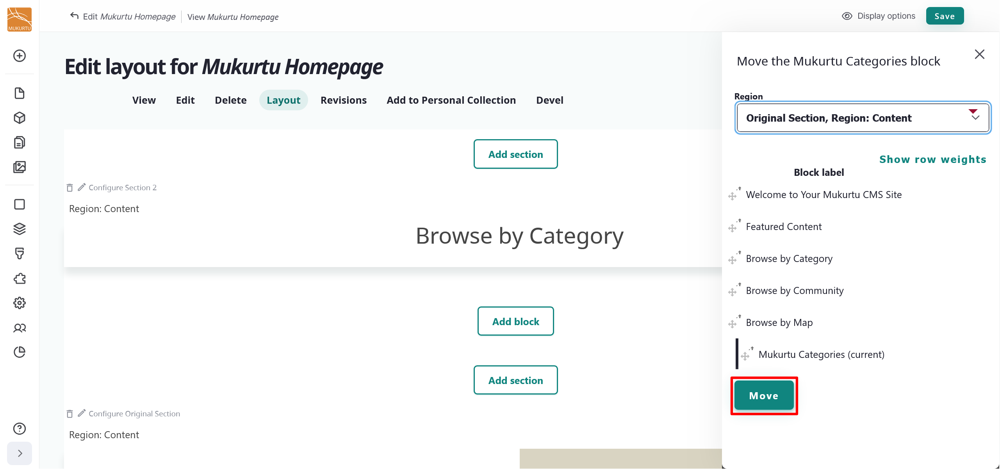

5. Select "Save" to save the updates to your landing page.

#### Add a block

1. Select the "Add block" button to add a new block to your landing page.

    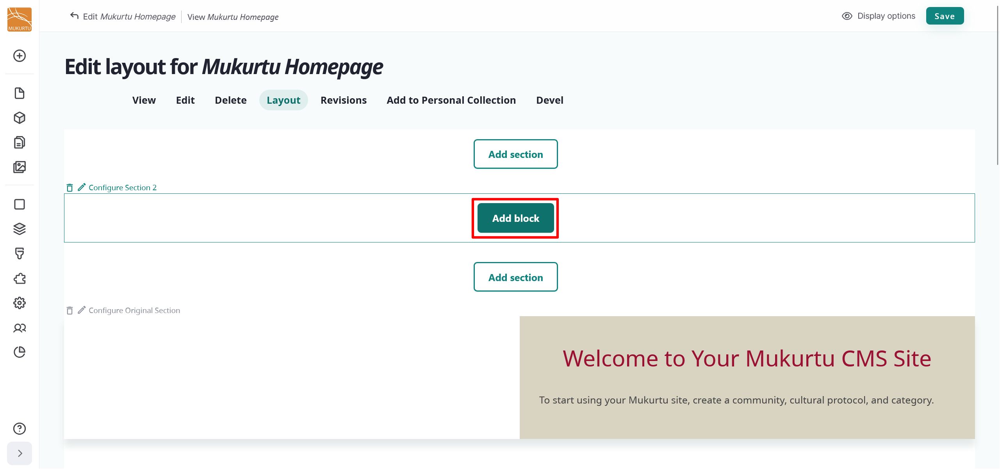

2. Select your block type from the **Choose a block** sidebar menu. You can add different block types, including a Content block, a Custom block, or a Lists (Views) block. Use the *Filter by block name* field to search for a specific block.

    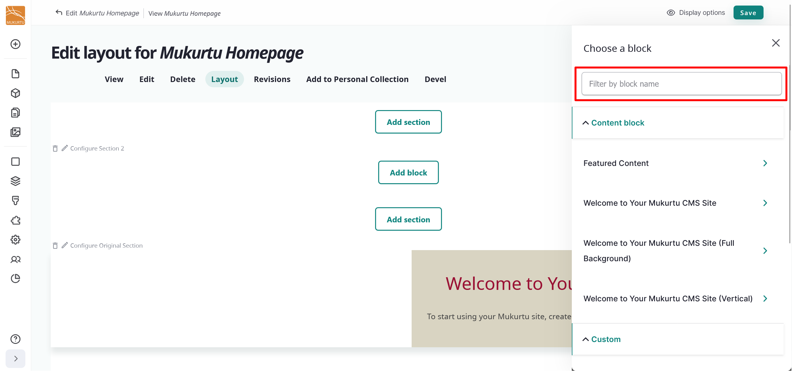

    - Content blocks include Featured Content and Welcome to your Mukurtu CMS Site blocks.
    - Custom blocks include the Consent popup block.
    - Lists (Views) include the Browse by Community, Browse by Map: Map Block, and Mukurtu Categories blocks.

3. Selecting your block opens the **Configure block** settings. 

    - You may choose to hide the display title by selecting the toggle.
    - Items per block is set to "0" by default. This setting allows your block to display even without applicable content.
    - You may select the toggle to override the display title. If you choose to override the display title, enter a new title in the *Title* field.

4. Select the "Add block" button to add your block.

    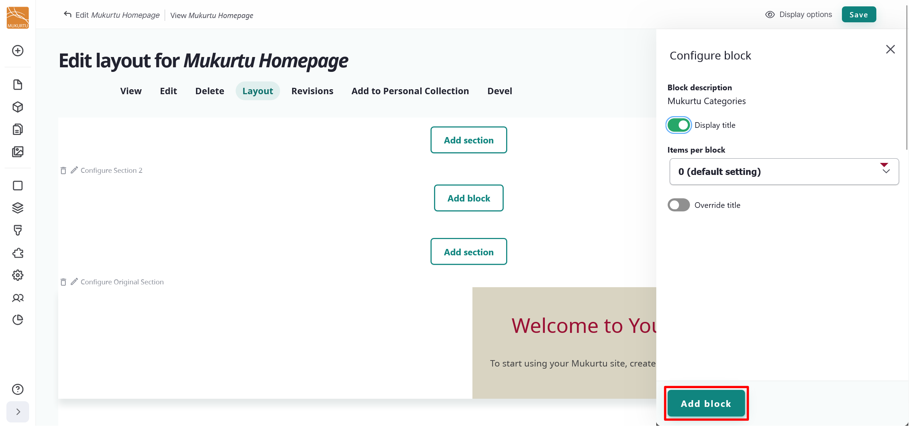

5. You may choose to add more blocks, or select "Save" to save your landing page configuration.

    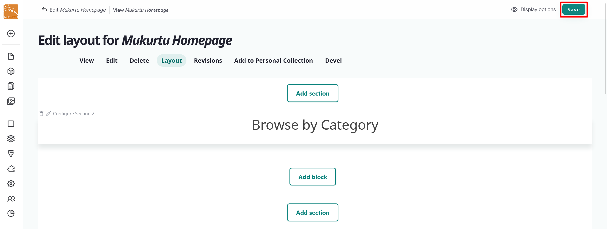

## Add a new landing page

You can add a new default landing page to your Mukurtu site. To add a landing page from the **Admin menu**, navigate to the **Create** section and select the **Landing Page** link.

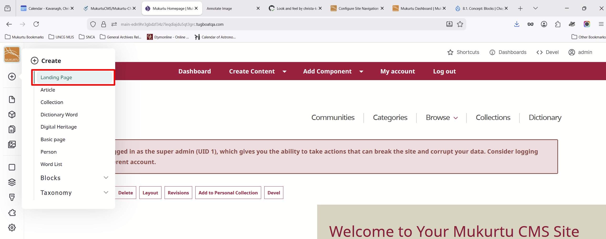

1. Enter a *Title* for your landing page, then select the "Save" button.

    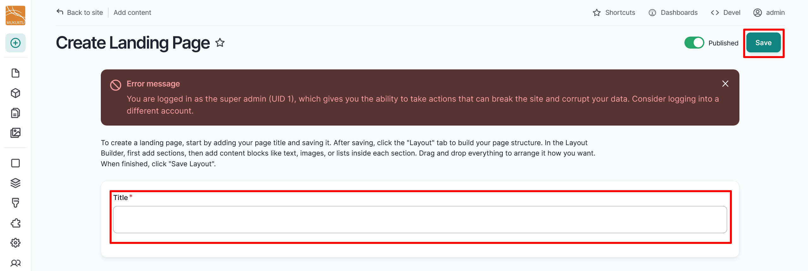

2. This will take you to your new landing page. Select the "Layout" button to add sections and blocks to your landing page. 

    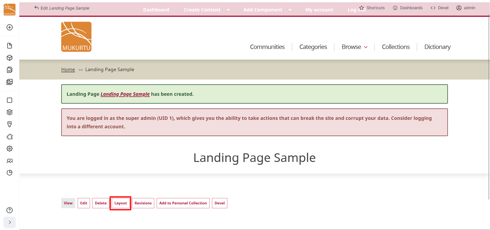

3. Add your sections and blocks. For more information on adding sections and blocks, refer to the [Add a Section](#add-a-section) and [Add a Block](#add-a-block) sections of this article.
4. Select "Save" to save your landing page. 
5. For instructions on how to set your new landing page as the front page, refer to the [Set Landing Page](../look-and-feel/ConfigureNameEmail.md#set-landing-page) section of the Basic Site Settings article.

