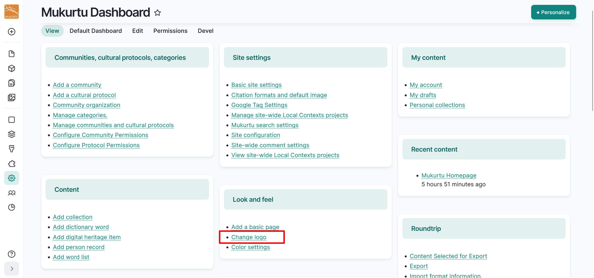
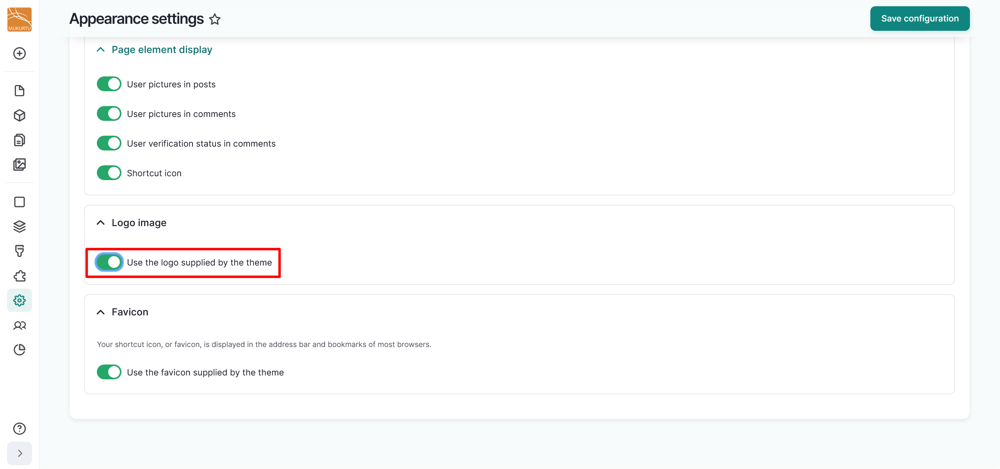
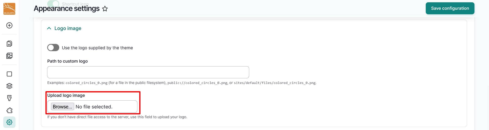
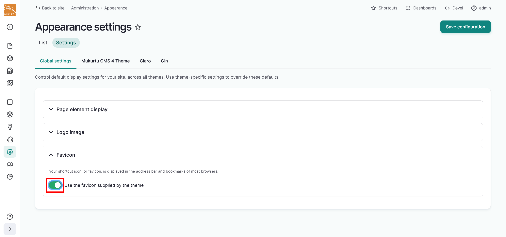
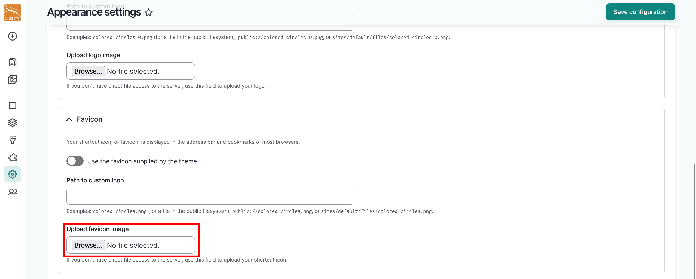
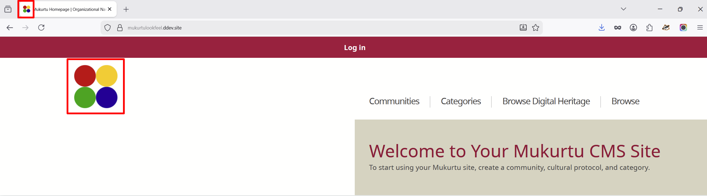

---
tags:
    - getting started
    - look and feel
---

# Configure Logos

!!! roles "User roles"
    Administrator, Mukurtu manager

## Configure your logo

1. From your **Dashboard**, navigate to the **Look and Feel** section. Select the **Change logo** link, or go directly to `/admin/appearance/settings`.

    

2. Navigate to the **Logo image** section and toggle the slider to the left of the *Use the logo supplied by the theme* field off.

    

3. You can upload your custom logo image by selecting the "Browse" or "Choose File" button. The text of the button depends on your browser settings.

    

4. You can select the "Save configuration" button to save your logo at this point, or you can continue for instructions on how to customize your favicon.

## Configure your favicon

Your shortcut icon, or favicon, is displayed in the address bar and bookmarks of most browsers.

1. From your **Dashboard**, navigate to the **Look and Feel** section. Select the **Change logo** link, or go directly to `/admin/appearance/settings`.

    

2. Navigate to the **Favicon** section and toggle the slider to the left of the *Use the favicon supplied by the theme* field off.

    

3. You can upload your favicon image by selecting the "Browse" or "Choose File" button. The text of the button depends on your browser settings.

    

4. Select the "Save configuration" button to save your favicon.

