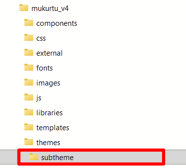
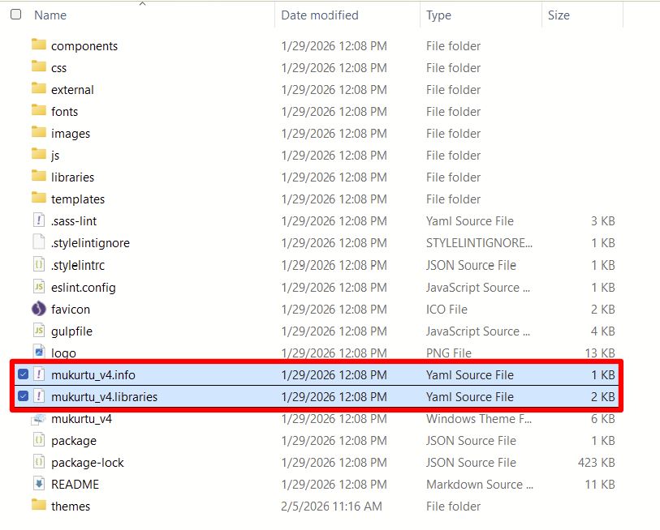
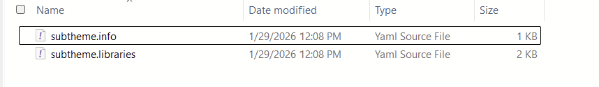
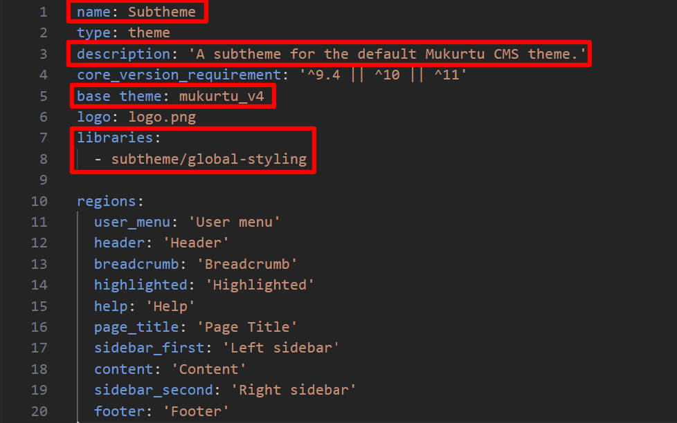
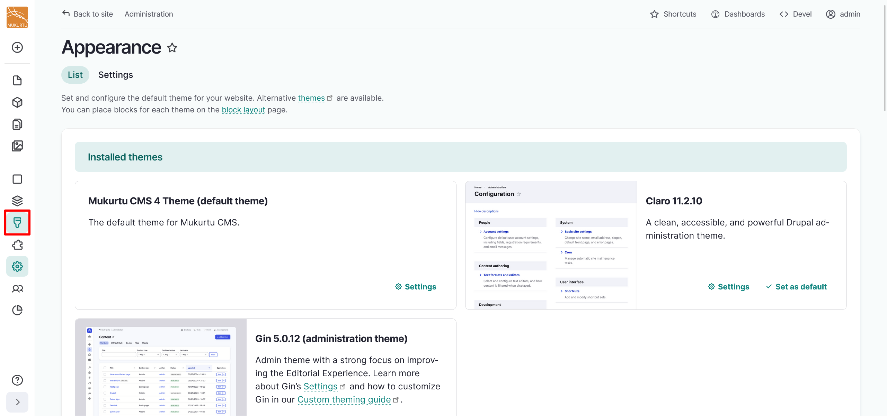
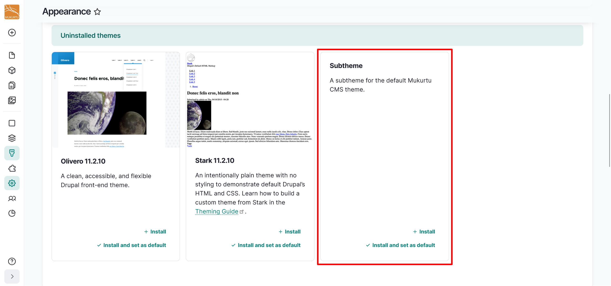
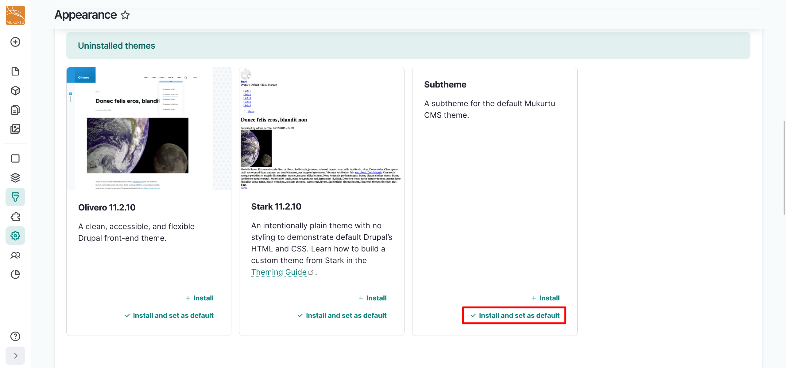

---
tags:
    - look and feel
---

# Configure Subtheme

!!! roles "User role"
    Administrator

The most effective way to customize the look and feel of your site without having to reimplement changes is to install a subtheme. Subthemes are built off the main Mukurtu_v4 theme, and inherit the parent theme's resources while functioning like any other theme.

!!! warning 
    The instructions in this article require a degree of familiarity working with command line tools and editing code, which is not without risk. Changing your code may break your site and corrupt your data. Before following these instructions, make sure to back up your site, and confirm that you can restore from a backup.

1. In your site's file structure, navigate to the Mukurtu_v4 themes folder by going to `\web\profiles\mukurtu\themes\mukurtu_v4`.
2. Create a `Themes` folder.
3. Create a subfolder with the name of your subtheme. For this example, we will use `subtheme` as the name of our subtheme.

    

4. Copy the `mukurtu_v4.info` and `mukurtu_v4.libraries` YAML source files from the parent theme to your subtheme folder.

    

5. Rename the `mukurtu_v4.info` and `mukurtu_v4.libraries` YAML source files to `subtheme.info` and `subtheme.libraries`.

    

6. Open the `.info` file in your preferred text editor. 
7. Rename the **name** field to reflect the name you want to give your subtheme. 
8. Use the **description** field to describe your subtheme. It can be helpful to annotate which parent theme your subtheme is a child of.
9. In the **base theme** field, input `mukurtu_v4` as your base theme.
10. Use the **libraries** field to annotate your subtheme. This should read `subtheme1/global-styling`.

    

11. Select "Save" to save your subtheme.
12. On your Mukurtu site, use the **Appearance** icon to navigate to the **Appearance** admin page. 

    

13. Navigate to the **Uninstalled themes** section of the page. Your subtheme should be listed.

    

14. Select **Install and set as default** to install your subtheme and make it the default theme for your site.

    

