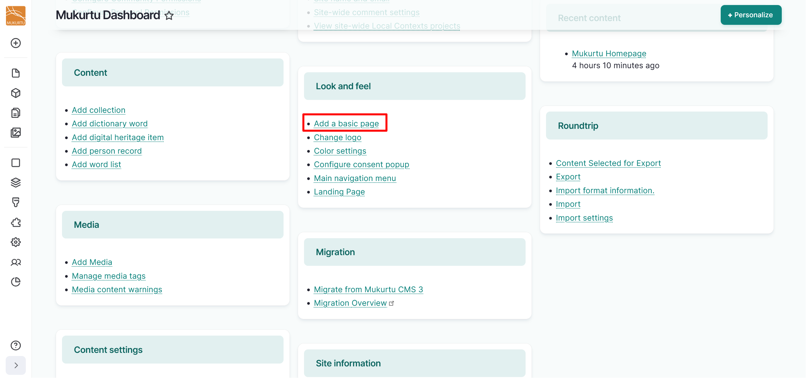
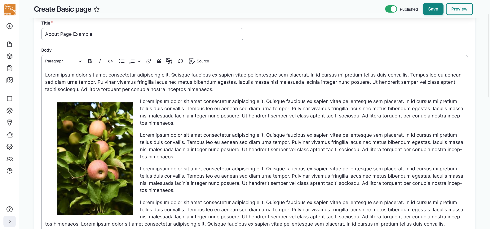
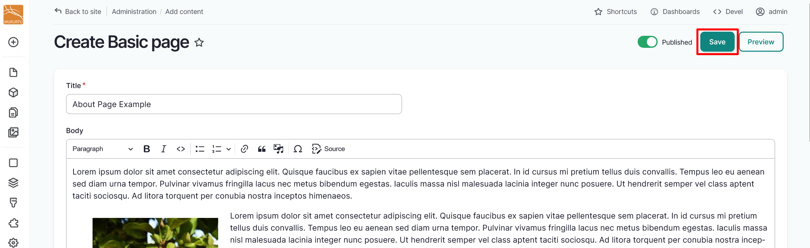

---
tags:
    - getting started
    - look and feel
---

# Create and Edit Basic Pages

!!! roles "User roles"
    Drupal administrator, Mukurtu manager

Basic pages can be used as About pages or as other static pages on your site. Follow the instructions below to create a Basic page.

1. From the **Dashboard**, navigate to the **Look and Feel** section and select the **Add a basic page** link.

    

2. Use the *Title* field to enter a title for your basic page. 

    - This is a required field.

3. Enter text or media assets in the *Body* field. This is a full text HTML field that can support images, documents, audio or video recordings, or embeds. To add media, select the "Insert Media" icon from the field's toolbar. Follow the steps in the [Create Media Assets](../media/CreateMediaAssets.md) article to select media assets or to add new media assets to your library.

    !!! tip
        Your site must have at least one Community and Cultural Protocol enabled to add media assets. 
    
    

4. Use the **Media Assets** section to add media assets to your basic page. For instructions on how to add a media asset, refer to the [Create Media Assets](../media/CreateMediaAssets.md) article.

    - You can add multiple media assets by selecting more than one media asset from the media modal. 
    - To reorder your media assets, select your media assets and drag them into the order you prefer.

5. Select the "Save" button to save your Basic page.

    

6. Select the "Edit" button to edit your Basic page. After editing, select the "Save" button to save your changes.