---
tags:
    - getting started
    - look and feel
---

# Create and Edit Basic Pages

!!! roles "User roles"
    Administrator, Mukurtu manager

Basic pages can be used as About pages or as other static pages on your site. Follow the instructions below to create a Basic page.

## Create a basic page

1. From the **Dashboard**, navigate to the **Look and Feel** section and select the **Add a basic page** link.

    

2. Use the *Title* field to enter a title for your basic page. 

    - This is a required field.

3. Enter text or media assets in the *Body* field. This is a full text HTML field that can support images, documents, audio or video recordings, or embeds. To add media, select the "Insert Media" icon from the field's toolbar. Follow the steps in the [Create Media Assets](../media/CreateMediaAssets.md) article to select media assets or to add new media assets to your library.

    !!! tip
        Your site must have at least one Community and Cultural Protocol enabled to add media assets. 
    
    

4. Use the **Media Assets** section to add media assets to your basic page. For instructions on how to add a media asset, refer to the [Create Media Assets](../media/CreateMediaAssets.md) article.

    - You can add multiple media assets by selecting more than one media asset from the media modal. 
    - To reorder your media assets, select your media assets and drag them into the order you prefer.

5. Select the "Save" button to save your Basic page.

    

6. Select the "Edit" button to edit your Basic page. After editing, select the "Save" button to save your changes.

## Configure page with Layout Builder

After you create your basic page, you can optionally use the "Layout" button to configure the layout of your basic page with Layout Builder. Navigate to your basic page and select "Layout".

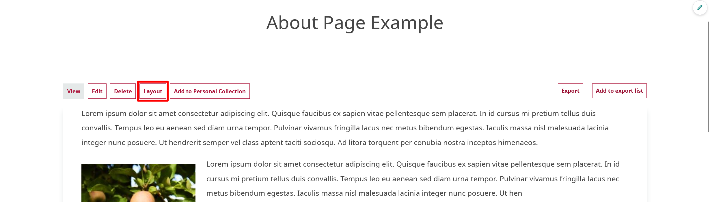

Layout Builder uses sections and blocks to structure the layout of your page. Sections contain blocks, which can include content, dividers, media assets, text, a call to action modal, or Local Contexts labels. 

### Add a section 

1. To add a section, select "Add section".

    !!! tip
        If you add a section to your page without populating it with blocks, the section will not appear on your saved basic page.

2. Sections can be laid out in one, two, three, or four columns. Select your layout for the section.

    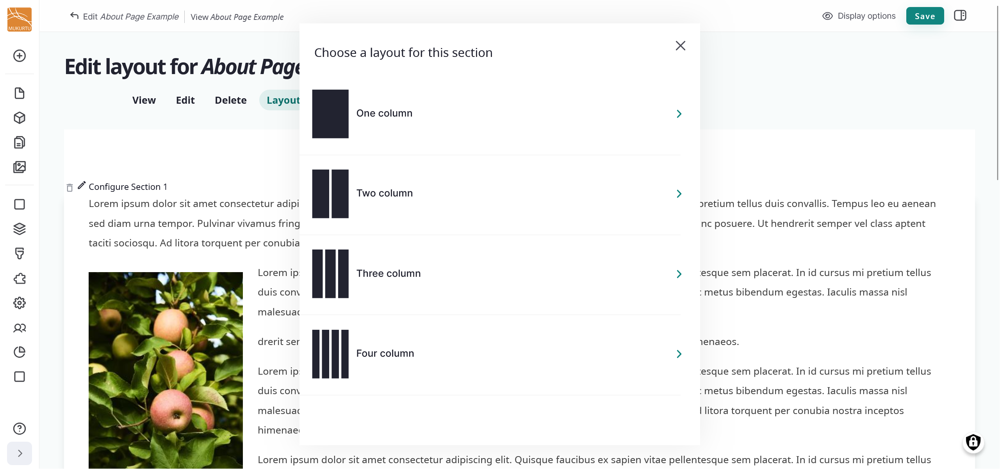

3. Use the *Column widths* dropdown to configure the column widths for your section.

    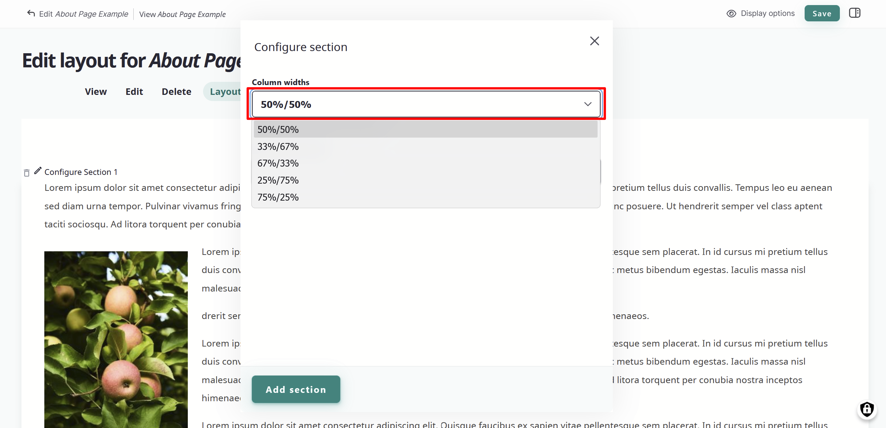

4. Add an optional *Administrative label* to your section. This label will not be visible to end users.

    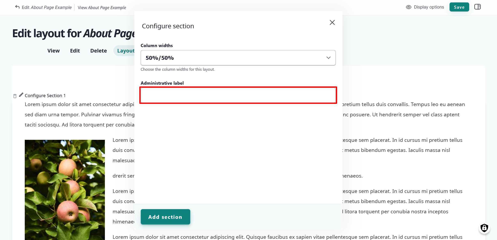

5. Select the "Add section" button to add your section.

    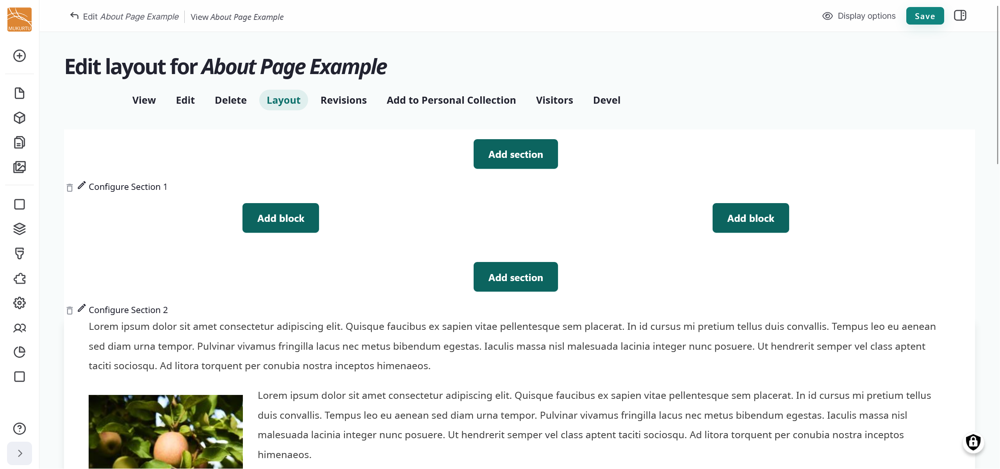

6. Edit or delete your section by selecting the **Edit** or **Delete** icons in the top left-hand side of the section.

    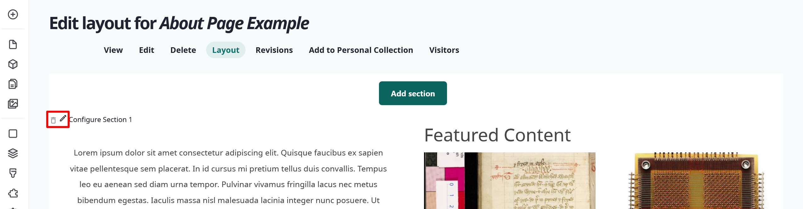

7. Select the "Save" button in the top right-hand corner to save your layout.

### Add blocks

1. To add a block, select "Add block". 
2. Select the type of block you want to add. You can add a Call to action, featured content, horizontal divider, Local Contexts labels and notices, media assets, or a text block.

    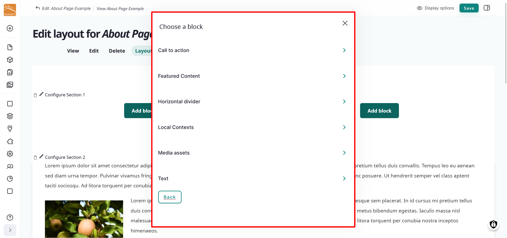

#### Call to action 

A call to action block enables a block with text and a button that redirects users to a specific site. Calls to action can be used to direct users to specific campaigns or to bring attention to particular aspects of the site.

1. Add a title in the required *Title* field. You can use the optional **Display title** toggle to configure whether the title is displayed or not.
2. You can use the full text HTML *Text box* to add explanatory text or embedded media.

    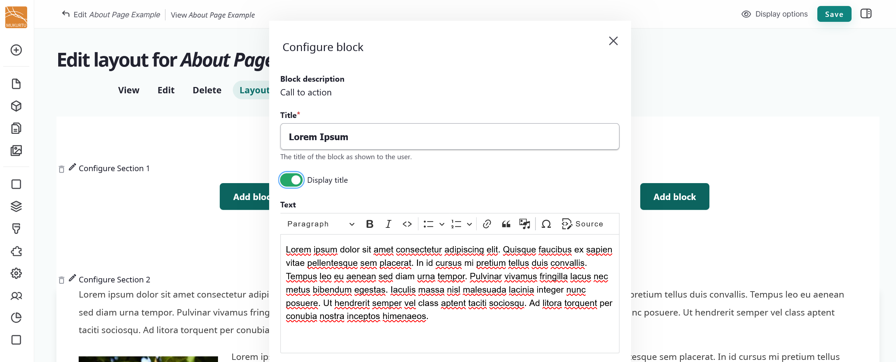

3. Use the *URL* and *link text* fields to include a link.
4. Select the "Add block" button to add your call to action block.

    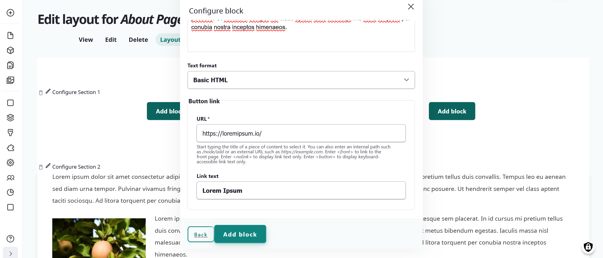

5. You can continue to add blocks, or select the "Save" button in the top right-hand side of the page to save your layout.

    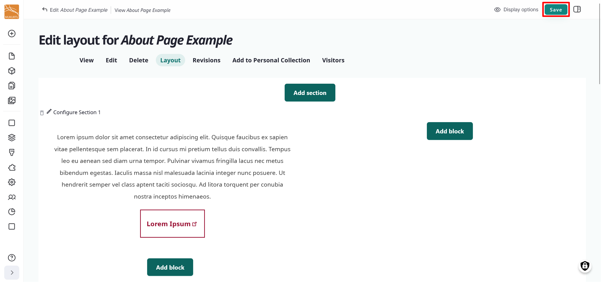

!!! tip
    It is recommended to save your layout as you add blocks in order to avoid losing your work.

#### Featured Content

Add featured content to your basic page. This does not impact any featured content displayed on your landing page.

1. Add a title to your featured content block using the *Title* field. Use the **Display title** toggle to choose whether your title is displayed.
2. Select the "Select Content" button to add content to your featured content block.

    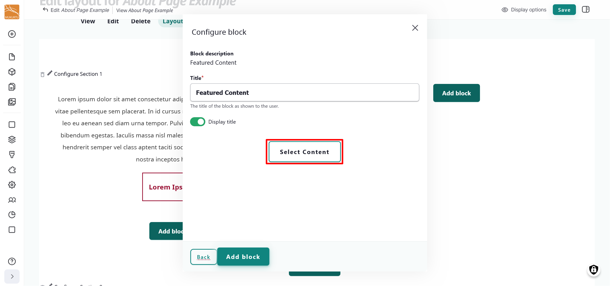

3. Select content to add to your featured content block, then select the "Add content" button to add your content. 
4. Select the "Remove" button to remove any content you do not want included.
5. Select the "Add block" button to save your featured content block.

    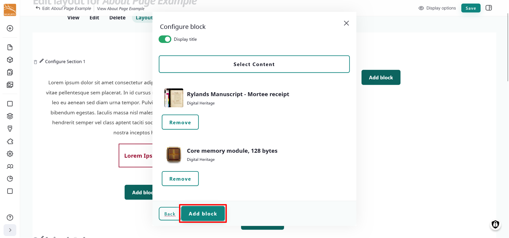

6. You can continue to add blocks, or select the "Save" button in the top right-hand side of the page to save your layout.

    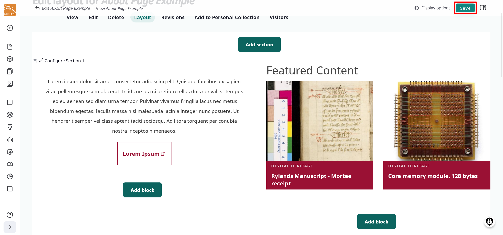

#### Horizontal divider

You may choose to add a horizontal divider block to your page. Select the **Horizontal divider** link, then select the "Add block" button. 

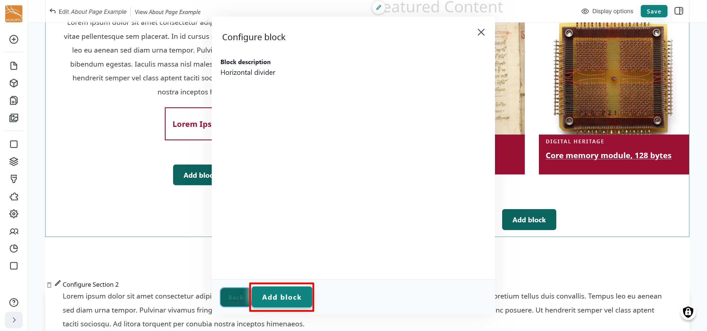

The horizontal divider block is a light grey line that extends the width of one column in your section.

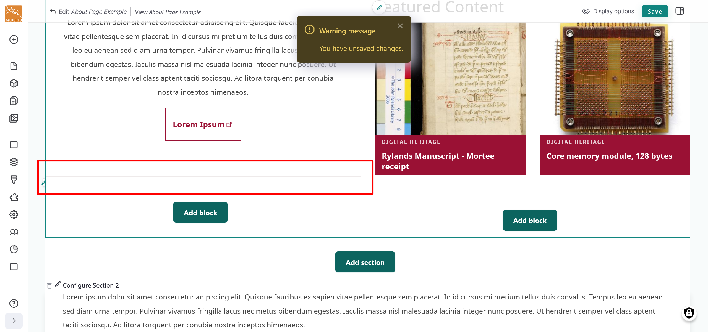

You can continue to add blocks, or select the "Save" button in the top right-hand side of the page to save your layout.

#### Local Contexts

To add a Local Contexts labels and notices block, select the **Local Contexts** link. You can add an entire Local Contexts project or individual labels and notices to your block.

1. Add a title to your Local Contexts block using the *Title* field. Use the **Display title** toggle to choose whether your title is displayed.
2. In the **Local Contexts projects** section, use the checkboxes to select projects to add to your block. This will apply all of the labels and notices under the project.
3. In the **Local Contexts labels and notices** section, use the dropdown menu to expand a project. Then use the checkboxes to apply individual labels and notices to your block.

    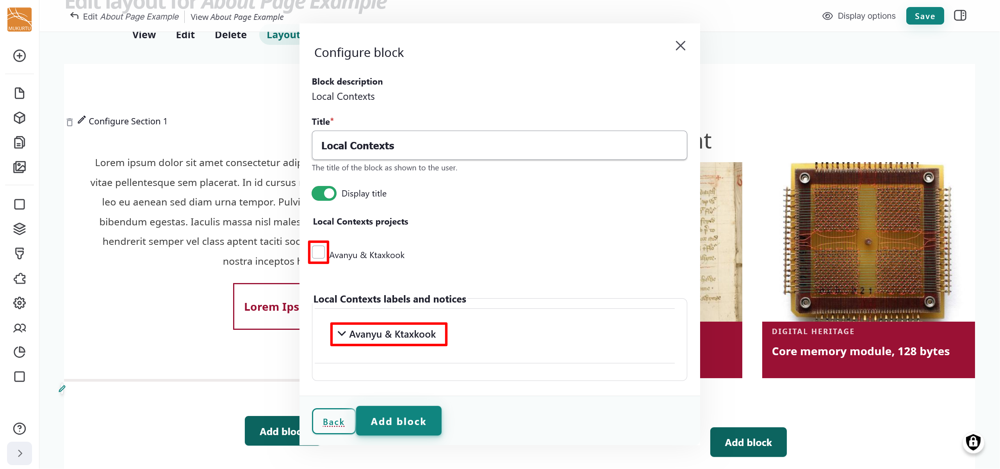

    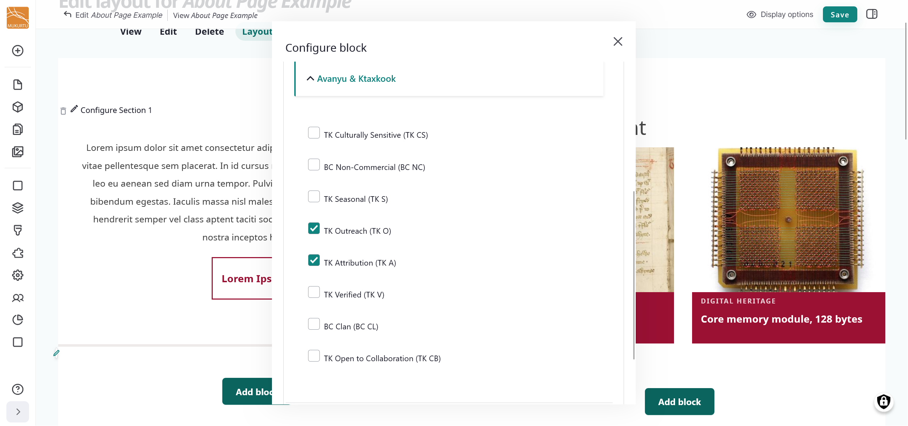

4. Select "Add block" to add your Local Contexts block.
5. You can continue to add blocks, or select the "Save" button in the top right-hand side of the page to save your layout.

    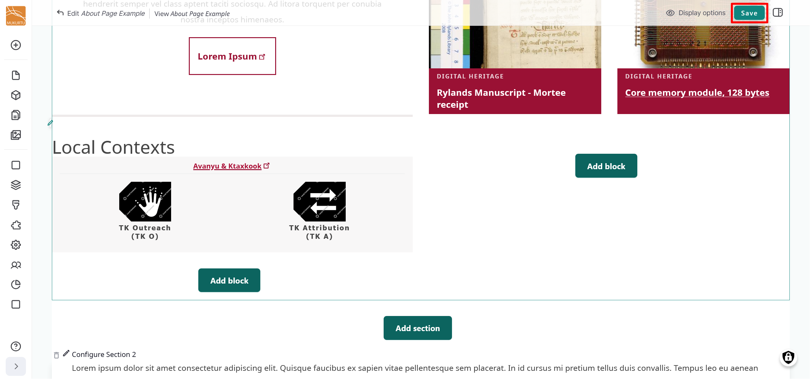

#### Media assets

To add a media assets block to your basic page, select the **Media assets** section.

1. Add a title to your Media assets block using the *Title* field. Use the **Display title** toggle to choose whether your title is displayed.
2. In the **Media items** section, select "Add media" to add media assets to your block. Multiple media assets display as a carousel.

    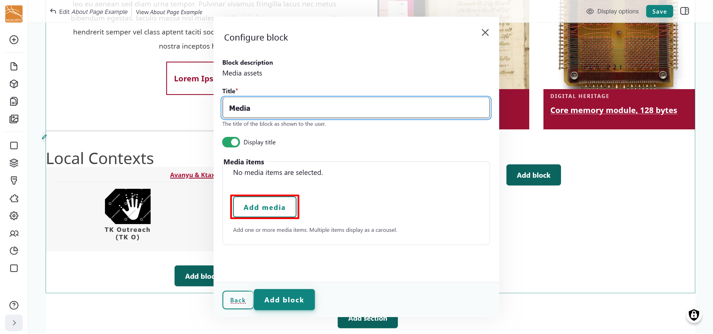

3. Select your media assets using the checkboxes, then select the "Insert selected" button.

    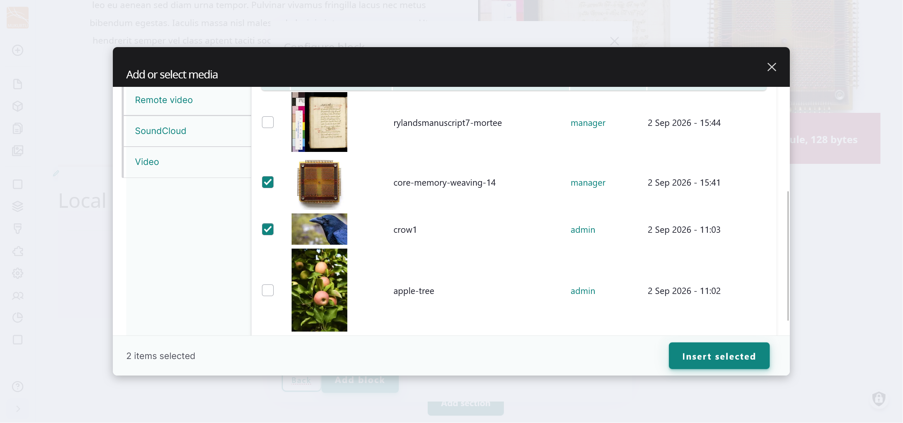
    
4. Select the "Add block" button to add your media asset block.

    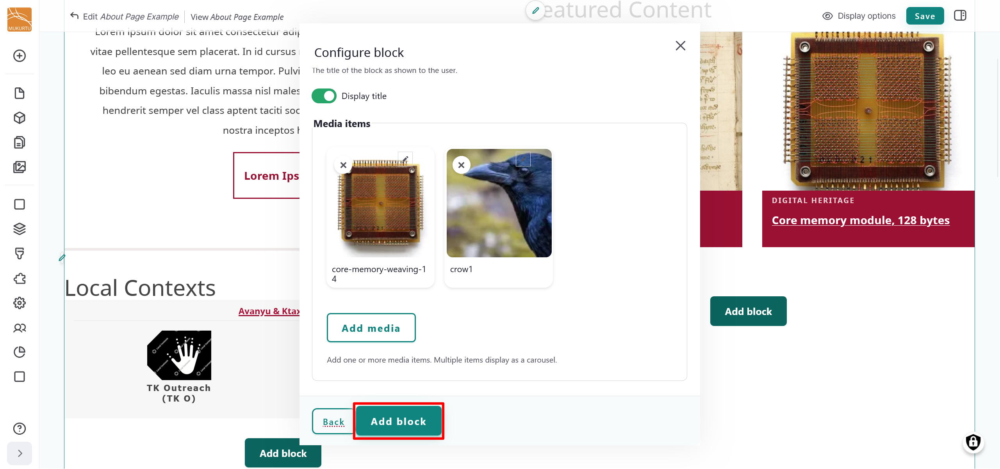

5. You can continue to add blocks, or select the "Save" button in the top right-hand side of the page to save your layout.

#### Text

To add a text block to your basic page, select the **Text** section.

1. Add a title to your text block using the *Title* field. Use the **Display title** toggle to choose whether your title is displayed.
2. Use the full text HTML field to add text or embedded media to your block.
3. Select the "Add block" button to add your text block.
4. You can continue to add blocks, or select the "Save" button in the top right-hand side of the page to save your layout.

### Edit blocks

You can edit, move, or remove blocks from your basic page by navigating to the **Layout** tab. 

- To edit a block, select the **Edit** icon in the top left-hand corner of the block, then select the **Configure** option to edit your block.

    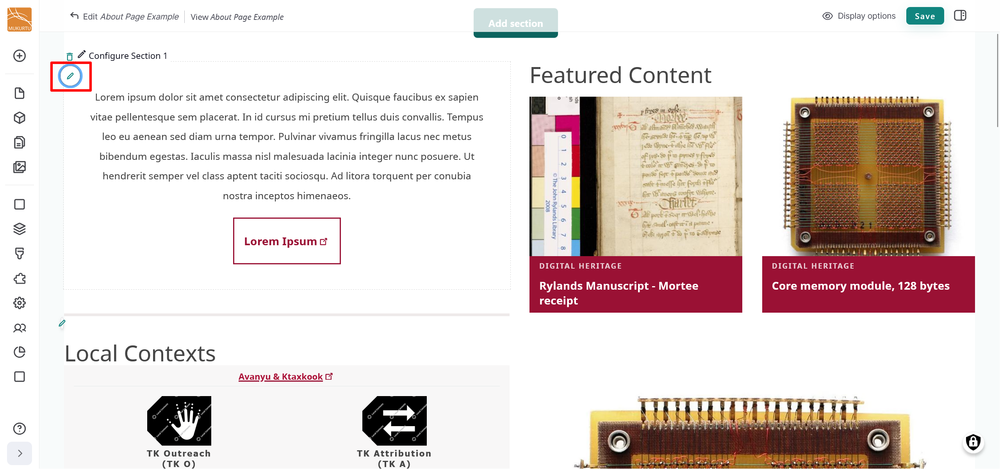

    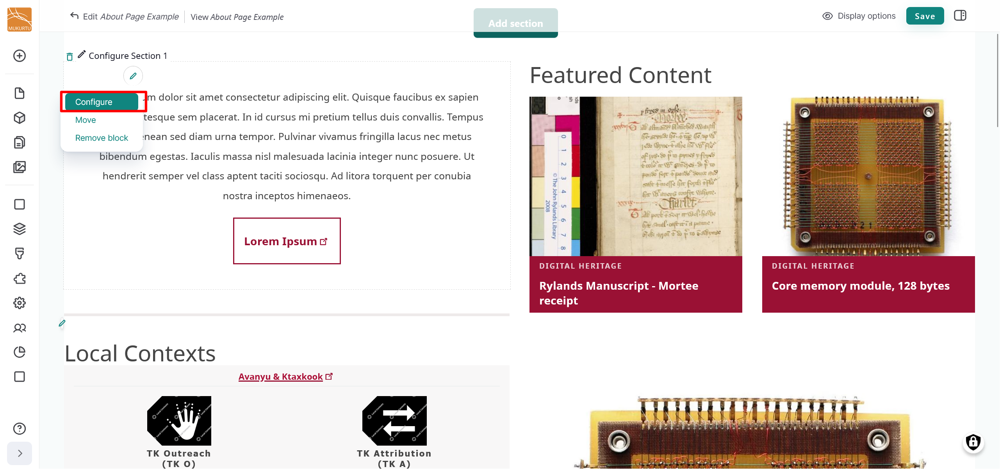

- To move a block, select the **Edit** icon in the top left-hand corner of the block, then select the **Move** option to select and drag your block. You can also select and drag your block using the **Move** icon.

    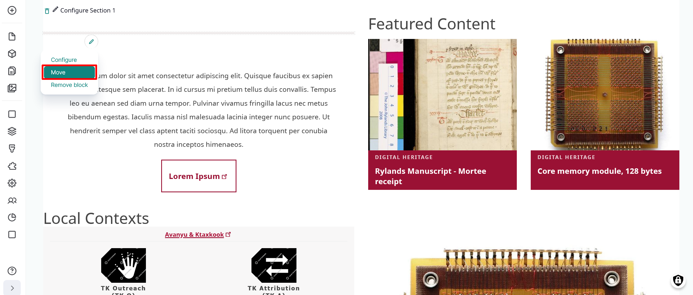

- To delete a block, select the **Edit** icon in the top left-hand corner of the block, then select the **Remove** option. 

    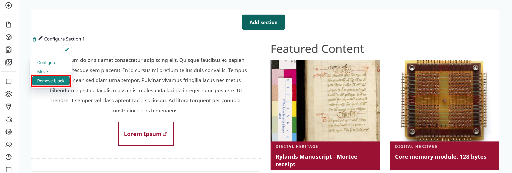

You will receive a confirmation message confirming that you want to remove the block. Select the "Remove" button to finish removing the block.

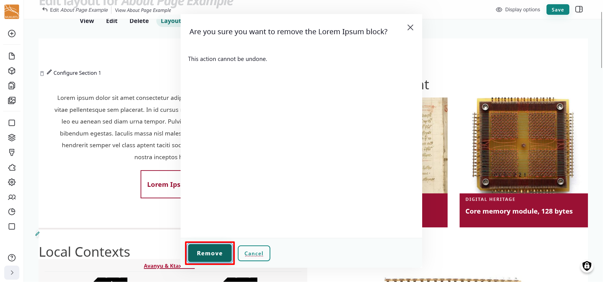

Select the "Save" button in the top right-hand corner of the page to save any changes you make to your basic page layout.

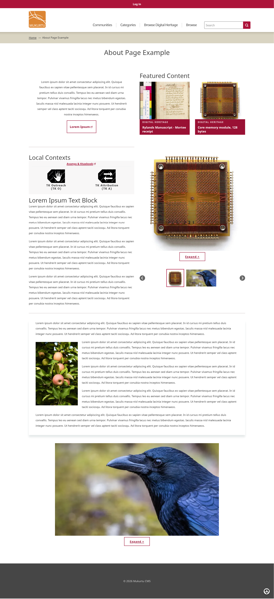