---
tags:
    - getting started
    - look and feel
---

# Customize Site Navigation

!!! roles "User roles"
    Drupal administrator, Mukurtu Manager

You can customize the menus on your Mukurtu CMS site to better reflect your content and help users navigate your site. To customize your site's main menus, navigate to the **Structure** link in your left-hand sidebar, then select **Menus**. 

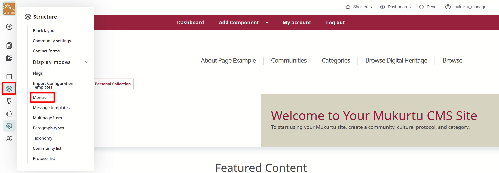

Navigate to **Main navigation** and select the "Edit menu" button. You can also navigate directly to `/admin/structure/menu/manage/main`.

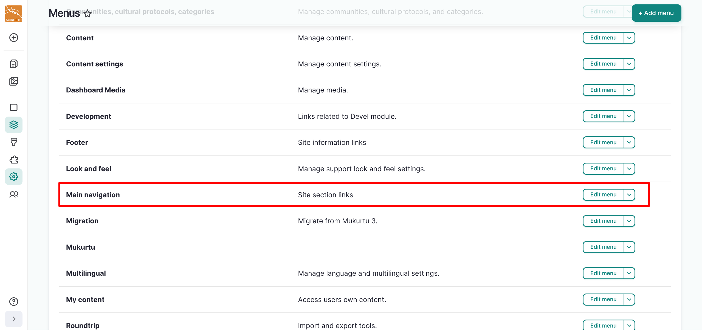

Optionally, you may choose to customize the *Title* or *Administrative summary* fields to better describe your site's navigation menu. 

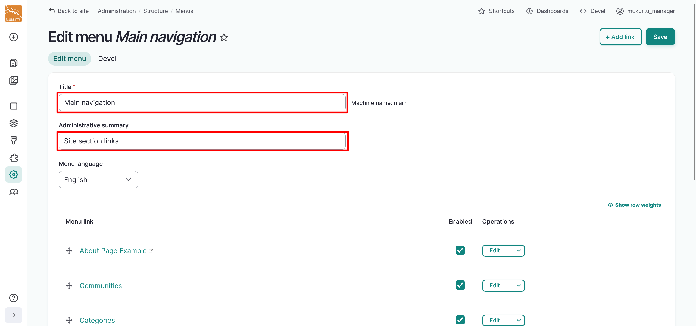

Use the **Menu link** menu to reorder your navigation menu, enable or disable menus, edit your navigation menu, or add child menu links.

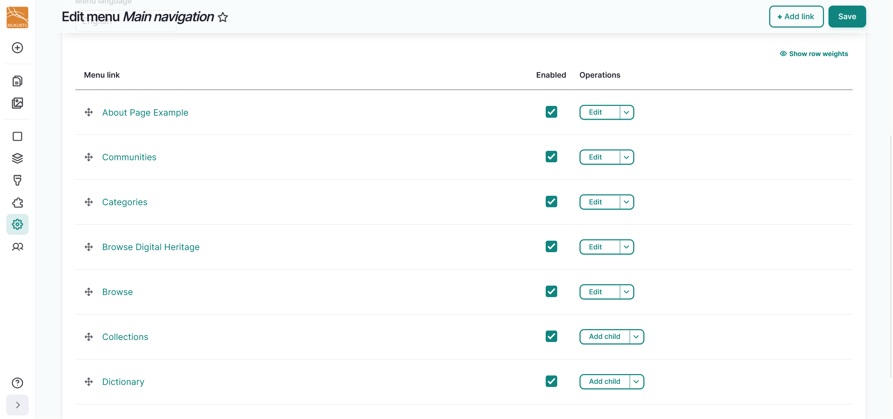

## Reorder navigation menu

1. Use the **Reorder** icons to drag your menu links into your preferred order.

    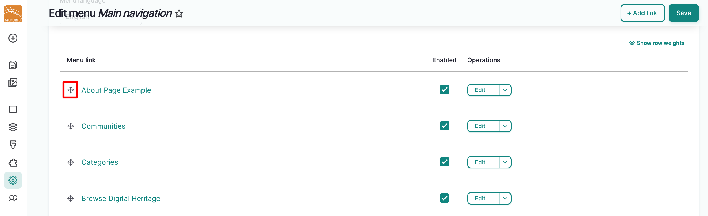

2. Select the "Save" button to save the order of your navigation menu.

## Enable or disable menus

1. To enable or hide individual menu links, select the checkbox to the right of the menu link.

    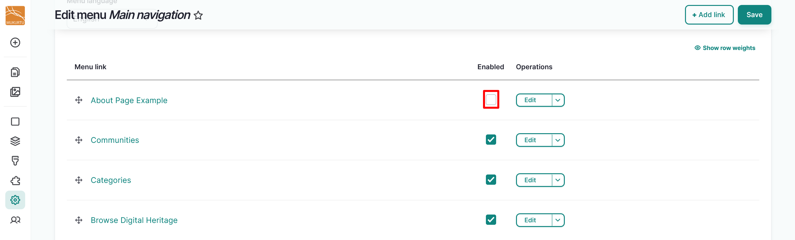

2. Select the "Save" button to save your menu link selections.

## Create a menu link

1. Select the "Add link" button in the top right-hand corner. 

    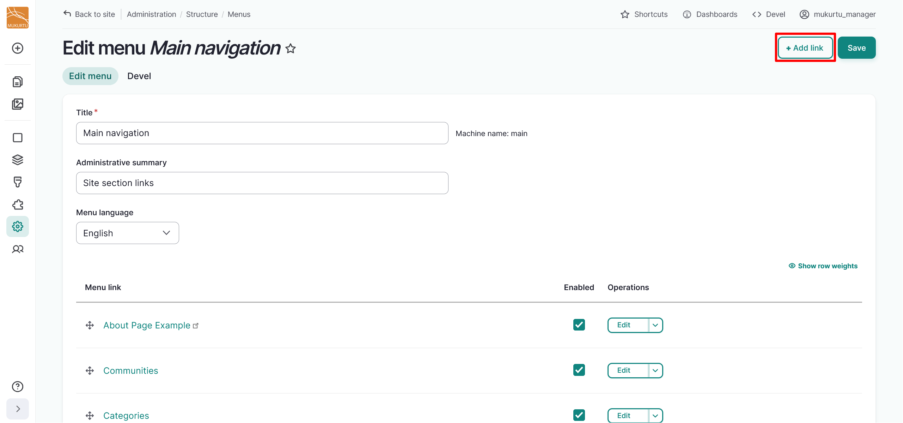

2. Enter your *Menu link title*. 
    
    - This is a required field.

3. Enter your *Link*. 

    - You can enter an internal link by starting to enter the title and selecting from the options presented, or by entering an internal path such as `/digital-heritage/sample-item`.
    - Enter an external URL by entering the full URL into the *Link* field, such as `https://www.example.com`.
    - Enter `<Front>` to link to the site's front page. 
    - This is a required field.

4. Select the **Enabled** slider to determine whether the menu link should be enabled in menus or hidden.

    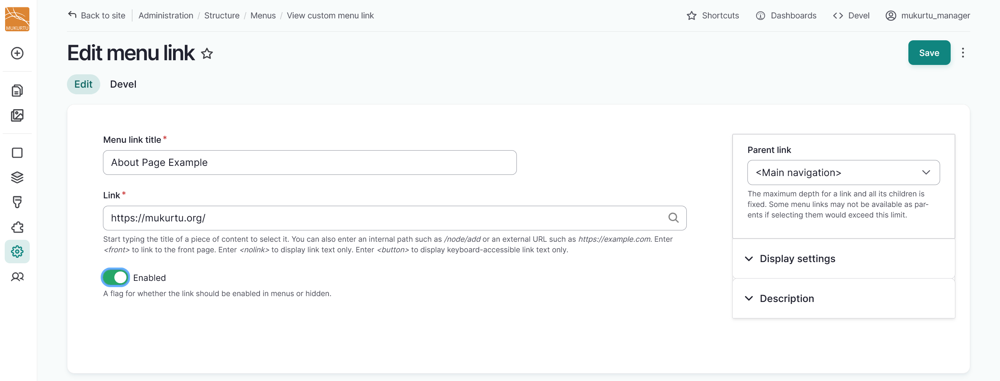

5. Select the **Parent link** from the dropdown menu. Unless you are adding a child link, `<Main navigation>` should be automatically selected. For more information on adding child menu links, refer to the [Add a child menu link](#add-a-child-menu-link) section of this article.

    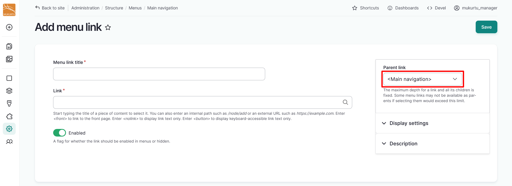

## Edit menu links

You can edit menus links to reflect your site's naming conventions, to link to an internal path, or to redirect to an external URL. Redirecting to an external URL could be useful for sites that want to direct users to an About page that is externally hosted. Follow the instructions below to edit your menu links. 

1. Select the "Edit" button to the right of your menu link.

    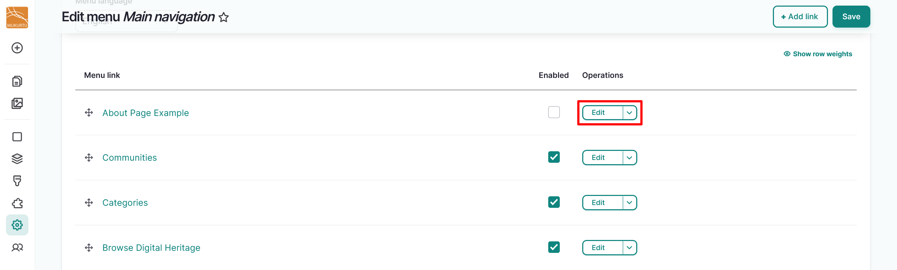

2. Enter your *Menu link title*. 

    - This is a required field.

3. Enter your *Link*. You can link to either internal or external pages.

    - You can enter an internal link by starting to enter the title and selecting from the options presented, or by entering an internal path such as `/digital-heritage/sample-item`.
    - Enter an external URL by entering the full URL into the *Link* field, such as `https://www.example.com`.
    - Enter `<Front>` to link to the site's front page. 
    - This is a required field.

4. Select the **Enabled** slider to determine whether the menu link should be enabled in menus or hidden.

    

5. Select the "Save" button to save the edits to your menu link.

## Add a child menu link

You may choose to add child menu links to your main navigation menu links to help users navigate your site. There are two ways to add child menu links: by creating a new menu link as a child, or by using the **Reorder** icon to drag and indent an existing menu link. Follow the instructions below to add child menu links.

### Create a menu link as a child

1. From the "Edit" button dropdown to the right of your menu link, select "Add Child".

    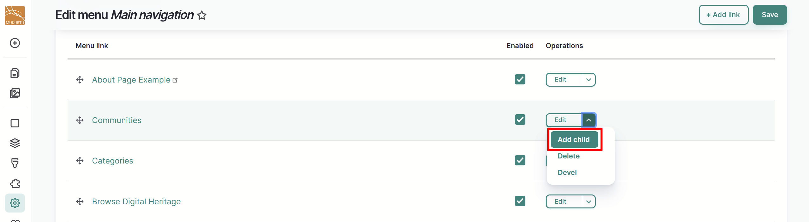

2. Create your child link the same way you would create a new menu link. For more information on creating a new menu link, refer to the [Create a menu link](#create-a-menu-link) section of this article.

3. Select the **Parent link** you prefer from the dropdown menu. 

    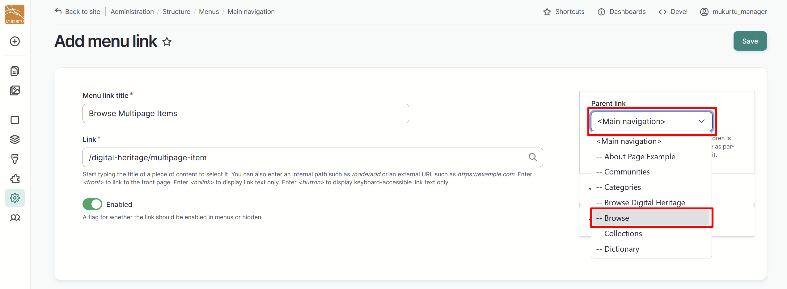

4. Select "Save" to save your child menu link. 

### Reorder existing menu link

1. From the **Menu Links** section of the **Main Navigation** page, use the **Reorder** icons to drag your menu links under your preferred parent link.

    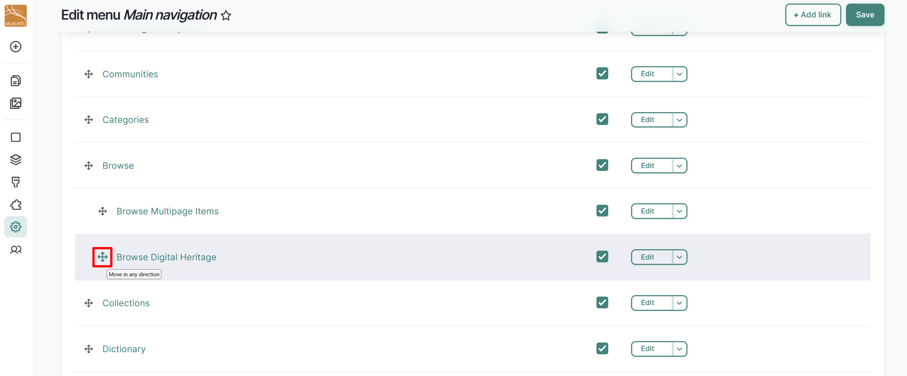

2. Select the "Save" button to save your menu links. 

Your child menu links will appear as a submenu when you hover over the parent menu link.

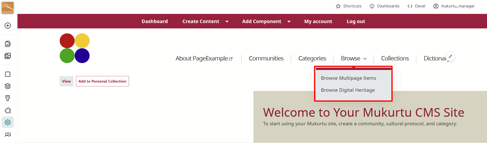

