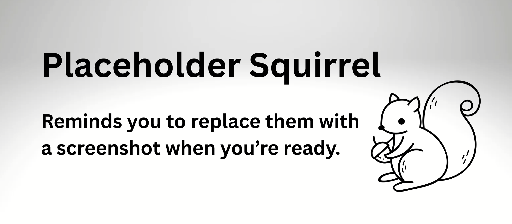

# Media Upload Instructions by Media Type

!!! roles "User roles"
	Protocol steward, contributor, community record steward, curator, language steward, language contributor 

Mukurtu supports different types of media, including audio files, SoundCloud links, documents, external embeds, image files, remote video, and video files. Most media types have unique metadata fields and other requirements to add them to your media library. This article provides step-by-step instructions on how to upload each media type.

Media can be uploaded from your dashboard or when adding content. This article focuses on uploading media from your dashboard. Instructions on for uploading media when you create content can be found here **MAKE AN ARTICLE FOR THIS!!!**

## Audio files

     !!! requirement
         The following fields are required.

1. Navigate to your dashboard. Select **Add Media**. 

    

2. Select the **Audio** link.
3. In the **Audio file** field, select the "Choose File" or "Browse" button to upload an audio file. 

     !!! tip
         The text of the upload button depends on your browser. 
        
    - Select an audio file from your file explorer.        
    - If you selected the incorrect file, remove it by selecting the "Remove" button after the file uploads.

4. The name of your recording is automatically generated from your filename. You can edit the name of your audio file by editing the text in the *Name* field.

     !!! tip
         Several of the media file names are automatically generated by Mukurtu, so it is helpful to have good file naming conventions.

5. Navigate to the **Sharing Setting** field to apply a sharing setting. Select **All** or **Any**.
    - All means that the item may only be shared with members belonging to ALL the protocols listed. This is the more restrictive setting. 
    - Any means the asset may be shared with members of ANY of the protocols listed. This is less restrictive.

6. Use the checkboxes to apply cultural protocols to the media asset.

     !!! requirement
         The following fields are not required.

7. In the *Identifier* field, provide a unique identifier for the audio file. This identifier is usually an accession number, catalogue number, or other unique identifier.

8. 

## SoundCloud links

## Documents

## External embeds

## Images

## Remote video

## Video files

