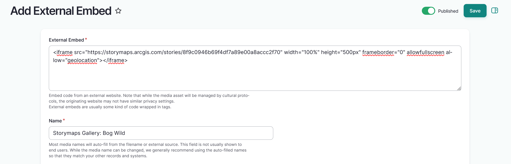
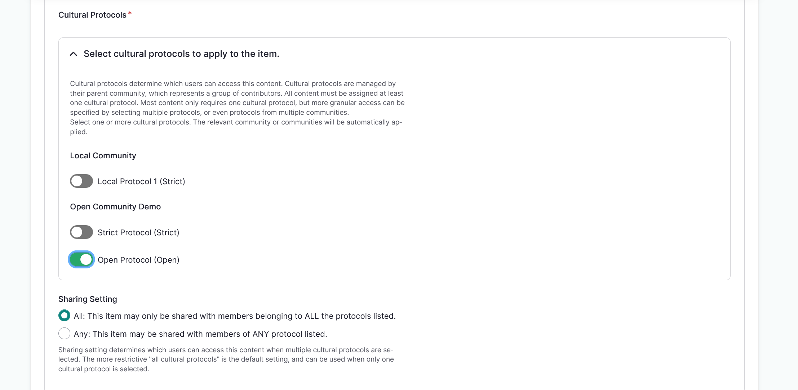
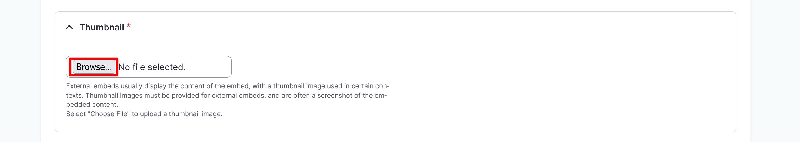
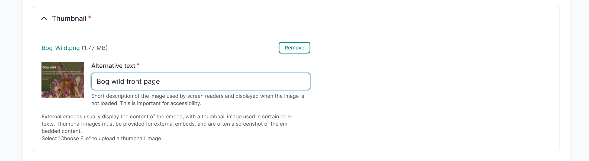
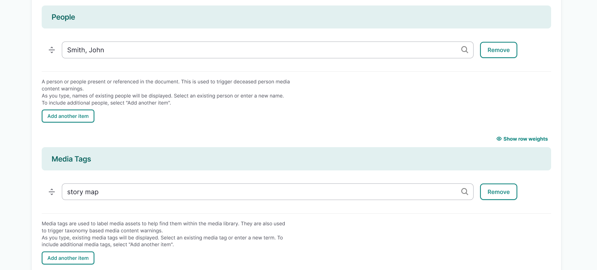

# External Embeds

!!! roles "User roles"
    Protocol steward, contributor, community record steward, curator, language steward, language contributor 

1. Navigate to your dashboard. Select **Add Media**. 
2. Select the **External Embed** link. You can embed any resource that has an external embed code. 
4. In the *External Embed* field, insert the full embed code for a asset. Some examples of external embed code include:

    - Image: `<embed type="image/jpg" src="image.jpg" width="300" height="200"> `
    - HTML page: `<iframe src="https://www.example.com/" style="height:200px;width:300px"></iframe>`
    - Video: `<embed type="video/webm" src="video.mp4" width="400" height="300">` 
    - This is a required field.

3. Enter the name of your external embed in the *Name* field. This is not automatically generated for external embeds.

    - This is a required field.

    

4. Use the toggle(s) to apply cultural protocols to the media asset.

    - This is a required field.
    
    !!! tip
        While the media asset will be managed by cultural protocols, the originating website may not have similar privacy settings.

5. Navigate to the **Sharing Setting** field to apply a sharing setting. Select **All** or **Any**.

    - All means that the media asset may only be shared with members belonging to ALL the protocols listed. This is the more restrictive setting. 
    - Any means the asset may be shared with members of ANY of the protocols listed. This is less restrictive.
    - This is a required field.

    !!! tip
        All is the default setting.

            

6. External embeds are represented by a thumbnail image. This must be added manually as it is not automatically generated, and are often a screenshot of the embedded content.

    - Select "Choose file" to upload an image.
    - Provide alternative text for your thumbnail. This is required for all thumbnail images. 
    - This is a required field.

    

    
    

7. In the *Identifier* field, provide a unique identifier for the external embed. This identifier is usually an accession number, catalogue number, or other unique identifier.
8. Use the *People* field to enter the name of anyone present, named, or referenced in the media asset. 
    
    !!! tip
        This field feeds into the "deceased person" media content warnings.

    - If more than one individual should be listed, use the "Add another item" button to add additional people fields. 
    - Select and drag the arrows to reorder your people if necessary. 
    - To remove a person, select the "Remove" button.
    
9. Select a *Media tag* to apply to the external embed by entering text in the dropdown box and selecting from the provided options. 

    !!! tip 
        Media tags can be used to tag and locate assets within the media library (for example, `oral history` or `newspaper`). They can also be used to trigger media content warnings when that tool is enabled.

    - If more than one media tag should be included, use the "Add another item" button to add additional media tag fields. 
    - Select and drag the arrows by the media tag's name to reorder it if necessary. 
    - To remove a media tag, select the "Remove" button.

    

10. Select the "Save" button to save your media asset.