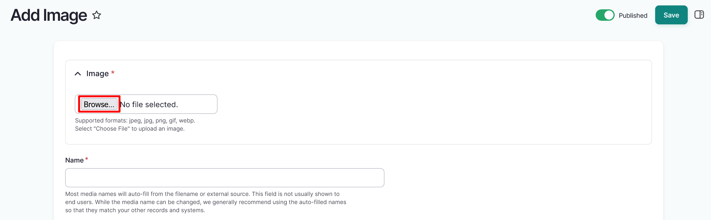
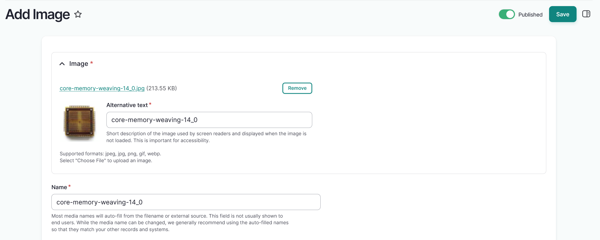
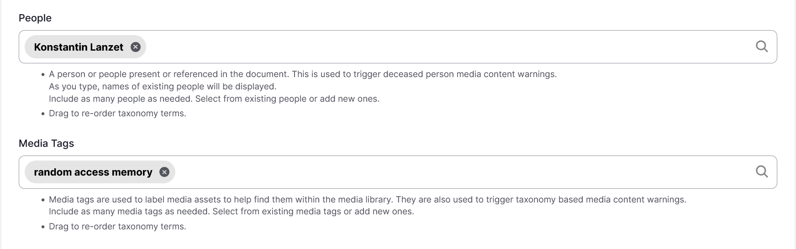

# Images

!!! roles "User roles"
    Protocol steward, contributor, community record steward, curator, language steward, language contributor 

1. Navigate to your dashboard. Select **Add Media**. 
2. Select the **Image** link.
3. In the **Image** field, select the "Choose File" or "Browse" button to upload an image file. 

    !!! tip
        The text of the upload button depends on your browser. 
        
    - Select an image file from your file explorer.        
    - If you selected the incorrect file, remove it by selecting the "Remove" button after the file uploads.
    - This is a required field.

    

4. *Alternative text* is a short description of the image is used by screen readers and displayed when the image is not loaded. This is important for accessibility. For more information on how to write helpful alt text, visit Harvard University's [Digital Accessibility: Write helpful Alt Text to describe images](https://accessibility.huit.harvard.edu/describe-content-images) site. Alternative text is automatically generated for most image files.

    - This is a required field.

5. The name of your image is automatically generated from your filename. We recommend leaving the autogenerated name so that it is consistent with your existing files and records. If necessary, you can edit the name of your image file by editing the text in the *Name* field.

    - This is a required field.

    

6. Use the toggle(s) to apply cultural protocols to the media asset.

    - This is a required field.

7. Navigate to the **Sharing Setting** field to apply a sharing setting. Select **All** or **Any**.

    - All means that the media asset may only be shared with members belonging to ALL the protocols listed. This is the more restrictive setting. 
    - Any means the asset may be shared with members of ANY of the protocols listed. This is less restrictive.
    - This is a required field.

    !!! tip
        All is the default setting.

    

8. In the *Identifier* field, provide a unique identifier for the image file. This identifier is usually an accession number, catalogue number, or other unique identifier.
9. Use the *People* field to enter the name of anyone present, named, or referenced in the media asset. 
    
    !!! tip
        This field feeds into the "deceased person" media content warnings.

    - If more than one individual should be listed, use the text box to select existing people terms or add new ones. 
    - Select and drag to reorder if necessary. 
    - To remove a person, select the "X".
    
10. Select a *Media tag* by entering text in the text box and selecting from the provided options. Include as many media tags as needed. Select from existing media tags or add new ones.

    !!! tip 
        Media tags can be used to tag and locate assets within the media library (for example, `oral history` or `newspaper`). They can also be used to trigger media content warnings when that tool is enabled.

    - Select and drag to reorder if necessary. 
    - To remove a media tag, select the "X".

    

11. Select the "Save" button to save your media asset.