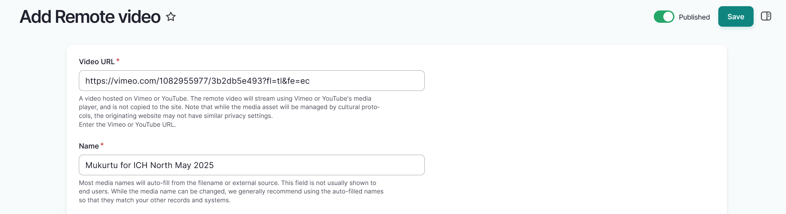
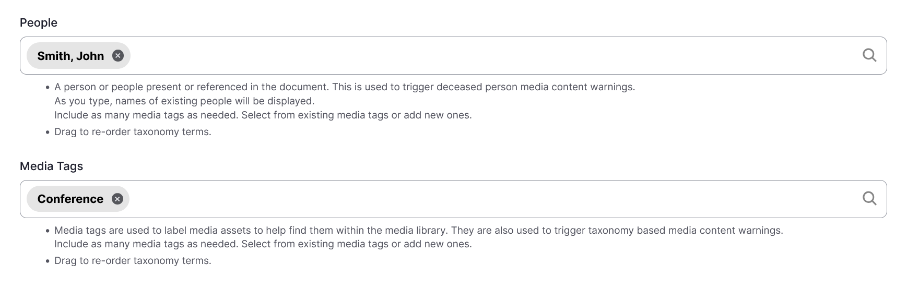

# Remote Videos

!!! roles "User roles"
    Protocol steward, contributor, community record steward, curator, language steward, language contributor 

1. Navigate to your dashboard. Select **Add Media**. 
2. Select the **Remote Video** link. Remote videos can be hosted by either Vimeo or YouTube.

3. In the *Video URL* field, insert the full URL for a remote video asset. This should be formatted as `https://www.full.asset.link`.
    
    - This is a required field.

4. The name of your remote video is automatically generated. If necessary, you can edit the name of your remote video by editing the text in the *Name* field.

    - This is a required field.

    

5. Use the toggle(s) to apply cultural protocols to the media asset. Media created within a content form will automatically inherit content protocols. 

    - This is a required field.

6. Navigate to the **Sharing Setting** field to apply a sharing setting. Select **All** or **Any**.

    - All means that the media asset may only be shared with members belonging to ALL the protocols listed. This is the more restrictive setting. 
    - Any means the asset may be shared with members of ANY of the protocols listed. This is less restrictive.
    - This is a required field.

    !!! tip
        All is the default setting.

7. Optionally, you may select the **Sync protocols with content** setting. When enabled, this setting ensures the media asset's protocols will always match those of it's parent content to keep content and media access in sync. Media created within a content form will automatically inherit content protocols. Media created elsewhere require protocol selection, but will sync once added to content. You can disable the sync setting to set media protocols independent of parent content. 

    

8. Remote video assets are represented by an interactive media player instead of a thumbnail image by default. You may choose to add a thumbnail to your remote video asset.

    - Select "Choose file" to upload an image.
    - Provide alternative text for your thumbnail. This is required for all thumbnail images. 

9. In the *Identifier* field, provide a unique identifier for the remote video asset. This identifier is usually an accession number, catalogue number, or other unique identifier.
10. Use the *People* field to enter the name of anyone present, named, or referenced in the media asset. 
    
    !!! tip
        This field feeds into the "deceased person" media content warnings.

    - If more than one individual should be listed, use the text box to select existing people terms or add new ones. 
    - Select and drag to reorder if necessary. 
    - To remove a person, select the "X".
    
11. Select a *Media tag* by entering text in the text box and selecting from the provided options. Include as many media tags as needed. Select from existing media tags or add new ones.

    !!! tip 
        Media tags can be used to tag and locate assets within the media library (for example, `oral history` or `newspaper`). They can also be used to trigger media content warnings when that tool is enabled.

    - Select and drag to reorder if necessary. 
    - To remove a media tag, select the "X".

    

12. Select the "Save" button to save your media asset.