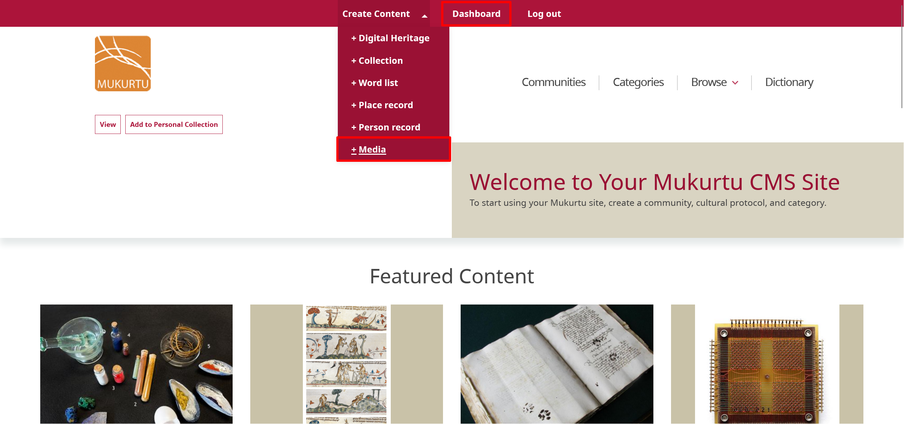
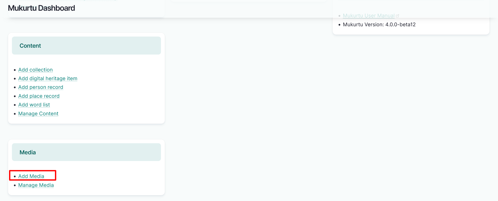
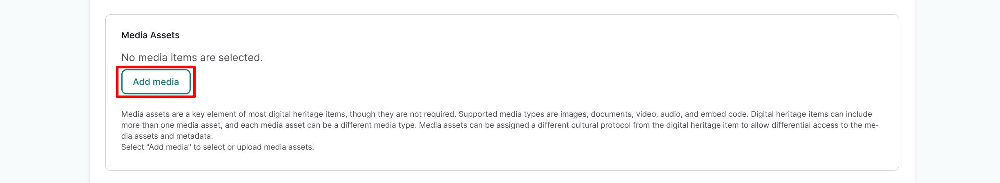
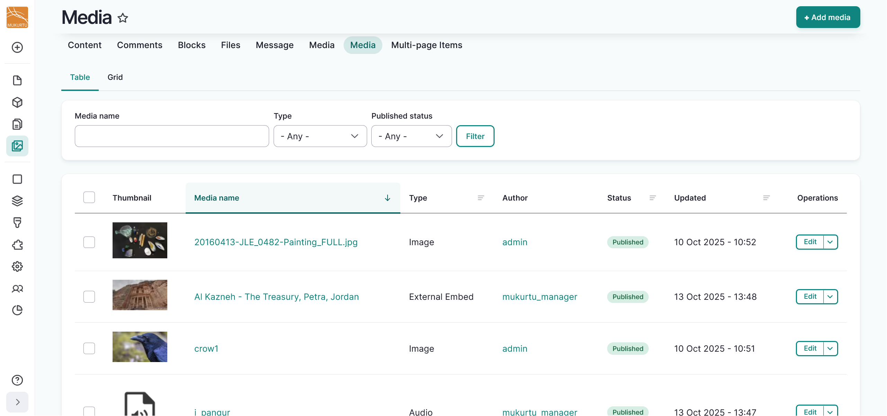
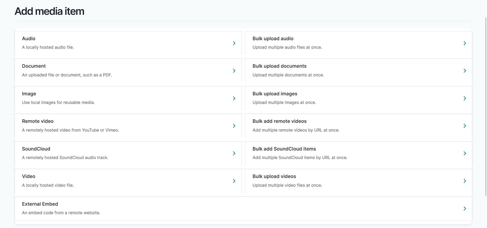
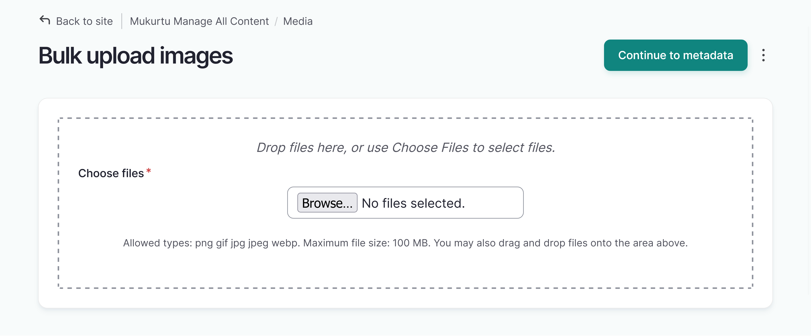
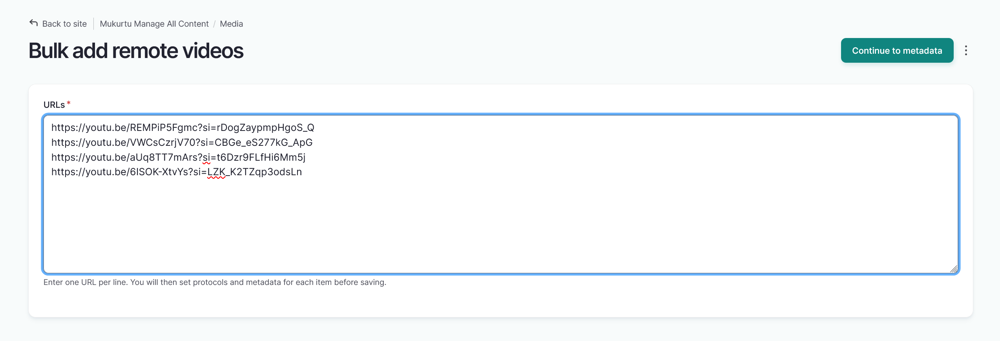

---
tags:
    - media
    - getting started
---

# Create Media Assets Overview

!!! roles "User roles"
	Protocol steward, contributor, community record steward, curator, language steward, language contributor 

Mukurtu supports the following media types:

- [Audio files](../../media/ByTypeMediaUpload/Audio)
- [Document files](../../media/ByTypeMediaUpload/Document)
- [Embedded code, such as iframe embeds](../../media/ByTypeMediaUpload/ExternalEmbed)
- [Image files](../../media/ByTypeMediaUpload/Image)
- [SoundCloud embeds](../../media/ByTypeMediaUpload/SoundCloud)
- [Video files](../../media/ByTypeMediaUpload/Video)
- [YouTube and Vimeo embeds](../../media/ByTypeMediaUpload/RemoteVideo)

The workflow for creating media assets varies somewhat for different media types or for bulk upload, but is generally consistent.

This article provides a basic overview of how to create media assets, including format-specific notes. For detailed instructions on creating each type of media asset, refer to the individual articles linked above.

## Overview 

You can create media assets from your dashboard, from the Create Content menu, or while creating content. Some elements will look different depending on where you are starting from, but the workflow is the same. 

To start adding media:

- When adding media from your dashboard, select "Add Media". 

	

- When adding media from your top Create Content menu, select **+ Media**. 

	

- When adding media from content, selecting "Add Media" in the *Media Assets* field allows you to add different media types. 
	- When adding media from content, the media type may be restricted by the type of content that is being created.

	

To add media:

- To add a single media asset from the **Add media item** menu, select the media type on the left. 
- To upload audio, document, image, or video files, select the "Choose File" or "Browse" button, then select one or more files. 

!!! tip
	Depending on your browser, the text of the button may vary.

- To insert remote video, SoundCloud, or external embeds, copy and paste the URL or embed code. 
- Media asset metadata for the different media types is briefly described below. For a more detailed overview, refer to the [Media Asset Metadata](MediaAssetMetadata.md) or the individual Upload Media Asset support documents.
- Once your media assets are part of your media library, they can easily be added to your content.

	

!!! warning 
	Note that while the media asset will be managed by cultural protocols, the originating website may not have similar privacy settings. 

## Bulk media creation

Mukurtu 4 has the option to bulk add media assets. To add more than one media asset, select the bulk add option for the media type on the right. Then you can add your media asset metadata. Please note that there is no bulk upload option for external embeds.
	

- To bulk upload audio, document, image, or video files, select the "Choose File" or "Browse" button, then select one or more files. Select "Continue to metadata" to input your media asset metadata.

	

- To bulk upload remote video or SoundCloud assets, select the bulk add option and paste your URLs in the text box. Select "Continue to metadata" to input your media asset metadata.

	

## Locally hosted media

- Names are automatically generated from the filename of the media. 
- *Cultural protocols* and *Sharing settings* are required. See [Manage Media Access with Cultural Protocols](ManageMediaAccessWithProtocols.md) for more information.

## Remotely hosted media 

- Enter the URL to link to your media asset.  
- Filenames automatically generate for remotely hosted media.
- *Cultural protocols* and *Sharing settings* are required. See [Manage Media Access with Cultural Protocols](ManageMediaAccessWithProtocols.md) for more information.

## Embedded media

- Provide a name for your embedded media. This field is not auto-generated.
- Enter the embed code to add your externally embedded media to the media library.
- You must provide a thumbnail image for your external embed.
	- In the **Thumbnail** field, select the "Choose File" or "Browse" button to upload an image file or drag and drop an image file from your file explorer.
	- Alternative text is required for the thumbnail image. This short description is used by screen readers and displayed when the image is not loaded. It is important for accessibility. This is a required field.
	
## Optional metadata fields 

All media types have the following metadata fields.

- Identifier 
- People 
- Media Tags 
- Thumbnail

### Audio metadata fields 

Audio files have the following optional metadata fields

- Contributor 
- Transcription 

### Required image metadata field

Image files have the following required metadata field.

- Alternative Text - this is a required field for all images, including thumbnails
