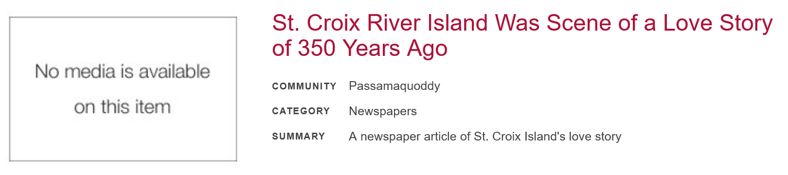
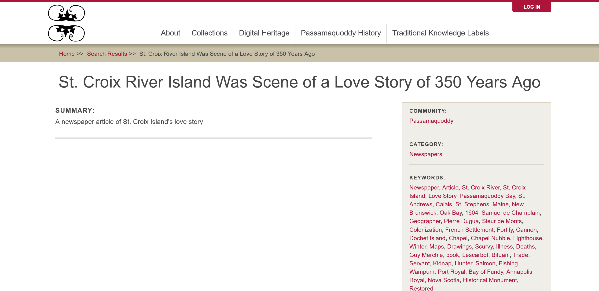

---
tags:
    - media
    - communities cultural protocols and categories
---
# Manage Media Access with Cultural Protocols

!!! question "User roles:"
    Protocol steward, Contributor, Community Record Steward, Curator, Language Steward, Language Contributor

Cultural protocols must be directly added to all media assets in your media library. This is a new requirement for Mukurtu v4.

We strongly recommend applying the same cultural protocols to each media asset that are applied to the content items where the media asset is used. 

You can apply a strict protocol to a media asset and associate it with a content item with an open protocol. The media asset will not appear to users outside that protocol, but they can view the metadata from the open protocol. This might be desirable if you prefer to restrict some media assets while you share the associated metadata. 

One example of how this appears on your site is found in the Passamaquoddy People's newspaper article "St. Croix River Island was Scene of a Love Story of 350 Years Ago". Only the metadata for the newspaper is available. The article itself was assigned a strict protocol and does not appear on the site.

