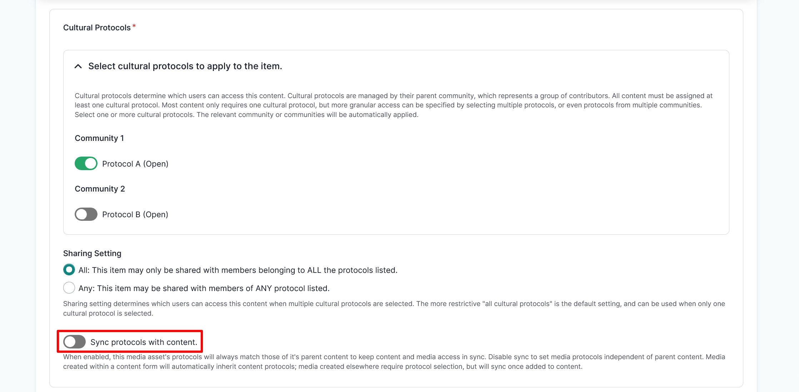
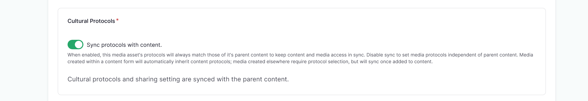
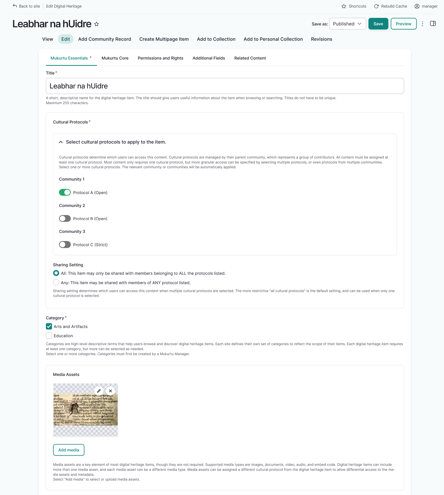

---
tags:
    - media
    - communities, cultural protocols, and categories
---
# Manage Media Access with Cultural Protocols

!!! roles "User roles"
    Protocol steward, contributor, community record steward, curator, language steward, language contributor 

All media assets require cultural protocols. 

!!! tip 
    In Mukurtu v3 protocols were optional. This is a new requirement for Mukurtu v4.

In most cases you will want to apply the same cultural protocols to each media asset that are applied to the content items where the media asset is used. This ensures that if a user can view the content, they can also view the media assets. This is facilitated by the **Sync protocols with content** setting. When enabled, this setting ensures the media asset's protocols will always match those of it's parent content to keep content and media access in sync. Media with synced protocols created within a content form will automatically inherit content protocols. Media created elsewhere require protocol selection, but will sync once added to content. You can disable the sync setting to set media protocols independent of parent content. 

When the **Sync protocols with content** toggle is selected, the cultural protocol and sharing settings options are automatically hidden.

You can have different protocols between content and media if this is appropriate or preferred for your site. This allows you to further manage access to media assets for your site users while keeping the metadata more widely accessible. For example, a digital heritage item under an open protocol featuring a media asset under a strict protocol would make the metadata and item discoverable, but limit access to the media assets.

