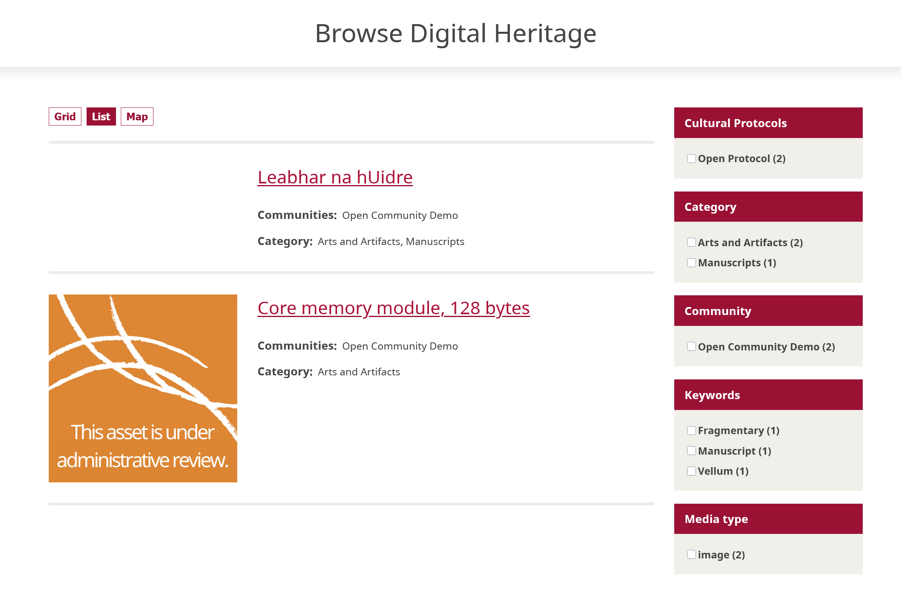

---
tags:
    - media
    - communities, cultural protocols, and categories
---
# Manage Media Access with Cultural Protocols

!!! roles "User roles"
    Protocol steward, contributor, community record steward, curator, language steward, language contributor 

All media assets require cultural protocols. 

!!! tip 
    In Mukurtu v3 protocols were optional. This is a new requirement for Mukurtu v4.

In most cases you will want to apply the same cultural protocols to each media asset that are applied to the content items where the media asset is used. This ensures that if a user can view the content, they can also view the media assets.

If necessary, you can have different protocols between content and media. For example, a digital heritage item under an open protocol featuring a media asset under a strict protocol would make the metadata and item discoverable, but limit access to the media assets.

