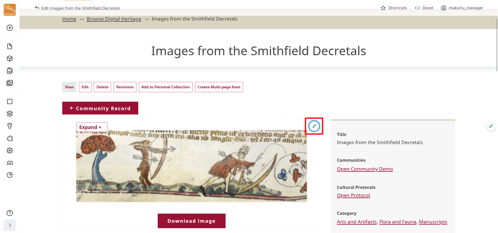

---
tags:
    - media
    - getting started
---

# Manage Media Assets

!!! roles "User roles"
	Protocol steward, contributor, community record steward, curator, language steward, language contributor 

You can use the Mukurtu Media Library to create, edit, and delete media assets. For detailed instructions on how to create media assets, refer to the [Create Media Assets](CreateMediaAssets) articles. 

You can access the media library from your Dashboard or from the Media link in the left-hand sidebar. 

You can use the *Media name* field to search for media assets by name, or you can filter by type or published status.

## Edit media assets

- To edit media assets in the media library, select the "Edit" button to the far right of the media asset. 

- Make your edits in the form and select Save when done.

- You can also edit media assets in content by selecting the "Edit" icon in the top right-hand corner of the media asset. 

## Delete media assets

To delete one media asset:

- Select the dropdown arrow in the "Edit" button to the far right of the media asset.

- Select the "Delete" option. 
- You will receive a confirmation message. If you are sure you want to delete your media asset, select "Delete". This action cannot be undone. If you do not want to delete your media asset, select "Cancel".

- You will get a status message confirming your media asset has been deleted.

To delete multiple media assets:

- Select the checkboxes to the left of the media assets you want to delete.

- Select the **Action** menu across the bottom of your Screen. 
- Select "Delete Media".

- Select the "Apply to Selected Items" button.

- You will recieve a conformation message asking if you are sure you want to delete the media assets. If you are sure, select "Delete".

- You will see a status message confirming your media asset has been deleted.

## Other actions

You can use the Action dropdown menu to batch add media assets to an export list or remove them, or to batch publish or unpublish media assets. 