---
tags:
    - media
    - getting started
---

# Manage Media Assets

!!! roles "User roles"
	Protocol steward, contributor, community record steward, curator, language steward, language contributor 

You can use the Mukurtu Media Library to create, edit, and delete media assets. For detailed instructions on how to create media assets, refer to the [Create Media Assets](CreateMediaAssets.md) articles. 

From the **Dashboard**, navigate to the Media section and select **Manage Media**. 

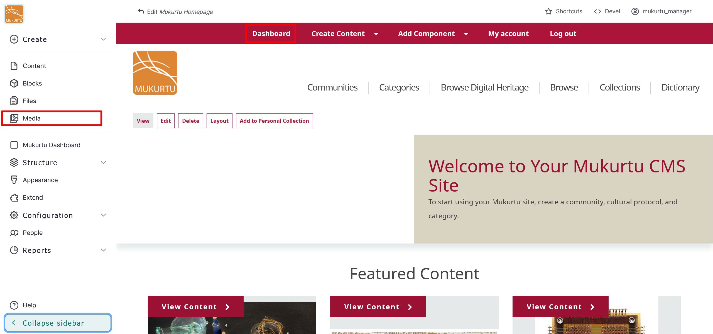

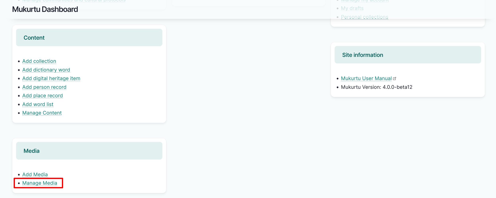

You can use the *Media name* field to search for media assets by name, or you can filter by type, published status, identifier, community, or other facets.

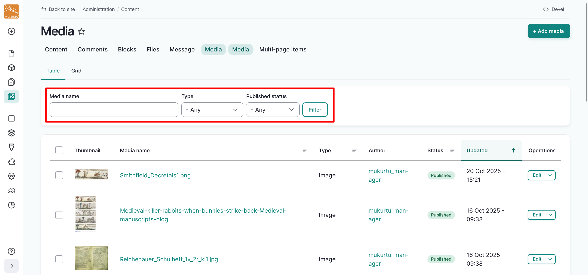

## Edit media assets

- To edit media assets in the media library, select the "Edit" button to the far right of the media asset. 

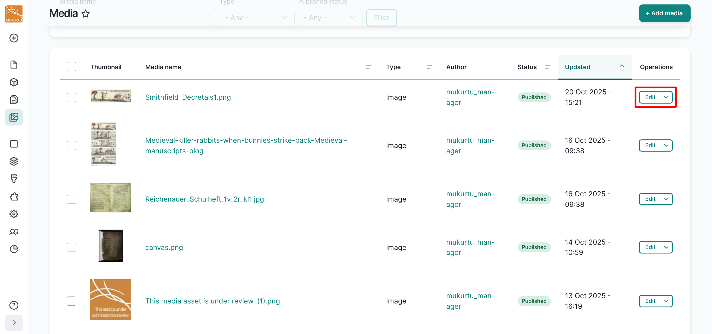

- Make your edits in the form and select Save when done.

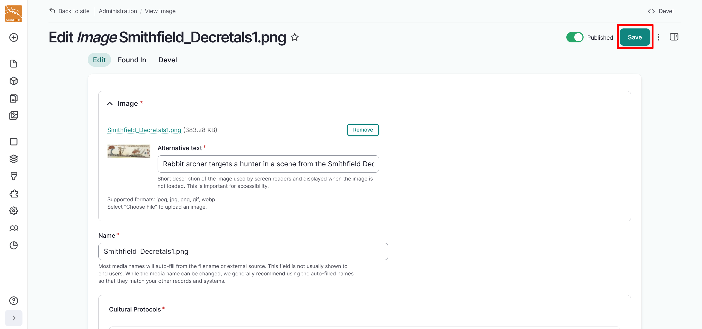

## Delete media assets

To delete one media asset:

- Select the dropdown arrow in the "Edit" button to the far right of the media asset.

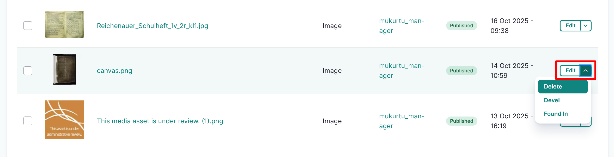

- Select the "Delete" option. 
- You will receive a confirmation message. If you are sure you want to delete your media asset, select "Delete". This action cannot be undone. If you do not want to delete your media asset, select "Cancel".

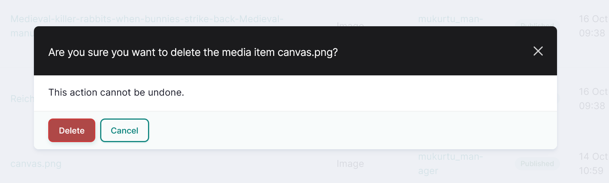

- You will get a status message confirming your media asset has been deleted.

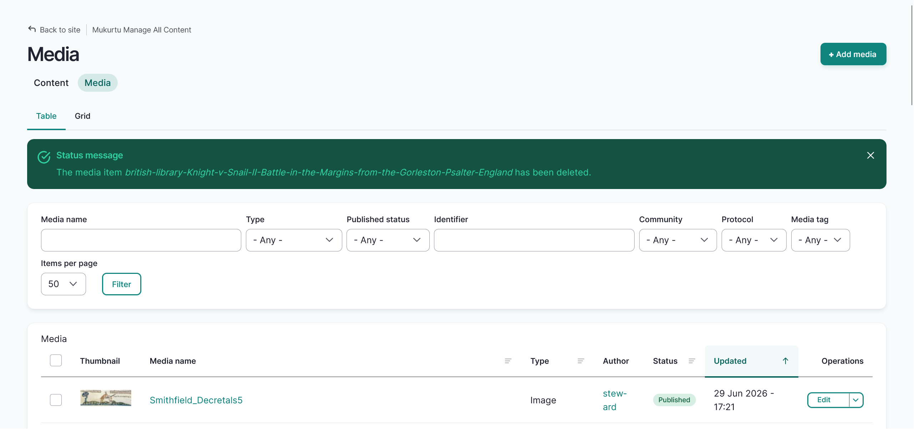

To delete multiple media assets:

- Select the checkboxes to the left of the media assets you want to delete.

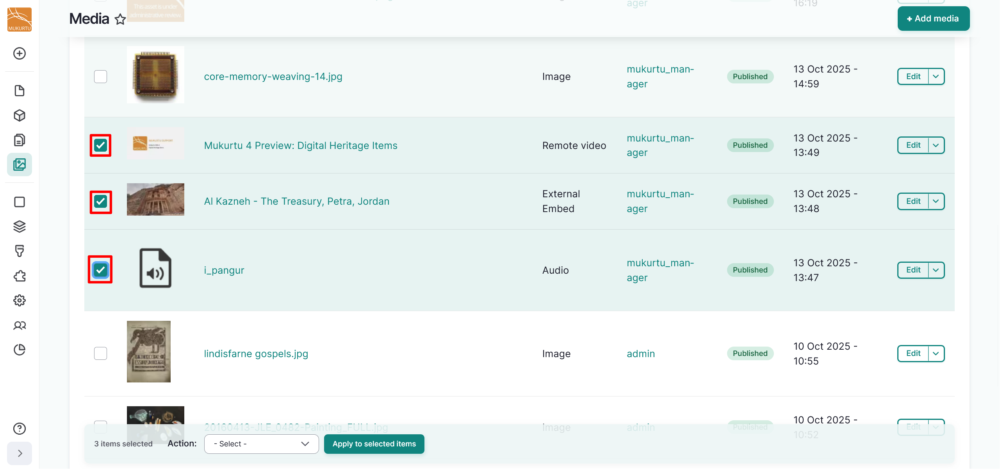

- Select the **Action** menu across the bottom of your Screen. 
- Select "Delete Media".

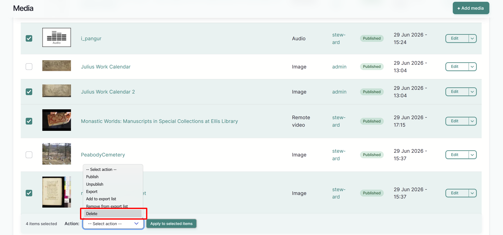

- Select the "Apply to Selected Items" button.

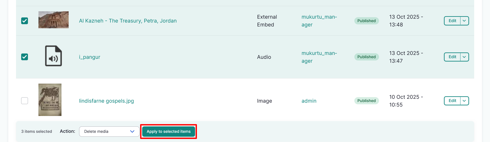

- You will recieve a confirmation message asking if you are sure you want to delete the media assets. If you are sure, select "Execute action".

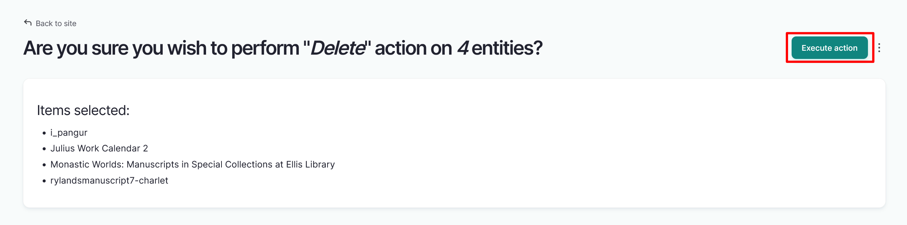

- You will see a status message confirming your media assets have been deleted.

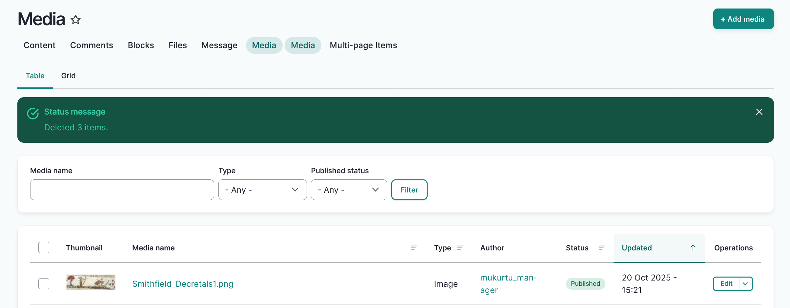

## Other actions

You can use the Operations or Action dropdown menus to singly or batch add media assets to an export list or remove them, or to batch publish or unpublish media assets. 

In the Operations menu you can also find the "Found in" feature, which compiles a list of content entities where the media is used. To use the *Found in* feature, select "Found In" from the dropdown.

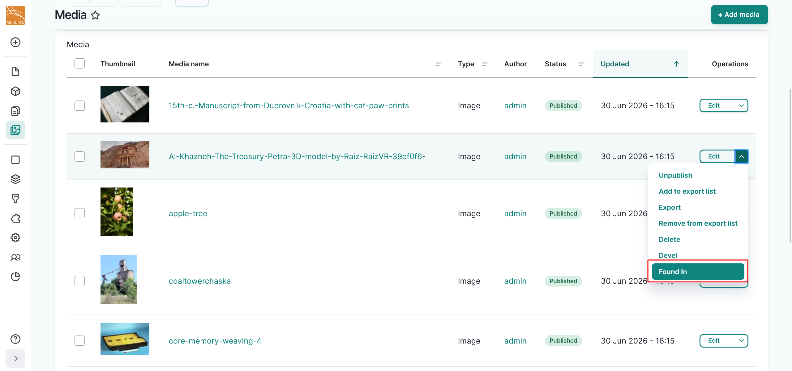

.png)

## Additional media settings

### Mukurtu media settings

Optionally, users can use Mukurtu Media Settings to include placeholder images for content that does not have any media assets or in the event that a user cannot view a media asset due to protocol restrictions. For more information about managing media assets using protocol restrictions, refer to [Manage Media Access with Protocols](ManageMediaAccessWithProtocols.md).

If content does not have a media asset or users do not have access to view the media asset, there is no media asset shown in previews or on the content page. 

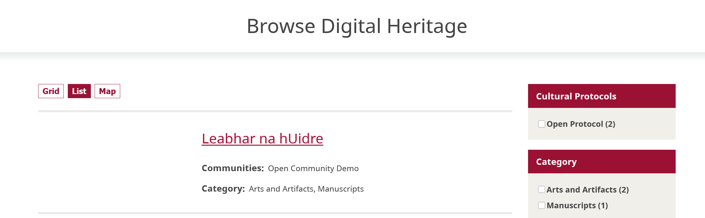

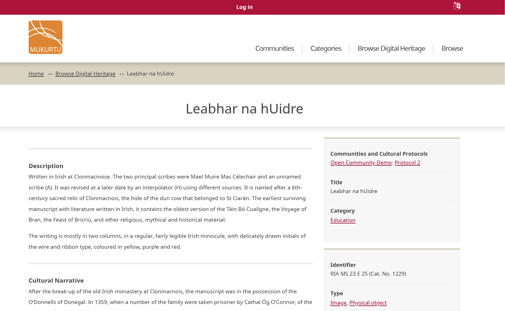

To add these placeholder images, navigate to your **Dashboard** and select the *Media settings* link.

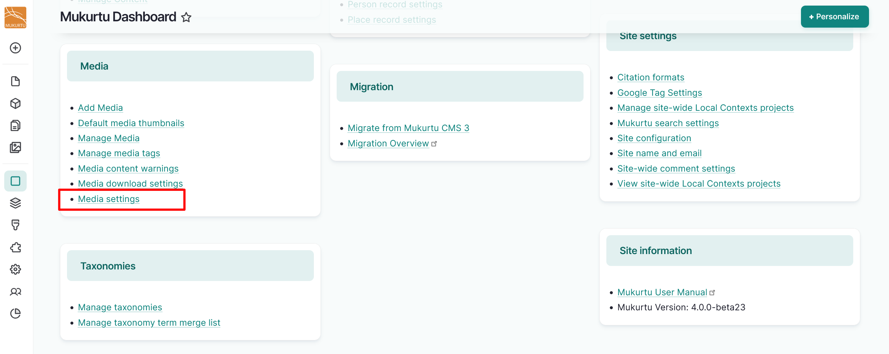

Select the "Choose File" or "Browse" button. 

!!! tip
	Depending on your browser, the text of the button may vary.

Select "Save configuration" to save your placeholder image(s).

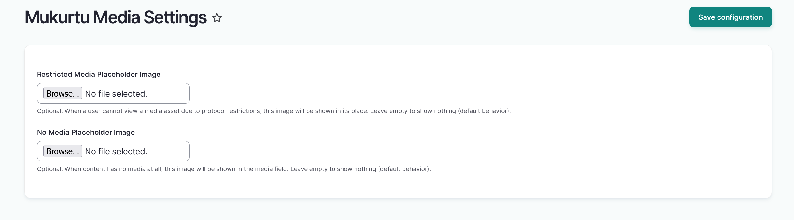

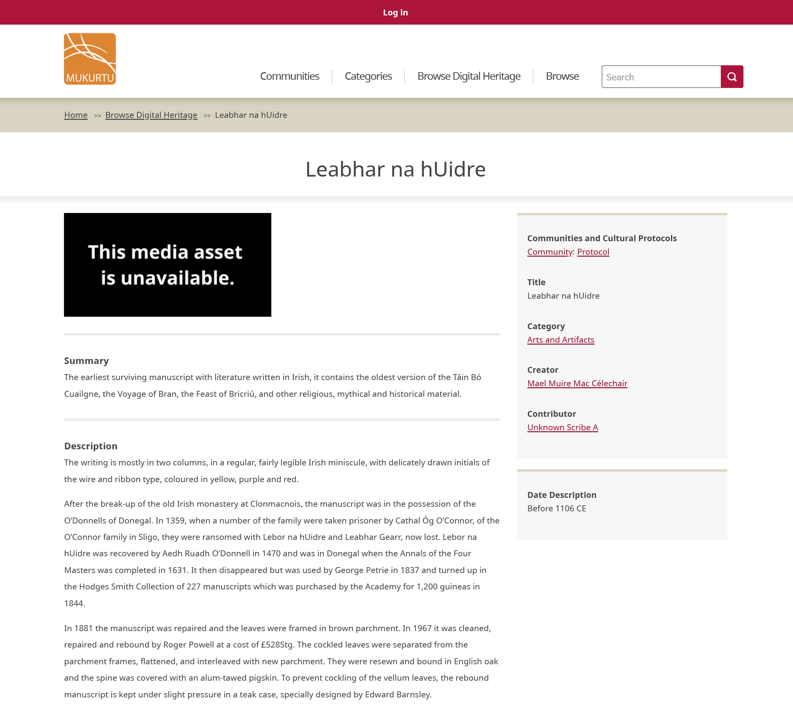

### Enable media download

Mukurtu managers can optionally enable or disable a media asset download button. To configure media download, navigate to the **Media** section of your **Dashboard** and select the *Media Download Settings* link, or go directly to `/admin/config/mukurtu/media-download-settings`.

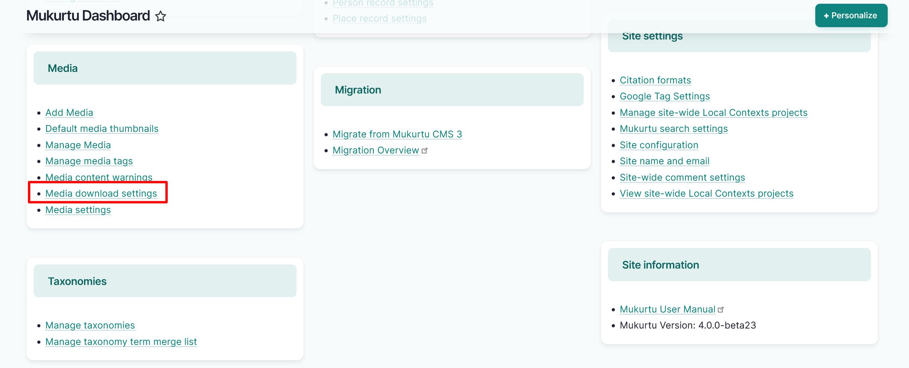

Select either the "Show download button" or "Hide download button" option, then select the "Save Configuration" button to save your media download configuration.

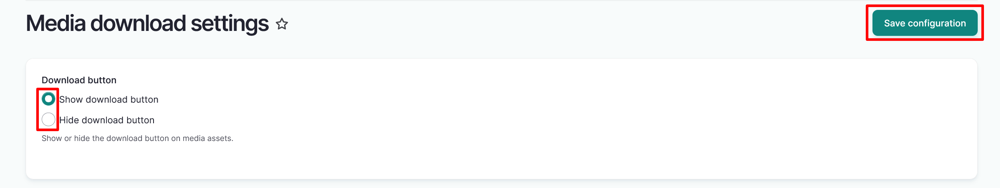

This is how your content will appear with the "Hide download button" option selected. Please note that hiding the download button does not guarantee that users will be unable to view or download your site's local media assets.

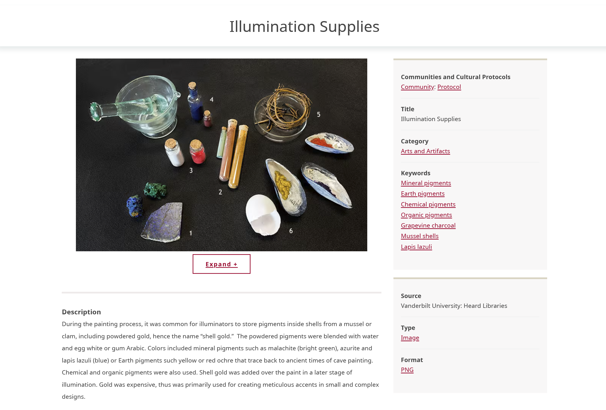

This is how your content will appear with the "Show download button" option selected. Please note that only local media can be downloaded.

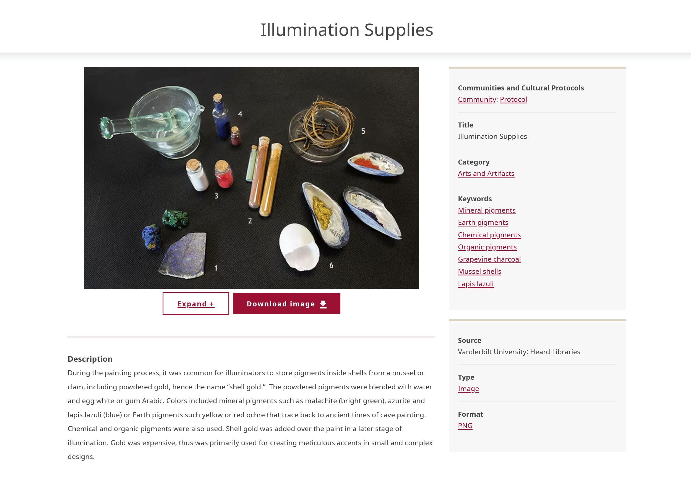