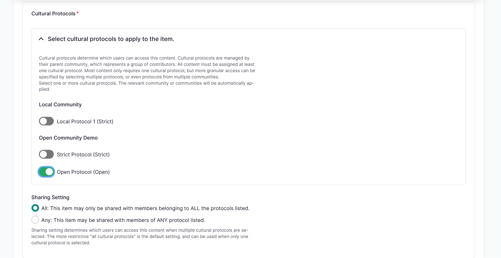

---
tags:
    - media
    - metadata
---
# Media Asset Metadata

!!! roles "User roles"
    Protocol steward, contributor, community record steward, curator, language steward, language contributor 

Media assets are the core element of digital heritage items and other content. They can be images, documents, video, audio files, or embedded media. 

## Fields used across all media types 

### Name 

- The name of the resource. 
- This is autogenerated for locally hosted media but must be entered manually for links and embeds. 
- This field is not shown to end users.
- This is a required field. 

### Cultural Protocols 

- Cultural protocols must be applied directly to media assets and determine which users can access the media asset. 
- Cultural protocols are managed by their parent community, which represents a group of contributors.
- All media assets must be assigned at least one cultural protocol. Most media assets only require one cultural protocol, but more granular access can be specified by selecting multiple protocols or protocols from multiple communities.
- These are required fields.  

#### Cultural Protocol 

- Select the checkbox beside the cultural protocol to apply it to the asset. This will automatically select the community as well.

#### Sharing Setting 

- Sharing setting determines which users can access this content when multiple cultural protocols are selected. The more restrictive "all cultural protocols" is the default setting, and can be used when only one cultural protocol is selected.

    - All: This item may only be shared with users who are members of  ALL selected cultural protocols (more restrictive).
    - Any: This item may be shared with users who are members of ANY one or more selected cultural protocol (less restrictive).
    
    !!!tip
        All is the default setting.

### Identifier

- A unique, unambiguous reference to the media asset. Identifiers are often provided by the contributing institution or organization so the original item can be located. Examples include call numbers or accession numbers.

### People 

- The name of anyone present, named, or referenced in the media asset. 
- This field is also used to trigger the "deceased person" media content warnings. 
    - If the "deceased person" media content warnings are in place, users see a blacked-out box in place of the media asset overlaid with descriptive text when they visit a page with a media tag. The user may choose to click through to access the media. 
    - This does not prevent users from accessing tagged media.
    - For more information on media content warnings, refer to the [Media Content Warnings](MediaContentWarnings.md) article.

### Media Tags 

- Media tags can be used to tag and locate assets within the media library (for example, `oral history` or `newspaper`). 
- They can also be used to trigger taxonomy-based media content warnings when that tool is enabled. 
    - Users see a blacked-out box in place of the media asset overlaid with descriptive text when they visit a page with a media tag. The user may choose to click through to access the media. 
    - This does not prevent users from accessing tagged media.
    - For more information on media content warnings, refer to the [Media Content Warnings](MediaContentWarnings.md) article.

### Thumbnail 

- A thumbnail image associated with the media asset. 
- These are automatically generated for audio, video, and URL-linked assets. 
- This is a required field for External Embeds.
- Thumbnail images require an alternative text description for accessibility. 
    
    !!!tip
        Thumbnails are auto-generated for image files.

## Fields unique to specific media asset types

### File types and paths 

Locally hosted file types:

- Audio file - A locally hosted audio file. 
- Document - A locally hosted document. Documents encompasses many different file types, and can include text based documents, spreadsheets, presentations, compression files, and graphics. 
- Image - A locally hosted image file.
- Video file - A locally hosted video or A/V file.

For more information on file formats for locally hosted file types, refer to [Media Asset File Formats](MediaAssetFileFormats.md)

External Embed - Insert the embed code from an external website. External embeds are usually some kind of code wrapped in `<iframe></iframe>` tags.

Remote Video via URL - Video files can be very large, so using a third party to host video content for access copies saves storage space on your server. Both [YouTube](https://www.youtube.com/) and [Vimeo](https://vimeo.com/) offer private and/or unlisted hosting of videos, allowing you to privately host content on either service and embed those videos into your Mukurtu site. Please note that each of these hosting services has their own list of supported file formats.

SoundCloud Track URL - This field includes URLs for SoundCloud Tracks, Albums, and Playlists. Audio files can be very large, so using a third party to host audio content for access copies saves storage space on your server. [SoundCloud](https://soundcloud.com/discover) offers private audio hosting, allowing you to privately host content on either service and embed that audio into your Mukurtu site. Please note that SoundCloud has its own list of supported file formats.

### Audio files

Contributor - Speakers or singers present in the audio file. Contributors listed here are displayed in the speaker field that accompanies the audio file in dictionary words. Applies to audio and SoundCloud assets.

Transcription - A short text transcription of the audio file. This is used as the corresponding text when the audio file is used as a sample sentence in a dictionary word.

### Images

Alternative text - A short description of the image used by screen readers and displayed when the image is not loaded. This is important for accessibility. 