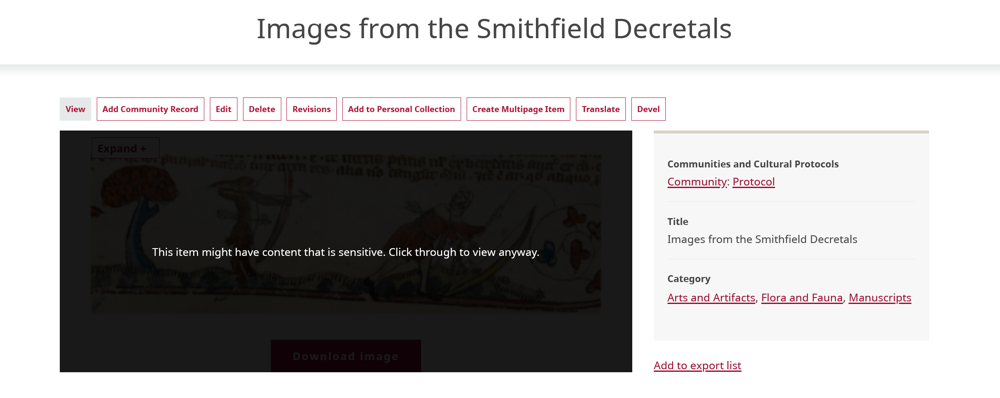
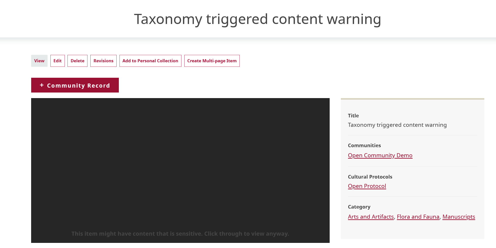
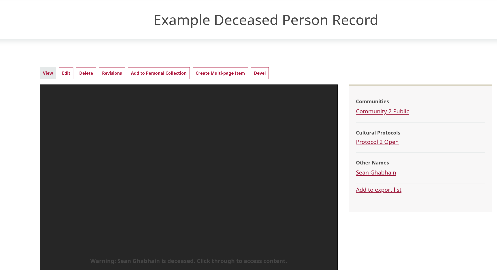
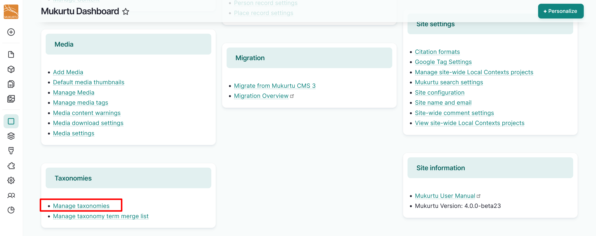
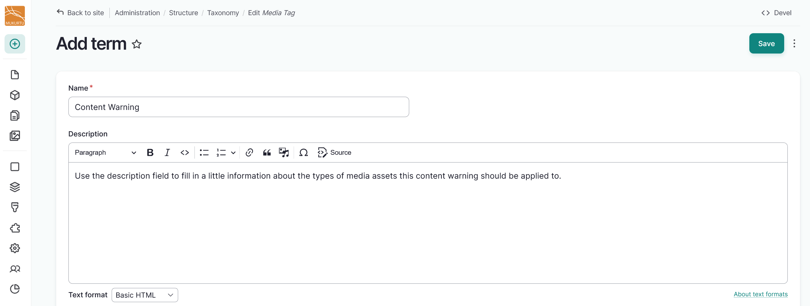
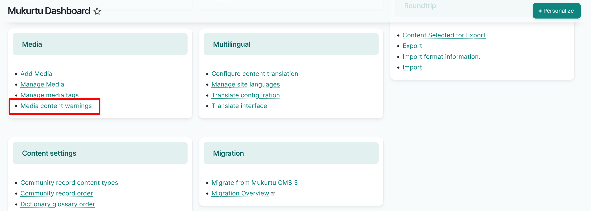
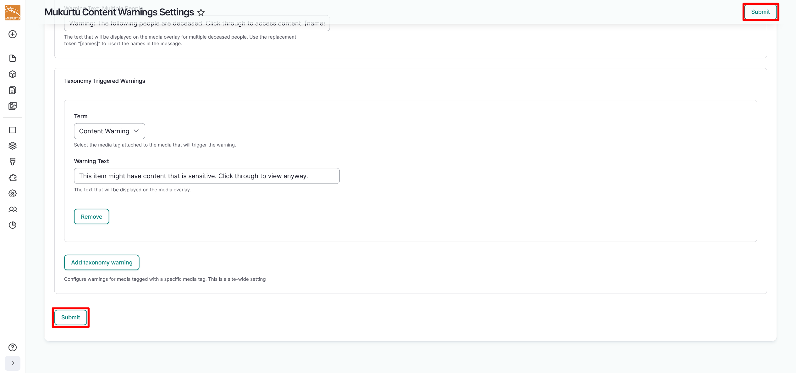
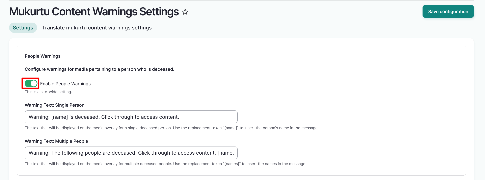
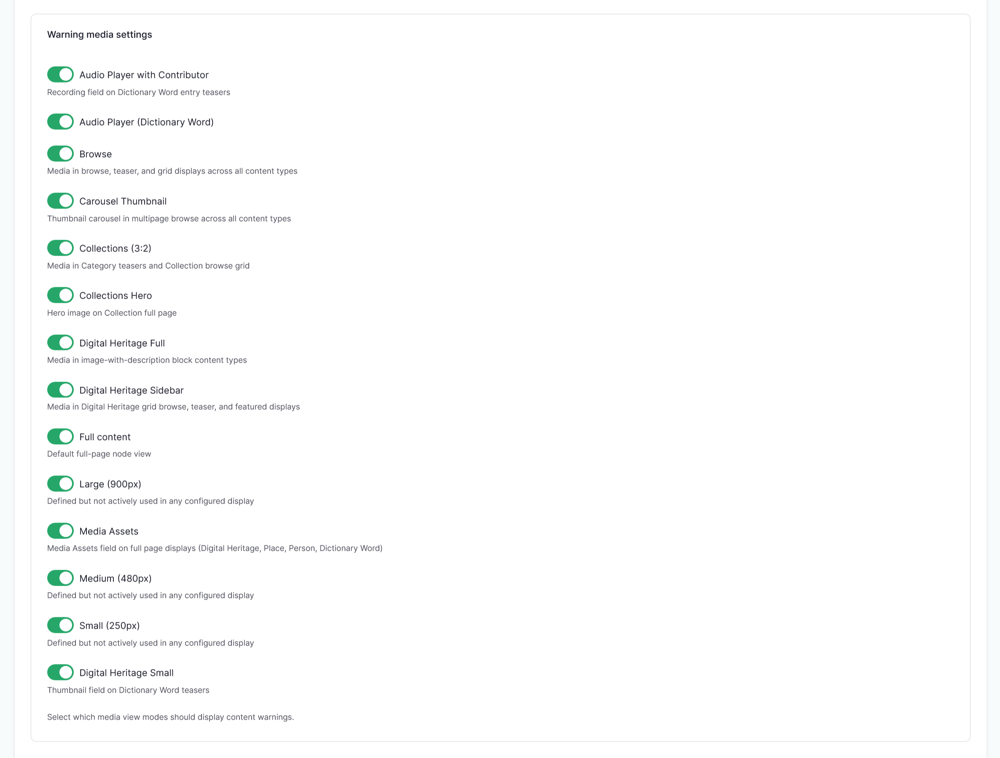

# Media Content Warnings

!!! roles "User role"
    Mukurtu manager

Media content warnings are a tool used to flag potentially sensitive or triggering media assets, and allow a user to choose whether or not to interact with them before viewing or accessing the media. They can be used with all media types, and can be configured to display with thumbnails, full-size media, and other display modes.

When a user is presented with a media asset that has a content warning, it will be replaced with a blacked-out box and descriptive warning text. At that point, the user can choose to dismiss the warning and access the media, or leave the warning in place. This feature does not replace or bypass cultural protocols on media assets, rather it presents users the choice to access it if they want to after being made aware of its sensitive nature. This also does not affect the rest of the page contents, so if a digital heritage item includes a media asset with a content warning, that does not extend to the metadata or other media assets in that item.

There are two types of media content warnings: taxonomy triggered warnings and deceased person warnings. Both can be active on one site, and they are configured separately.

**Taxonomy triggered warnings**

Taxonomy triggered warnings are the more flexible of the two types of warnings. They are dependent on the *Media tags* field that is included in all media types. You can configure as many different taxonomy warnings as necessary. Each warning is composed of the trigger media tag taxonomy term and a customized message.

Some example uses of taxonomy triggered warnings include boarding or residential school materials, graphic or violent text or images, offensive or racist language and representation, or materials that may otherwise make users uncomfortable.

A completed taxonomy triggered content warning can look like this:

**Deceased person warnings**

Deceased person warnings are more rigid than taxonomy triggered warnings. They are dependent on the people field that is included in all media types, and require use of Person Records. There is only one deceased person warning available, though the message can be customized.

!!! tip
     Deceased person warnings are a response to requests from communities where there are degrees of restrictions on how individuals can or should interact with images or recordings of people who have passed away. If the choice is individual this can be a useful tool. However, if there is need for stricter control over access to these materials, consider managing that with cultural protocols.

Creating media content warnings is a multi-step process. These parts need to be done in the order they are presented here to generate media content warnings and apply them to your media assets. 

Sites can have many different media content warnings configured, and media assets can have more than one media content warning applied. 

A completed deceased person record can look like this:

To begin, navigate to your dashboard. 

## Taxonomy triggered warnings

### Create a media tag

1. Under the **Taxonomies** section of the dashboard, select the **Manage Taxonomies** link or go directly to `/admin/structure/taxonomy`

    

2. Navigate to the **Media Tag** link. Your media tag will act as the term, or name, for your content warning, so choose a tag that clearly communicates the type of warning you want to apply.
3. Select the "Add a new term in Media Tag" button.
4. Use the *Name* field to enter a name for your media content warning.
5. Use the *Description* field to enter a description of the media tag for your media content warning. The description could help distinguish between media tags or describe the type of media assets they should be applied to.
6. Select the "Save" button to save your media tag.

    

7. Navigate back to your dashboard to complete creating your media content warning.

### Configure a taxonomy warning

1. Under the **Media** section of the dashboard, select the **Media Content Warnings** link or go directly to `/admin/config/mukurtu/content-warnings`

    

2. Navigate to the **Taxonomy Triggered Warnings** section. 
3. Select a **Term** from the dropdown menu. Terms are media tags attached to the media that will trigger the warning. They function as the name of your media content warning. 
4. Select the "Add taxonomy warning" button to add additional taxonomy warnings. 
5. Once you have selected your term, apply warning text. In the *Warning Text* field enter the warning text you would like displayed on your media overlay. This field has a 255 character limit.
6. Select the "Save configuration" button from the top right of the screen to save your media content warning. 

    

To apply a taxonomy based media content warning, navigate to the [Apply a media content warning](#apply-a-media-content-warning) section of this article.

## Deceased person warnings

There are several required steps to create a deceased person warning, including:

- creating a taxonomic people term
- creating a person record
- selecting the *Deceased* field on the person record

For further information about how to create person records, visit [Create Person Records](../person-records/PersonRecords.md). For further instructions on how to create deceased person media content warnings, follow the instructions below.

### Configure person warnings

1. Under the **Media** section of the dashboard, select the **Media Content Warnings** link or go directly to `/admin/config/mukurtu/content-warnings`

    

2. Navigate to the **People Warnings** section and select the toggle beside **Enable People Warnings**. 
3. In the *Warning Text: Single Person* field, enter the text to be displayed on the media overlay for a single deceased person. Use the replacement token `[name]` to automatically insert the person's name in the text. An example of warning text for a single person is `Warning: [name] is deceased. Click through to access content.`
4. In the *Warning Text: Multiple People* field, enter the text to be displayed on the media overlay for a media asset displaying multiple deceased individuals. Use the replacement token `[names]` to automatically insert the people's names in the text. An example of warning text for multiple people is `Warning: The following people are deceased. Click through to access content. [names]`

5. Navigate to the bottom of the page and select the "Save configuration" button to save your media content warnings.

### Configure person record settings

People terms can be drawn from content and media as they are created. If you have not created people terms directly from content and media, refer to the [Managing Taxonomies](../taxonomies/ManagingTaxonomies.md) article to add creator, contributor, or people terms directly to your taxonomies.

### Create a person record

Create a person record according to the instructions here [Create Person Records](../person-records/PersonRecords.md). To apply a person warning to a media asset, the *Deceased* field must be selected and the person's name must be entered as a taxonomic term in the **Other names** section. 

## Apply a media content warning

!!! roles "User roles"
    Protocol steward, contributor, community record steward, curator, language steward, language contributor 

Follow these steps to apply a media content warning to a media asset.

1. Navigate to your media asset. You can also apply a media content warning when you create a new media asset. For instructions on how to create a new media asset, visit the [Create Media Assets](../media/CreateMediaAssets.md) article.

    - From your dashboard, navigate to the **Media** section and select the **Manage Media** link. 
        - Under the **Operations** heading, select the "Edit" button from the dropdown button menu.

    - From a new media asset, follow the steps outlined in the [Create Media Assets](../media/CreateMediaAssets.md) articles to apply media tags.

2. To enter a taxonomy triggered media content warning, navigate to the **Media Tags** section of your media asset. As you type, existing media tags will be displayed. Select an existing media tag or enter a new term. To include additional media tags, select "Add another item".
3. To enter a deceased person content warning, navigate to the *People* field in your media asset. As you type, names of existing people will be displayed. Select an existing person or enter a new name. To include additional people, select "Add another item".
5. Select the "Save" button to save your media asset.

## Warning media settings

Media content warnings are automatically configured to display on all media view modes, but can be configured to only display on selected view modes. This can be helpful in the event that you want your site to display media content warnings on certain media assets, like images of a deceased person, but not on others, like the dictionary audio player with a recording of the deceased person as contributor.

To select which media view modes should display content warnings, navigate to `/admin/config/mukurtu/content-warnings` and select the toggle to the left of any media asset view mode that you do not want to display content warnings. 

Select "Save configuration" to save your options.

