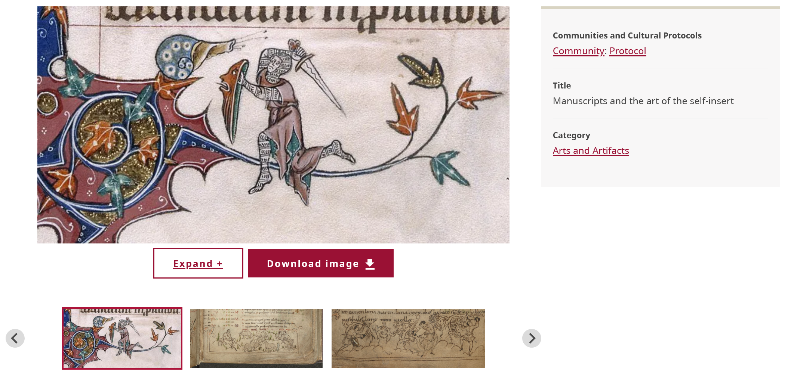

# Understanding Media Assets

!!! roles "User roles"
    Protocol steward, contributor, community record steward, curator, language steward, language contributor 

Media assets are the core element of digital heritage items and other content. Mukurtu provides wide support for many different media types, including images, documents, video, audio files, or embedded media. Media can be uploaded or hosted from an external site such as Vimeo or YouTube. 

Mukurtu supports several different types of media assets. These include:

- Audio Files
- Documents 
- External Embeds 
- Images 
- Remote Video 
- SoundCloud 
- Video Files 

You can apply media assets to content and taxonomic records, such as digital heritage items, dictionary words, person records, and other facets of Mukurtu. Most items do not have a limit on the number of associated media assets. 

Digital heritage items generally feature at least one media asset, though they are not required. Media assets help provide a more tangible connection to the digital heritage item's metadata, and can aid in facilitating discovery and interest. Some media assets, such as PDF documents, are indexed to enable full-text search. When multiple media assets are included in a digital heritage item, they are displayed in a media carousel for ease of navigation. Media assets can also be included in full HTML fields, such as the Cultural Narrative field, as descriptive metadata.

Dictionary words can use multiple audio files to provide users more comprehensive pronounciation examples.  In addition to audio in the main recording and sample sentences fields, dictionary words have an additional media field where supplementary images, video, or other resources can be included. Person records include the same kind of multi-media as DH items to provide photos and recordings of the featured person.

