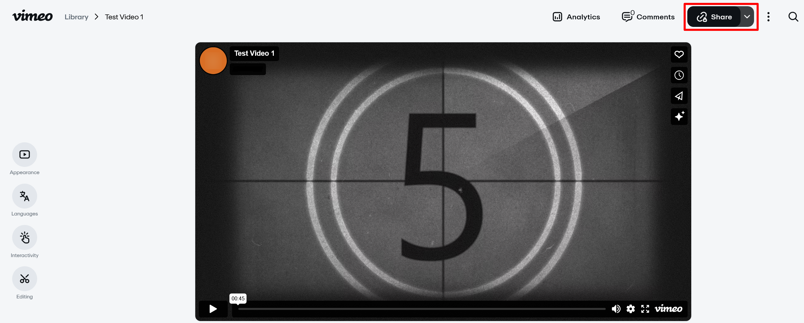
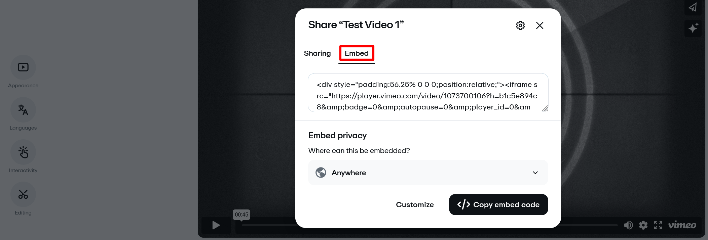
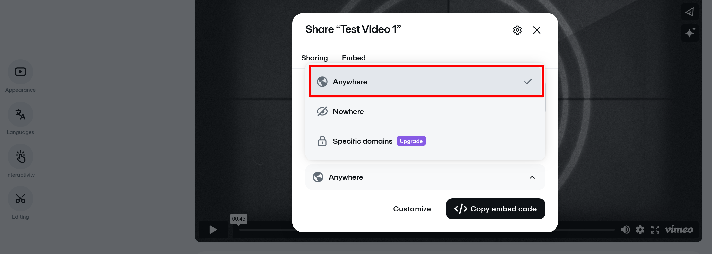
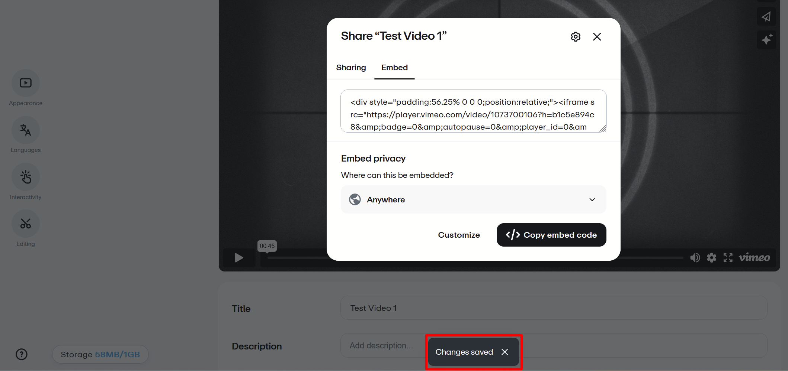

---
tags:
    - media
    - privacy
---
# Vimeo Privacy Settings

!!! roles "User roles"
    Protocol steward, contributor, community record steward, curator, language steward, language contributor 

Vimeo's paid plans offer multiple privacy settings. For more information on these settings, visit [Vimeo privacy information](https://vimeo.com/features/video-privacy).

These privacy settings will allow your videos to be added to the Mukurtu media library and viewed by users. Content and media protocols apply.

- **Public**
- **Unlisted**
- **Hide from Vimeo**

These privacy settings will not allow your videos to work as expected in Mukurtu.

- **Private**. You cannot add private videos to the media library. If a video is added and then set to private, it will no longer play in Mukurtu. 
- **Password**. You can add password protected videos to the media library, but the password will be required for a user to view the videos.

## Embed permissions can limit function

Mukurtu cannot display Vimeo media assets if **Embed privacy** is set to **Nowhere**. To change your embed permissions, complete the following steps.

1. Select the "Share" button.

     

2. Navigate to the **Embed** tab.

     

3. Navigate to **Embed privacy**. Select **Anywhere** from the dropdown menu.

     

4. You do not have to do anything to save your changes. A pop-up appears in the center bottom of the screen notifying you that your changes have been saved.

      
