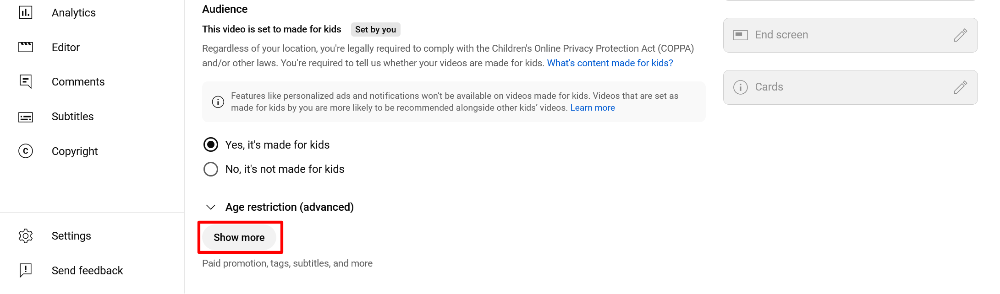

---
tags:
    - media
    - privacy
---
# YouTube Privacy Settings

!!! roles "User roles"
    Protocol steward, contributor, community record steward, curator, language steward, language contributor 

Youtube offers limited privacy settings.

These privacy settings will allow your videos to be added to the Mukurtu media library and viewed by users. Content and media protocols apply.

- **Public**
- **Unlisted**

These privacy settings will not allow your videos to work as expected in Mukurtu.

- **Private**

!!! warning
    You cannot add private videos to the media library. If a video is added and then set to private, it will no longer play in Mukurtu. 

## Embed permissions can limit function

Mukurtu cannot display YouTube media assets if Allow embedding is not enabled. 

1. Navigate to your video's **Video Details** link to allow embedding. 

    

2. Select the **Show more** button to expand the page.

    

3. Navigate to **Allow embedding** and select the checkbox to allow your YouTube videos to be embedded in Mukurtu. 

    