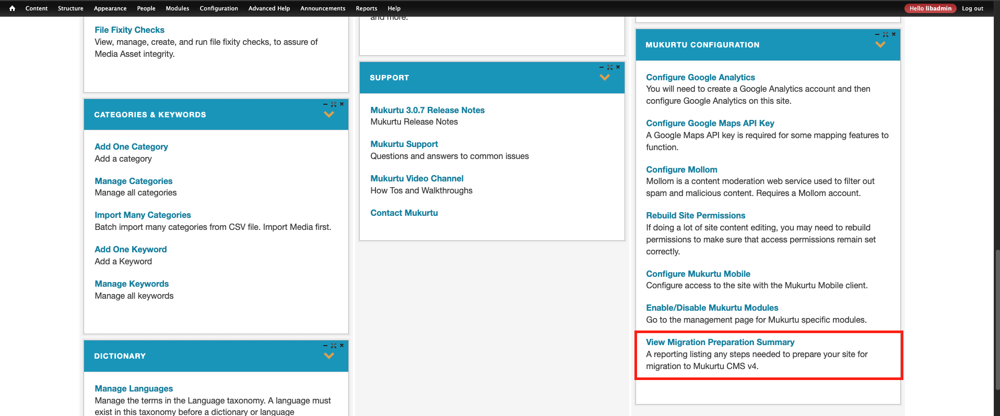
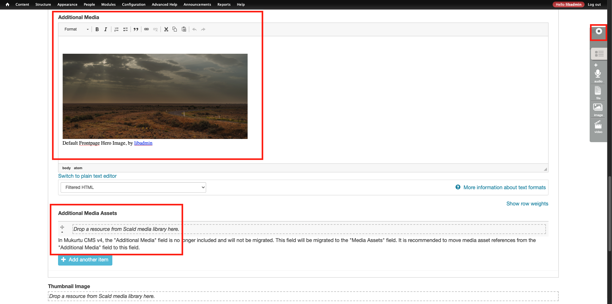
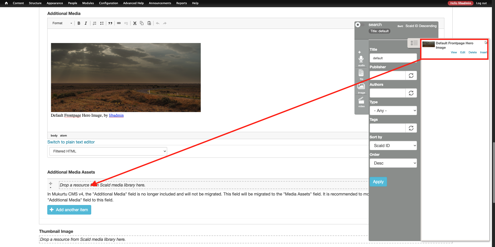
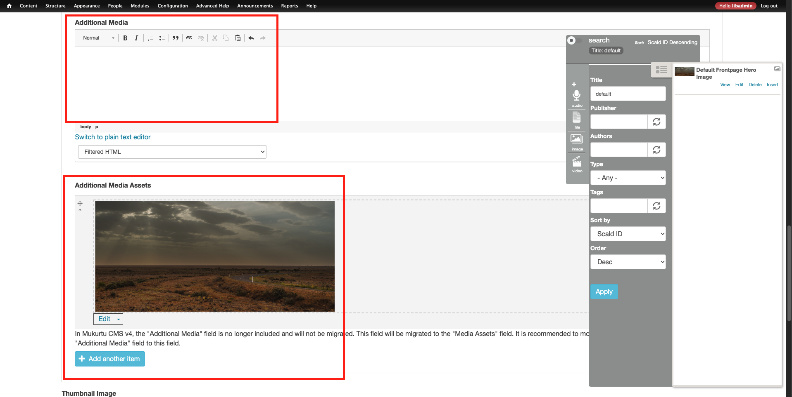
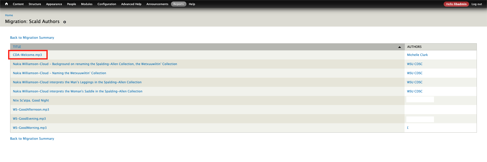

# 3) Mukurtu 3 Pre-Migration Activities

The pre-migration report will identify all site content that needs to be updated or modified before it can be migrated to Mukurtu 4. The report will also identify any content settings that will not be migrated. 

> The pre-migration report and migration tools only address stock Mukurtu content and features. For example, if you have created a new content type, or added a new field, it will not be reflected in this report. Please contact [support@mukurtu.org](mailto:support@mukurtu.org) with any questions.

There are six categories included in the pre-migration report. A more detailed description of the changes for each is provided in the relevant section below.

1) Content (nodes) with no assigned protocols
2) Media assets (atoms) with no assigned protocols
3) Text formats: "Markdown" and "Display Suite code"
4) Dictionary words with additional media
5) Dailymotion media assets (atoms)
6) Scald authors field

## Run the pre-migration report and clear caches

It is best for these activities to be run by a Drupal administrator to ensure all content is addressed. Depending on how you have assigned protocol membership, the account may need to be enrolled in additional protocols to apply protocols to content and media.

You can access the pre-migration report directly at /admin/reports/migration/summary (eg: https://mysite.com/admin/reports/migration/summary).

You can also access the report by following the "View Migration Preparation Summary" link on your dashboard.

And you can access the report by following the "Reports" > "Pre-migration summary report" path from the Drupal administrator menu.

The report should run automatically, but you may need to click the "Run Pre-migration Report" button run the report. 

After running the pre-migration report, clear all site caches to ensure the report summary is updated. 
Hover over the home icon at the top left of the page, and click "Flush all caches". The page will reload when complete, which may take some time depending on the size of the site and server configuration.

The report should automatically update as you complete the activities below. If the report summary does not automatically update, re-run the report and clear caches as shown above.

## Resolve pre-migration activities

Each category will have a summary in the "status" field on the right, which includes a link to a more detailed report and actions.

You should resolve the activities in the order displayed to avoid going through some steps multiple times. For example, a piece of content needs to have an assigned protocol before media used in that content can copy that protocol. 

In the "Status" column, click the "Details" link to view the report for each category.

### Content (nodes) with no assigned protocols

Content refers to digital heritage items, dictionary words, collections, word lists, and person records.

- In Mukurtu 3 protocols were optional for dictionary words and collections, and were not available for person records and word lists.
- In Mukurtu 4 cultural protocols are required for ALL content types.
- You will most likely be able to use the bulk processing tool to add protocols to all content without one, but some content may require manual editing.

The content with missing cultural protocols report displays all content that does not have a protocol assigned.
If you need to review a single piece of content, you can click on it's title to view. Opening content in a new tab is helpful so you don't have to navigate back to this page as often.

You can filter by content type. This is useful if, for example, you know that all dictionary words will continue to be public or all use the same private protocol, but other content will require more granular decisions. If relevant, select the content type and click "Apply".

From the "Operations" dropdown, select "Set cultural protocols for content".

Select the content to be assigned a protocol using the check boxes. You can select all content by using the checkbox in the top row.
Please note that all content selected here will receive the SAME protocol(s) in the next step, so you will likely need to repeat this process multiple times for different groups of content.
Click "execute".

Select the appropriate item sharing setting - ANY or ALL. 
If the content will use only one protocol, either setting will work, but the default setting when creating new content on the site is ALL, in case you want to align with that.
If the content will use more than one protocol, choosing the correct setting is very important:
- ANY means that  a user enrolled in ANY of the selected protocols can access the content. This is a more permissive setting.
- ALL means that a user must be enrolled in ALL of the selected protocols to access the content. This is a more restrictive setting.

Use the checkboxes to select the appropriate protocol(s).
If there is a protocol you want to use and it is not listed here, ensure that the active user account is a protocol steward for the protocol in question.
Click "next".

A confirmation list will be displayed. If the list looks correct, click "confirm".

Finally a confirmation message will be displayed. You can then return to the pre-migration report summary to repeat the above steps for other content if needed, or move on to additional steps.

### Media assets (atoms) with no assigned protocols

Media assets represent the files uploaded to the site and stored in the media library (including remotely hosted video). These may be referred to as media, media assets, or atoms, and may be identified by a "SCALD ID" in addition to their filename.

   - In Mukurtu 3 protocols were optional, but recommended.
   - In Mukurtu 4 cultural protocols are required for ALL media assets.
   - The bulk processing tool will add protocols to most media assets, but some may require manual editing.

The Scald Atoms with missing cultural protocols report displays all media assets that do not have a protocol assigned.
If you need to review a single media asset, you can click on its title to view. Opening media assets in a new tab is helpful so you don't have to navigate back to this page as often.

You can filter by media type to limit the scope of the results. In most cases this isn't necessary.

In the "Operations" dropdown, there are two choices that will allow you to assign protocols to media assets in bulk

**Duplicate cultural protocols from item**
- This selection will copy the all protocols and item sharing settings from a piece of content and apply them to the media assets found in that content.
- Content and media assets using the same protocols is the most common arrangement across Mukurtu sites. 
- The two most common scenarios are when users saved time by not applying protocols to media assets used in public content, or if protocols were accidentally missed on media assets used in private content.

**Set cultural protocols for scald atoms**
- This selection allows you to set the specific protocols and item sharing settings on media assets instead of copying them from related content.
- On many sites this selection will not be needed.
- Situations that cannot be resolved by the system and manual assignment of protocols is required:
   - If a media assets is used in more than one piece of content (eg: in a digital heritage item and as the featured image for a collection). The system can't identify which piece of content takes precedence.
   - If a media asset is NOT used in any content (eg: one media asset was uploaded multiple times, or content was deleted but the media asset wasn't). Depending on the situation, you may want to delete unused media assets before migration or apply a "to be reviewed" protocol to ensure the migration con be completed and the media assets reviewed later.

Select the appropriate operation from the dropdown menu.

#### Duplicate cultural protocols from items

Select the media assets to duplicate protocols from content using the check boxes. You can select all media assets by using the checkbox in the top row.
Click "Execute".

A confirmation message will be displayed. If relevant, media assets that could not automatically be assigned a protocol will be flagged.

#### Set cultural protocols for scald atoms

From the "Operations" dropdown, select "Set cultural protocols for Scald Atoms".
Select the media assets to be assigned a protocol using the check boxes. You can select all media assets by using the checkbox in the top row.
Please note that all media assets selected here will receive the SAME protocol(s) in the next step, so you will likely need to repeat this process multiple times for different groups of media assets.
Click "execute".

Select the appropriate sharing setting - ANY or ALL. 
If the media assets will use only one protocol, either setting will work, but the default setting when uploading new media assets the site is ALL, in case you want to align with that.
If the media assets will use more than one protocol, choosing the correct setting is very important:
- ANY means that  a user enrolled in ANY of the selected protocols can access the media assets. This is a more permissive setting.
- ALL means that a user must be enrolled in ALL of the selected protocols to access the media assets. This is a more restrictive setting.

Use the checkboxes to select the appropriate protocol(s).
If there is a protocol you want to use and it is not listed here, ensure that the active user account is a protocol steward for the protocol in question.
Click "next".

A confirmation list will be displayed. If the list looks correct, click "confirm".

Finally a confirmation message will be displayed. You can then return to the pre-migration report summary to repeat the above steps for other media assets if needed, or move on to additional steps.

### Text formats "Markdown" and "Display Suite code"

- Mukurtu 3 supported a wide range of text formats in the default HTML/rich text text editor: plain text, basic HTML, full HTML, markdown, and display suite code.
- In Mukurtu 4 the markdown and display suite code formats are no longer supported by default. Plain text, basic HTML, and Full HTML are still supported.
- Markdown and display suite code were most commonly used to implement custom styling in the description field of basic pages and community pages, and in additional fields of some content types (eg: description, cultural narrative, traditional knowledge, additional media).
- If you have used either format to achieve specific styling, it may be replicable with one of the HTML settings in Mukurtu 4. We recommend taking screenshots of the pages and copying the code you wrote so that it can be reviewed and re-implemented after migration.
- This setting will need to manually changed on all fields that use markdown or display suite code. The system cannot infer the correct setting to use, so there are no bulk tools available for this operation.

From the Text formats Markdown and Display Suite code report page, click on the title of the page or content to be reviewed. Opening links in a new tab is helpful so you don't have to navigate back to this page as often.

Depending on the type of page, in the top left, click either "page menu" or "item menu" and then "edit".

Located the affected field(s). They will list "Display suite code" or "markdown" in the dropdown menu below the text box. 
Some pages or content might have multiple affected fields - this would be most common with digital heritage items in the "Mukurtu Core" field group.

Change the setting to "plain text", "filtered HTML", or "full html" as needed. If unsure, "filtered HTML" is a safe choice to make.

Save the page or content (not shown).

Repeat these steps for each result in the report.

### Dictionary words with additional media

- Mukurtu 3 had a single "additional media" field that was a basic HTML field.
- In Mukurtu 4 the "additional media" field has been replaced by two new fields: 
   - "Media assets", which accepts all media types and is intended for supplementary media like a video recording or images.
   - "Thumbnail", which only accepts images. Those images will be displayed as a thumbnail in search results.
- The system can't infer how to move these media assets, so you will need to manually move any media assets used in the Mukurtu 3 "additional media" field into the new thumbnail or media assets field if you want them to be included in the migration. The contents of the additional media field will NOT be migrated. If no action is taken, this data WILL be lost.
- This can also be accomplished with regular batch update tools if preferred.

From the Dictionary words with additional media report, click on the dictionary word to be edited.

From the "item menu" at the top left of the page, select "edit". 

If necessary, inspect the embedded media asset to find its name. 
Expand the media library on the right sidebar.

Locate the media asset(s) in the media library, and drag and drop them into the new "additional media assets"  or "thumbnail image" field.

Ensure that the new field is showing the media assets, then delete the contents of the old "additional media" field.

Save the item (not shown).

Repeat these steps for each result in the report.

### Dailymotion media assets (atoms)

- Support for Dailymotion has been dropped in Mukurtu 4. We are not aware of any Mukurtu sites actively using Dailymotion.
- Dailymotion media assets will NOT be migrated.
- There is no automated process to resolve Dailymotion videos.
- If you have any Dailymotion videos, you will need to...
   1) Move them to a different hosting platform (either Vimeo or Youtube) or upload them directly to the site (not recommended).
   2) Create new media assets for the newly hosted videos.
   3) Replace the Dailymotion media assets with the new media assets in any DH items or other content where they are used.
   4) Delete the old Dailymotion media assets.

### Scald authors field

- Mukurtu 3 included an optional "authors" field (along with many other optional fields) in the media asset metadata. 
- Additional scald/media asset fields that are not being migrated: Identifier, Original DNG, Archival TIFF, Full-size JPEG, Created, Creator, Headline (Caption), Description, Geo Location, Location, Rights, Standard and Creative Commons Licensing, and Category.

- The Scald "Authors" (scald_authors) field will not be migrated to Mukurtu 4. There is a separate "author" field that automatically records the user responsible for uploading the media asset.
- No action is required, you can leave this field populated and it will not affect the migration.
- If you do choose to resolve these messages follow the steps below. This can also be accomplished with regular batch update tools if preferred.

From the Scald Authors report, click on the title of the media asset to be edited.

From the "page menu" select "edit".

Expand the "additional fields" section.
Locate the "authors" field and delete any terms. If you need to preserve these terms, consider entering them in the "people" or "contributor" field, as appropriate.
With the field empty, click "Finish".
A confirmation message will be displayed (not shown).

Repeat these steps for each result in the report.

## Pre-migration work complete

When you have completed the pre-migration activities, the report will indicate:
- There are no nodes using unsupported text formats
- All content has cultural protocols
- All Scald Atoms have cultural protocols
- No dictionary words have additional media
- No Dailymotion atoms are found
- No Scald Authors terms are found, if you removed them. If you choose to leave them they will still be reported, but will not be migrated, or affect the migration.

**If any of these are incomplete and you proceed with the migration, there will be corresponding data loss, and the migration as a whole may fail.**

> If you continue to work on the site after completing the migration activities, and before running the migration, please ensure that any new and updated content will pass the pre-migration report (eg: when creating a new collection, ensure that it uses protocols).
> 
> If you are not planning to work on the site between completing the migration activities and running the migration, consider placing the site in maintenance mode to prevent unintentional changes.
> 
> **In all cases, we STRONGLY recommend running a final pre-migration report before migration and then placing the site in maintenance mode to prevent changes being made.**

